# 3FS 分布式文件系统架构总结

## 1. 系统概述

**Fire-Flyer File System (3FS)** 是一个为AI训练和推理工作负载设计的高性能分布式文件系统。它利用现代SSD和RDMA网络提供共享存储层，简化分布式应用的开发。

### 核心特性
- **分离式架构**: 结合数千块SSD的吞吐量和数百个存储节点的网络带宽
- **强一致性**: 实现CRAQ（Chain Replication with Apportioned Queries）
- **文件接口**: 提供标准POSIX文件接口，易于使用
- **高性能**: 在180节点集群上达到6.6 TiB/s的读吞吐量

## 2. 系统架构

### 2.1 架构图

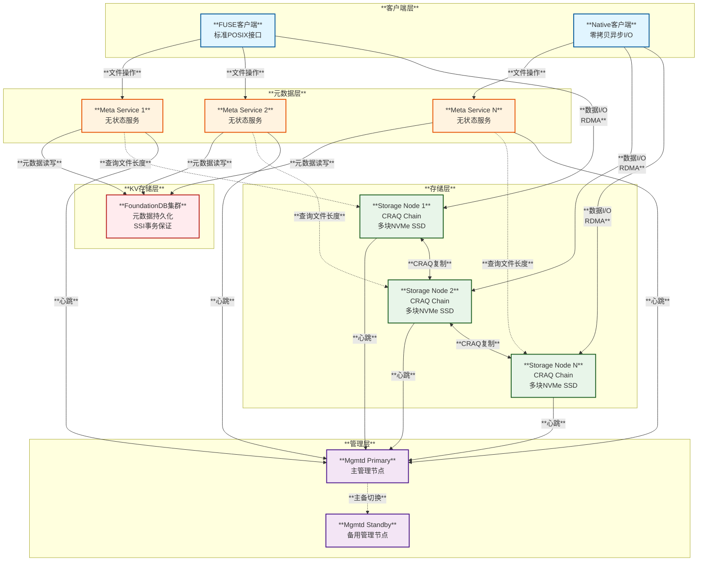

### 2.2 核心模块

#### **Mgmtd (集群管理服务)**
- **职责**:
  - 管理集群成员关系（存储节点、元数据节点）
  - 检测节点故障（基于心跳机制）
  - 分发集群配置和Chain Table
  - 主备切换（通过选举机制）
- **高可用**: 多个Mgmtd实例，其中一个为Primary

#### **Meta Service (元数据服务)**
- **职责**:
  - 处理文件系统元数据操作（create, open, stat, remove等）
  - 管理文件和目录的inode
  - 管理文件会话（write模式打开的文件）
  - 更新文件长度信息
- **特点**:
  - **无状态设计**: 所有状态存储在FoundationDB
  - **水平扩展**: 客户端可连接任意Meta服务
  - **事务保证**: 利用FoundationDB的SSI事务

#### **Storage Service (存储服务)**
- **职责**:
  - 管理本地NVMe SSD
  - 实现CRAQ协议进行数据复制
  - 处理客户端的读写请求
  - 数据恢复和同步
- **关键组件**:
  - **ChunkEngine**: Rust实现的块存储引擎
  - **StorageOperator**: 处理读写请求
  - **ReliableForwarding**: 可靠的链式转发
  - **AioReadWorker**: 异步I/O工作线程

#### **Client (客户端)**
- **FUSE客户端**:
  - 通过FUSE内核模块提供POSIX接口
  - 适用于大多数应用
  - 存在性能限制（内存拷贝、锁竞争）
  
- **Native客户端**:
  - 提供零拷贝异步I/O接口
  - 适用于性能关键型应用
  - 通过共享内存和IoRing实现高性能

## 3. 核心原理

### 3.1 CRAQ复制协议

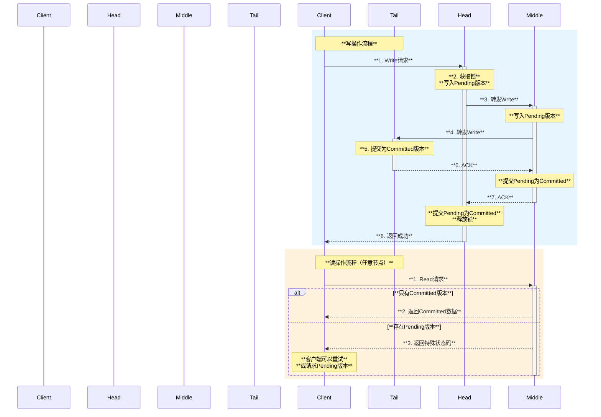

**CRAQ特点**:
- **Write-All-Read-Any**: 写入所有副本，可从任意副本读取
- **强一致性**: 通过版本号和ACK机制保证
- **负载均衡**: 读请求分散到所有副本
- **故障恢复**: 节点故障时重新配置Chain

### 3.2 数据布局

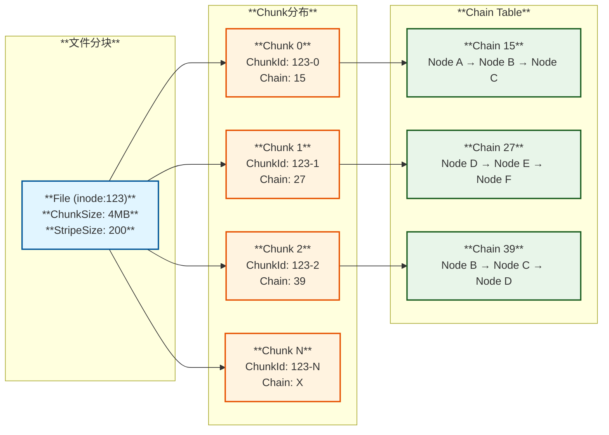

**关键概念**:
- **ChunkSize**: 每个Chunk的大小（如4MB）
- **StripeSize**: 文件条带化的Chain数量（如200）
- **ChunkID**: 由inode ID和chunk索引组成
- **Chain**: 一组Storage Target的复制链

### 3.3 元数据存储

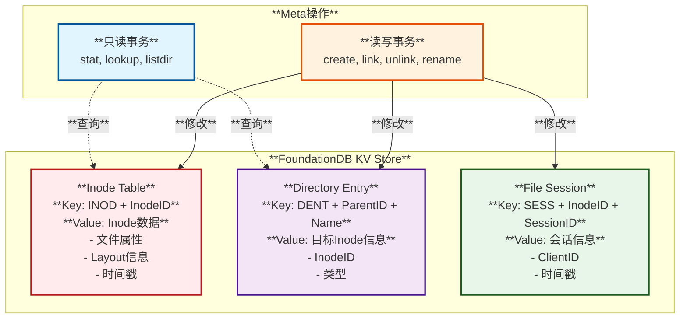

**元数据操作特点**:
- **事务保证**: 利用FoundationDB的SSI（Serializable Snapshot Isolation）
- **冲突检测**: 并发事务冲突时自动重试
- **范围查询**: 高效的目录列表操作
- **增量Inode ID**: 单调递增的全局唯一ID

## 4. 关键交互时序

### 4.1 文件创建流程

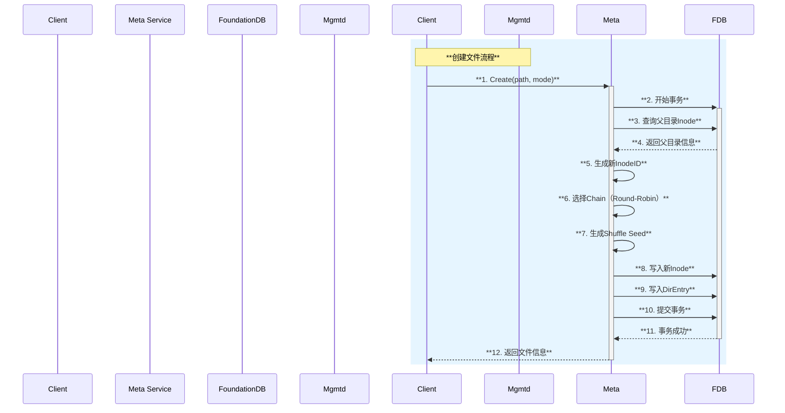

### 4.2 文件读取流程

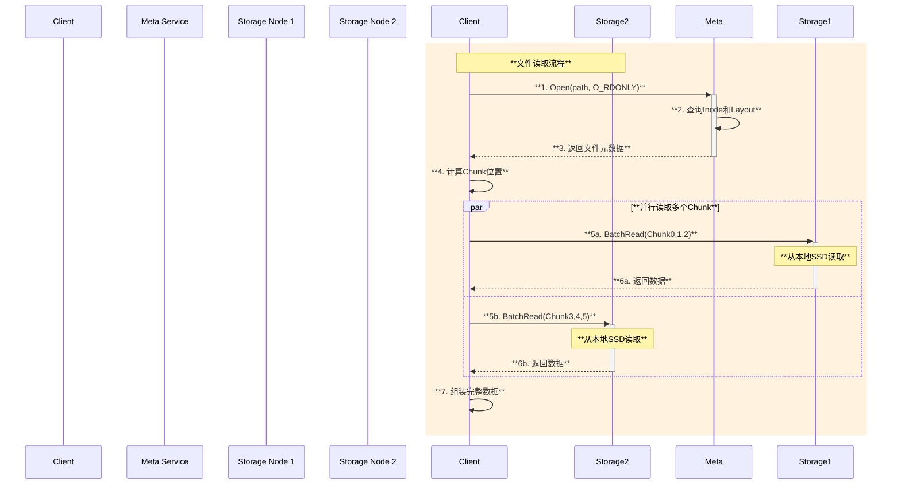

### 4.3 文件写入流程

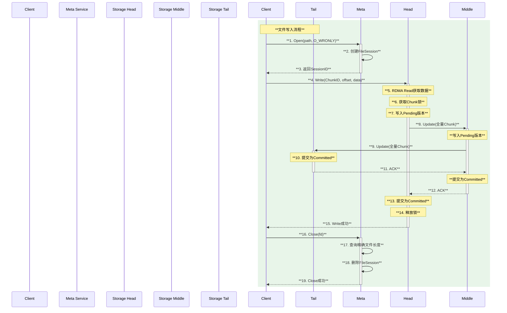

## 5. 使用场景

### 5.1 AI训练场景

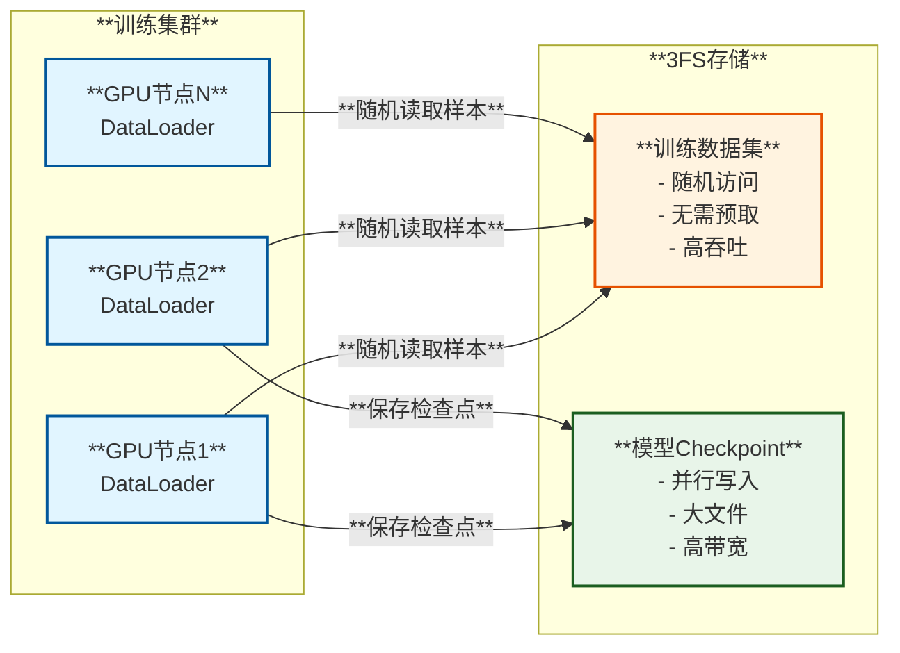

**优势**:
- **随机访问**: 无需数据预取或shuffle
- **高吞吐**: 充分利用SSD和RDMA带宽
- **并行Checkpoint**: 支持大规模并行写入

### 5.2 数据准备场景

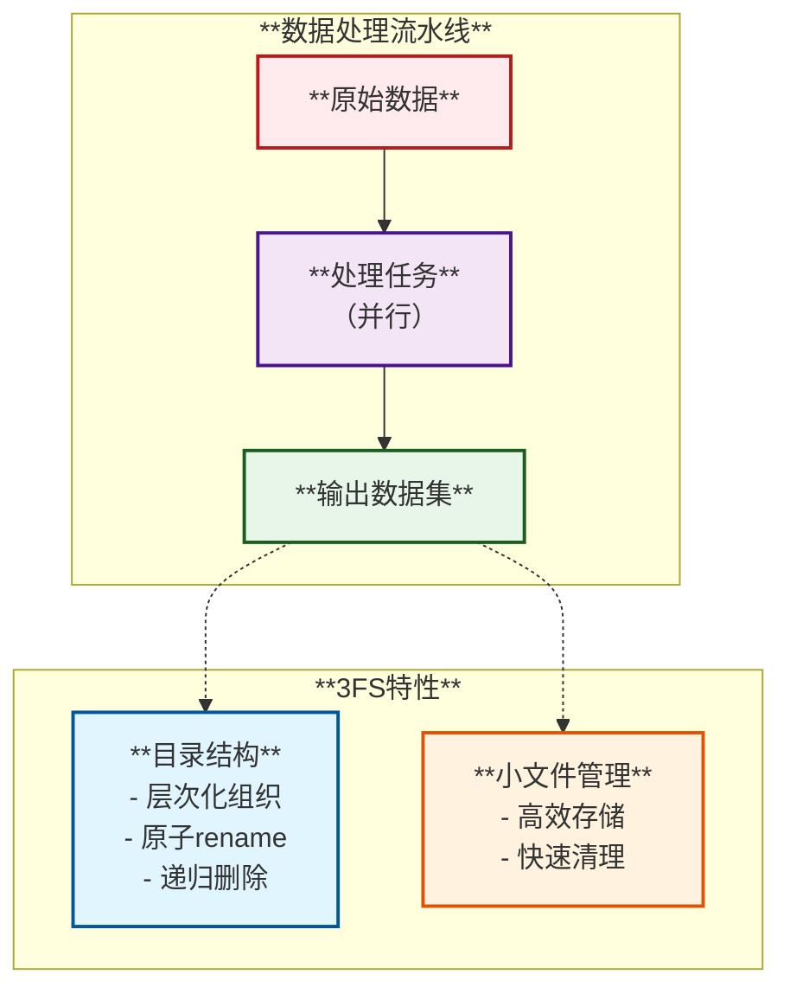

### 5.3 推理KV Cache场景

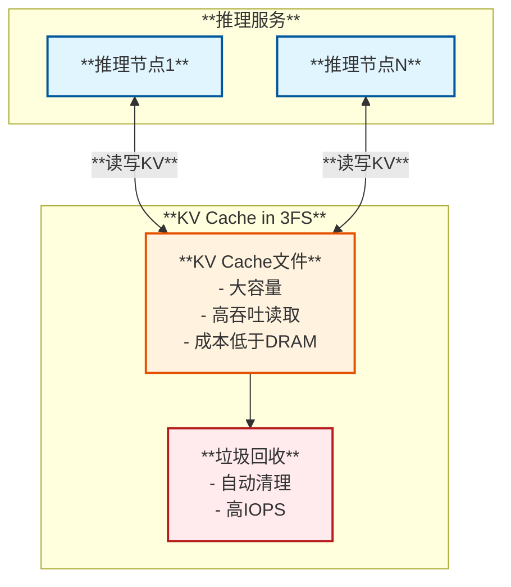

**优势**:
- **大容量**: SSD容量远超DRAM
- **成本效益**: 比DRAM缓存更经济
- **高性能**: 40 GiB/s峰值吞吐

## 6. 与其他文件系统对比

### 6.1 功能对比表

| **特性** | **3FS** | **Lustre** | **CephFS** | **HDFS** |
|---------|---------|-----------|-----------|---------|
| **架构** | 分离式架构，无状态Meta | 集中式元数据 | 分布式元数据 | NameNode + DataNode |
| **一致性** | 强一致性（CRAQ） | 强一致性 | 最终一致性→强一致性 | 强一致性 |
| **元数据存储** | FoundationDB | 单点或HA | Rados（分布式） | NameNode内存+日志 |
| **复制协议** | CRAQ（读任意副本） | 客户端选择 | 主副本 | Pipeline写 |
| **网络** | RDMA优化 | TCP/RDMA | TCP | TCP |
| **小文件性能** | 优秀（事务+批量） | 中等 | 较差 | 较差 |
| **随机读性能** | 极高（RDMA+SSD） | 高 | 中等 | 差 |
| **扩展性** | 水平扩展（无状态） | 受限于元数据服务器 | 水平扩展 | 水平扩展 |
| **接口** | POSIX + Native API | POSIX | POSIX | HDFS API |

### 6.2 性能对比

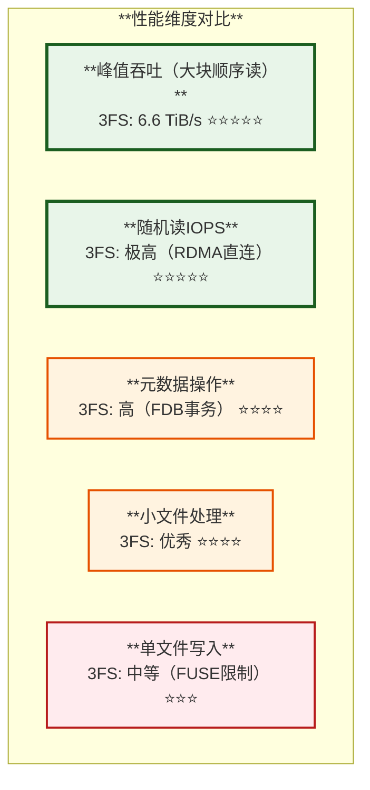

### 6.3 架构差异

**3FS的独特设计**:
1. **无状态元数据服务**: 利用FoundationDB作为唯一的状态存储，Meta服务可随意扩展
2. **CRAQ优化**: Write-All-Read-Any，最大化读取吞吐量
3. **Native Client API**: 零拷贝异步I/O，突破FUSE性能瓶颈
4. **AI工作负载优化**: 针对训练和推理场景的特定优化

**传统文件系统限制**:
- **Lustre**: 元数据服务器是瓶颈
- **CephFS**: 复杂的元数据分片，小文件性能较差
- **HDFS**: 不支持POSIX，NameNode内存限制

## 7. 总结

### 7.1 核心优势

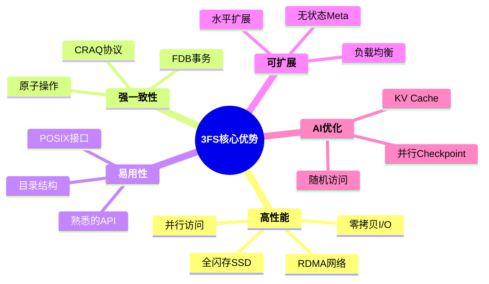

### 7.2 技术亮点

1. **分离式架构**: 计算、元数据、存储完全解耦，独立扩展
2. **CRAQ复制**: 平衡一致性和性能，读取可从任意副本
3. **FoundationDB支撑**: 强事务保证，简化元数据管理
4. **零拷贝I/O**: Native API突破FUSE限制，达到极致性能
5. **RDMA深度集成**: 充分利用现代网络硬件

### 7.3 适用场景

| **场景** | **适用度** | **原因** |
|---------|----------|---------|
| **大规模AI训练** | ⭐⭐⭐⭐⭐ | 随机访问、高吞吐、并行Checkpoint |
| **LLM推理KV Cache** | ⭐⭐⭐⭐⭐ | 大容量、高性能、低成本 |
| **数据预处理** | ⭐⭐⭐⭐⭐ | 目录操作、小文件管理 |
| **通用文件存储** | ⭐⭐⭐⭐ | POSIX兼容、易用 |
| **单文件大规模写** | ⭐⭐⭐ | FUSE写性能限制（可用Native API） |

---

## 附录：关键技术指标

- **集群规模**: 180节点存储集群
- **峰值吞吐**: 6.6 TiB/s（大块读）
- **网络**: 200/400 Gbps InfiniBand
- **存储**: 16×14TB NVMe SSD/节点
- **副本数**: 通常3副本（可配置）
- **ChunkSize**: 可配置（典型4MB）
- **元数据后端**: FoundationDB 7.1+

