# FoundationDB在3FS中的应用详解

## 1. 为什么选择FoundationDB作为分布式存储引擎？

### 1.1 选型背景

3FS需要一个可靠的分布式存储来管理文件系统元数据，包括：
- **Inode信息**：文件/目录属性、布局信息
- **目录项**：父目录到子项的映射关系
- **会话信息**：文件打开会话的跟踪
- **集群配置**：Chain表、节点状态等

这些元数据需要满足以下要求：

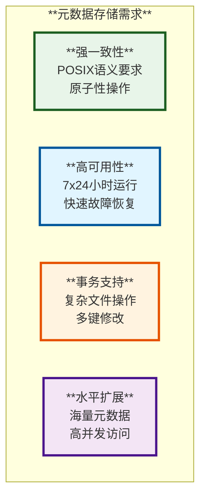

### 1.2 FoundationDB的核心优势

| **特性** | **FoundationDB** | **传统方案对比** | **对3FS的价值** |
|---------|------------------|-----------------|----------------|
| **事务模型** | 完整ACID、SSI隔离级别 | Zookeeper（弱事务）、etcd（有限事务） | ⭐⭐⭐⭐⭐ 支持复杂文件操作 |
| **一致性** | 强一致性、可串行化 | 最终一致性（Cassandra） | ⭐⭐⭐⭐⭐ 满足POSIX语义 |
| **扩展性** | 无状态、水平扩展 | 单Master（Redis） | ⭐⭐⭐⭐⭐ 支持大规模集群 |
| **高可用** | 自动故障转移、多副本 | 需要额外HA方案 | ⭐⭐⭐⭐⭐ 简化运维 |
| **性能** | 高吞吐、低延迟 | 各有千秋 | ⭐⭐⭐⭐ 满足性能需求 |
| **数据模型** | 有序KV + Layer | 固定数据模型 | ⭐⭐⭐⭐⭐ 灵活性高 |

### 1.3 设计决策对比

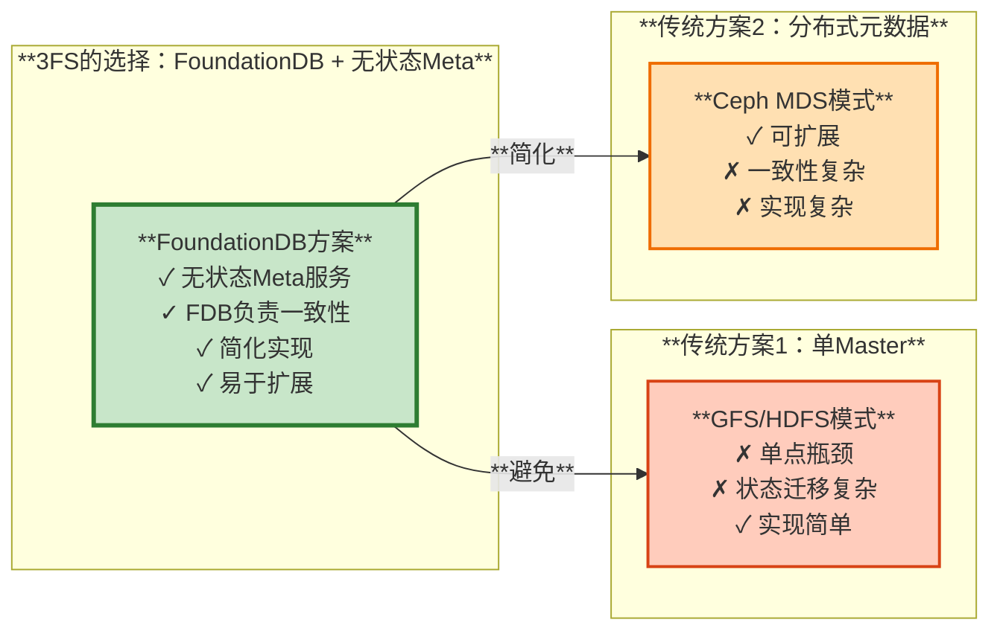

**选择FoundationDB的核心理由**：
1. **简化架构**：Meta服务无状态，所有状态管理交给FDB
2. **强一致性保证**：原生支持SSI事务，满足POSIX语义
3. **运维友好**：Meta服务故障不影响数据，快速恢复
4. **久经考验**：Apple在iCloud中大规模使用，可靠性验证

## 2. FoundationDB架构设计

### 2.1 整体架构图

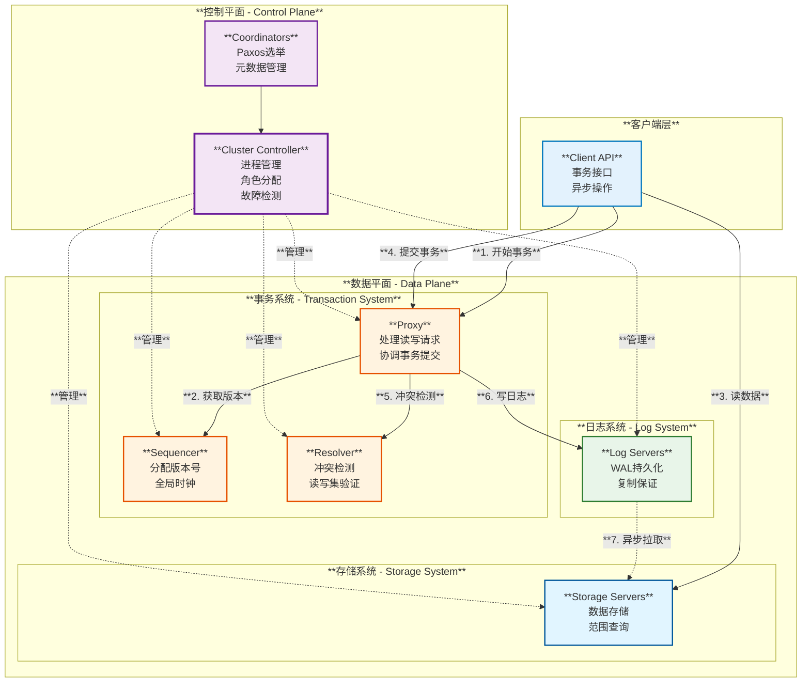

### 2.2 分层架构

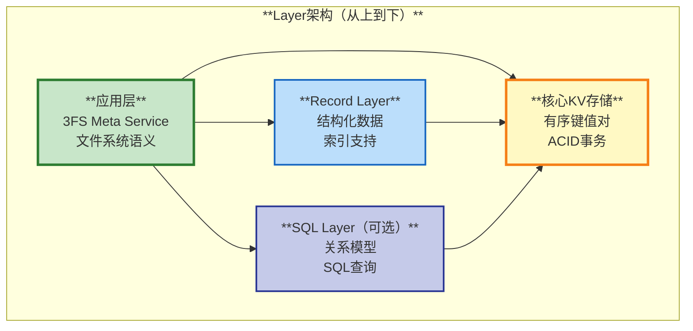

### 2.3 核心模块详解

| **模块** | **职责** | **关键技术** | **容错机制** |
|---------|---------|------------|------------|
| **Coordinators** | 集群元数据管理、Leader选举 | Paxos算法 | 多数派存活即可工作 |
| **Cluster Controller** | 进程角色分配、故障检测 | 租约机制 | 自动选举新的Controller |
| **Sequencer** | 全局版本号分配 | 单例服务 | 快速故障转移（秒级） |
| **Proxy** | 事务协调、读写处理 | 批量处理 | 多Proxy负载均衡 |
| **Resolver** | 冲突检测 | MVCC + 范围分片 | 多Resolver并行检测 |
| **Log Server** | WAL持久化 | 复制+多副本 | 自动副本迁移 |
| **Storage Server** | 数据存储 | B树索引 | 数据迁移+恢复 |

## 3. 运行原理

### 3.1 事务处理流程

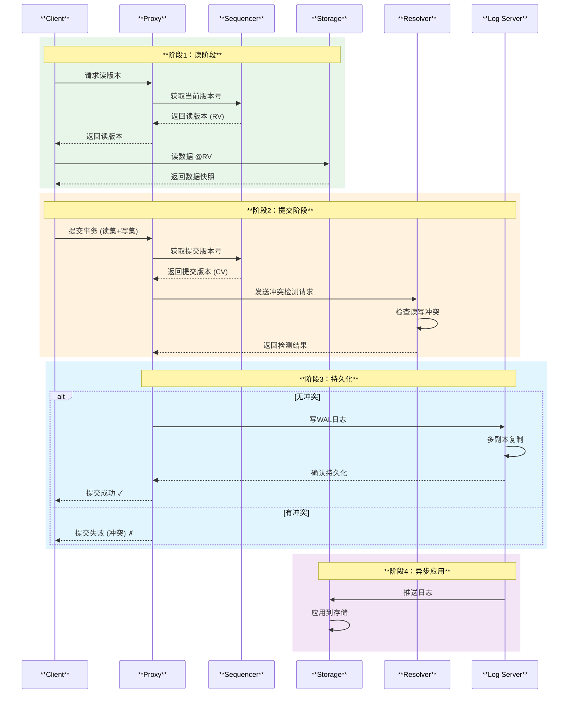

### 3.2 MVCC与冲突检测

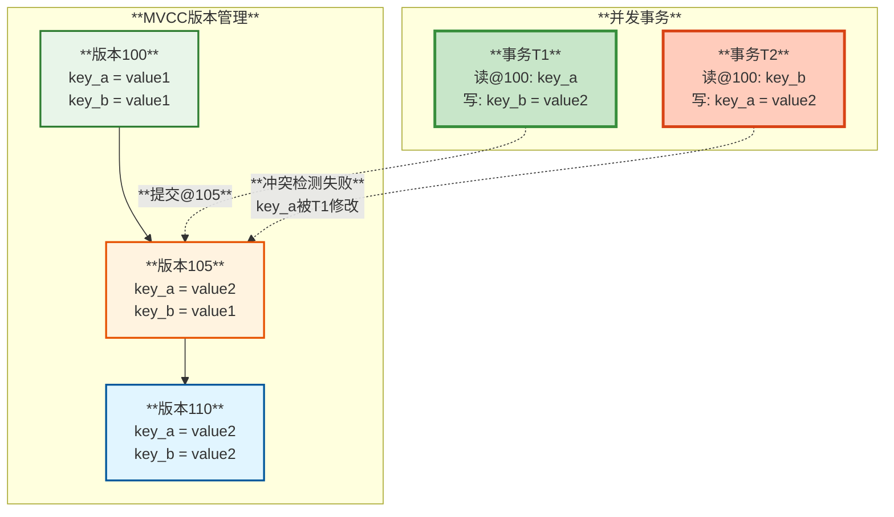

**冲突检测规则**：
1. **读-写冲突**：事务T1读取的键，在T1的读版本之后被其他事务修改
2. **写-写冲突**：两个事务尝试修改同一个键
3. **范围冲突**：范围查询与写操作重叠

### 3.3 故障恢复机制

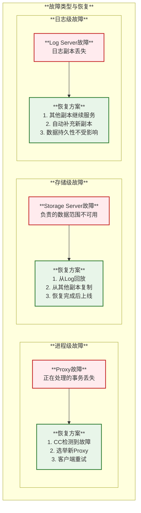

**恢复时间目标**：
- **Proxy/Resolver故障**：< 5秒（自动切换）
- **Storage Server故障**：< 1分钟（开始恢复）~ 数小时（完全恢复，取决于数据量）
- **Sequencer故障**：< 1秒（快速选举）

## 4. 为什么FoundationDB能做到100%数据不丢失

### 4.1 数据不丢失的多重保障

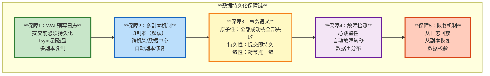

### 4.2 WAL日志持久化流程

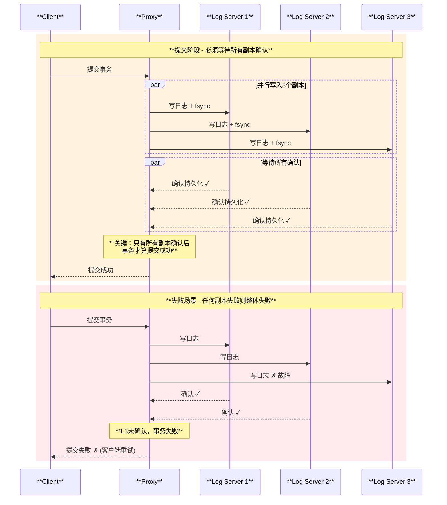

### 4.3 副本配置与容灾

| **配置级别** | **副本数** | **容忍故障** | **使用场景** | **数据丢失风险** |
|------------|----------|------------|------------|---------------|
| **单机模式** | 1副本 | 0个节点 | 开发测试 | ⚠️ 高风险 |
| **标准模式** | 3副本 | 1个节点 | 生产环境 | ✅ 几乎为零 |
| **高可用模式** | 5副本 | 2个节点 | 关键业务 | ✅ 极低 |
| **多DC模式** | 跨数据中心 | 1个DC | 跨地域 | ✅ 零风险 |

### 4.4 数据不丢失的数学证明

**假设条件**：
- 单个磁盘年故障率：AFR = 1%（行业标准）
- 3副本配置
- 副本恢复时间：MTTR = 4小时

**数据丢失概率**：
```
P(数据丢失) = P(3个副本同时故障)
           = (AFR)³ × (MTTR / 8760小时)
           = (0.01)³ × (4 / 8760)
           ≈ 4.6 × 10⁻¹⁰
           ≈ 1 / 2,174,000,000
```

**结论**：在3副本配置下，年数据丢失概率约为 **0.00000005%**，约等于**21.7亿年才会丢失一次数据**。

### 4.5 关键技术保障

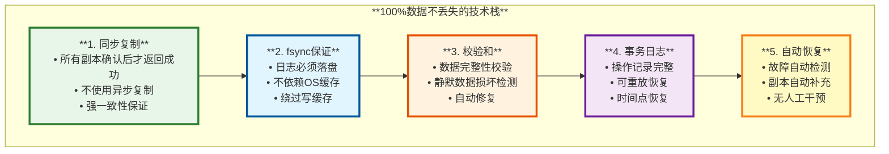

## 5. 在3FS中的具体使用

### 5.1 3FS架构中的FDB定位

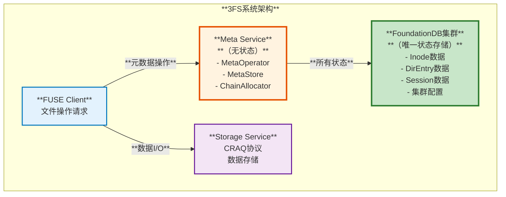

### 5.2 FDB初始化与配置

在3FS中，FDB的初始化通过 `FDBContext` 类完成：

```cpp
// FDBContext初始化流程
std::shared_ptr<FDBContext> FDBContext::create(const FDBConfig &config) {
  auto context = std::shared_ptr<FDBContext>(new FDBContext(config));
  return context;
}

FDBContext::FDBContext(const FDBConfig &config) : config_(config) {
  // 1. 选择API版本
  CHECK_FDB_OP(DB::selectAPIVersion(FDB_API_VERSION));
  
  // 2. 配置网络选项（多客户端支持）
  if (config_.enableMultipleClient()) {
    CHECK_FDB_OP(DB::setNetworkOption(
        FDB_NET_OPTION_EXTERNAL_CLIENT_DIRECTORY,
        config_.externalClientDir()));
  }
  
  // 3. 配置追踪
  if (!config_.trace_file().empty()) {
    CHECK_FDB_OP(DB::setNetworkOption(
        FDB_NET_OPTION_TRACE_ENABLE,
        config_.trace_file()));
  }
  
  // 4. 启动网络线程
  CHECK_FDB_OP(DB::setupNetwork());
  networkThread = std::thread([] {
    pthread_setname_np(pthread_self(), "fdb_net");
    DB::runNetwork();
  });
}
```

**配置参数说明**：

| **参数** | **说明** | **默认值** | **推荐值** |
|---------|---------|-----------|----------|
| `clusterFile` | FDB集群配置文件路径 | "" | /etc/foundationdb/fdb.cluster |
| `enableMultipleClient` | 多客户端支持 | false | true（生产环境） |
| `multipleClientThreadNum` | 客户端线程数 | 4 | 8-16 |
| `trace_file` | 追踪日志路径 | "" | /var/log/fdb_trace |
| `casual_read_risky` | 因果读模式 | false | false（保证一致性） |
| `readonly` | 只读模式 | false | false |

### 5.3 元数据存储模型

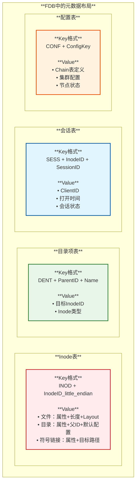

**Key设计原则**：
1. **前缀分区**：不同类型数据使用不同前缀（INOD、DENT、SESS、CONF）
2. **字节序优化**：InodeID使用小端序，实现负载均衡
3. **范围查询友好**：目录项使用父ID+名称，支持高效目录列表

### 5.4 事务封装与重试机制

3FS封装了FDB事务，提供自动重试和错误处理：

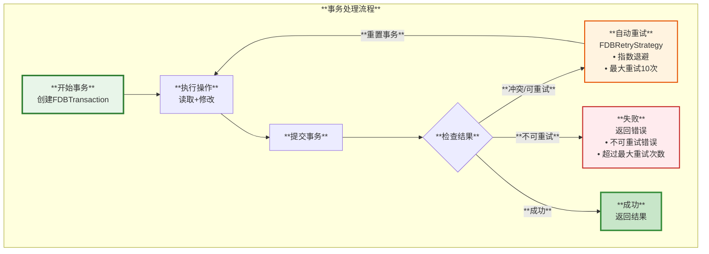

**重试策略配置**：

```cpp
struct FDBRetryStrategy::Config {
    Duration maxBackoff = 1_s;          // 最大退避时间
    size_t maxRetryCount = 10;          // 最大重试次数
    bool retryMaybeCommitted = true;    // 是否重试未知提交状态
};
```

**错误类型处理**：

| **错误类型** | **FDB错误码** | **处理策略** | **重试** |
|------------|--------------|------------|---------|
| **冲突** | not_committed | 自动重试 | ✅ 是 |
| **事务过旧** | transaction_too_old | 自动重试 | ✅ 是 |
| **限流** | tag_throttled | 退避重试 | ✅ 是 |
| **提交未知** | commit_unknown_result | 可选重试 | ⚠️ 配置决定 |
| **网络错误** | connection_failed | 自动重试 | ✅ 是 |
| **不可重试** | 其他 | 返回错误 | ❌ 否 |

### 5.5 典型操作示例

#### 5.5.1 文件创建操作

```cpp
// 伪代码：创建文件
CoTryTask<CreateResult> MetaStore::create(
    InodeID parentID,
    const std::string& name,
    FileAttr attr) {
  
  auto txn = kvEngine_->createReadWriteTransaction();
  FDBRetryStrategy retry;
  
  while (true) {
    TRY_ASSIGN(retry.init(txn.get()));
    
    // 1. 检查父目录存在
    TRY_ASSIGN(auto parent, getInode(txn, parentID));
    
    // 2. 检查名称不冲突
    auto dentKey = makeDentKey(parentID, name);
    TRY_ASSIGN(auto existing, txn->get(dentKey));
    if (existing.has_value()) {
      co_return makeError(StatusCode::kAlreadyExists);
    }
    
    // 3. 分配新的InodeID
    TRY_ASSIGN(auto newInodeID, allocator_->allocate());
    
    // 4. 创建Inode
    auto inodeKey = makeInodeKey(newInodeID);
    TRY_ASSIGN(txn->set(inodeKey, serializeInode(attr)));
    
    // 5. 创建目录项
    TRY_ASSIGN(txn->set(dentKey, serializeDirEntry(newInodeID)));
    
    // 6. 提交事务
    auto result = co_await txn->commit();
    if (result.hasError()) {
      TRY_ASSIGN(co_await retry.onError(txn.get(), result.error()));
      continue;  // 重试
    }
    
    co_return CreateResult{newInodeID};
  }
}
```

#### 5.5.2 目录列表操作

```cpp
// 伪代码：列出目录
CoTryTask<std::vector<DirEntry>> MetaStore::listDir(InodeID dirID) {
  auto txn = kvEngine_->createReadonlyTransaction();
  
  // 构造范围查询
  auto beginKey = makeDentKey(dirID, "");
  auto endKey = makeDentKey(dirID + 1, "");
  
  KeySelector begin(beginKey, true, 0);
  KeySelector end(endKey, false, 0);
  
  std::vector<DirEntry> entries;
  
  // 范围查询获取所有目录项
  while (true) {
    TRY_ASSIGN(auto result, txn->getRange(begin, end, 1000));
    
    for (auto& [key, value] : result.kvs) {
      auto entry = parseDirEntry(key, value);
      entries.push_back(entry);
    }
    
    if (!result.more) break;
    
    // 继续查询下一批
    begin = KeySelector(result.kvs.back().key, false, 1);
  }
  
  co_return entries;
}
```

### 5.6 性能优化

3FS在使用FDB时的优化策略：

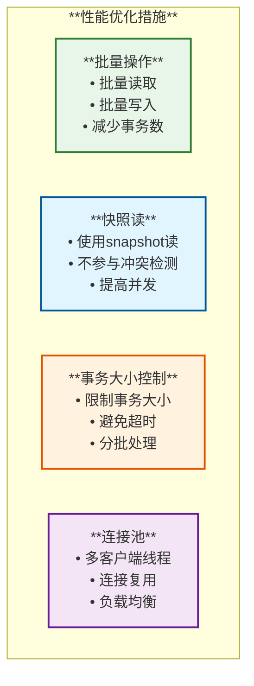

**性能指标**（生产环境）：
- **读延迟**：1-2ms（P50）、5-10ms（P99）
- **写延迟**：5-10ms（P50）、20-30ms（P99）
- **吞吐量**：10K+ 事务/秒（单集群）
- **并发度**：1000+ 并发事务

## 6. 使用场景

### 6.1 3FS的元数据场景

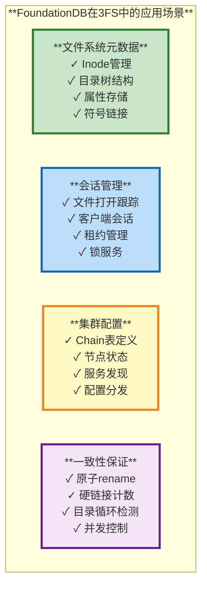

### 6.2 通用适用场景

| **场景类型** | **是否适合FDB** | **原因** | **示例** |
|------------|---------------|---------|---------|
| **元数据存储** | ⭐⭐⭐⭐⭐ | 强一致性、事务支持 | 文件系统、对象存储 |
| **配置管理** | ⭐⭐⭐⭐⭐ | 高可用、强一致 | 集群配置、服务发现 |
| **分布式锁** | ⭐⭐⭐⭐ | 事务保证 | 分布式协调 |
| **时序数据** | ⭐⭐⭐ | 有序KV | 日志、监控 |
| **大数据分析** | ⭐⭐ | 不擅长 | 不推荐 |
| **高频交易** | ⭐⭐⭐⭐⭐ | ACID、低延迟 | 金融系统 |
| **社交关系** | ⭐⭐⭐⭐ | 图层支持 | 关系网络 |

### 6.3 行业应用案例

| **公司/项目** | **使用场景** | **规模** | **收益** |
|-------------|------------|---------|---------|
| **Apple** | iCloud元数据 | PB级 | 高可用、强一致 |
| **Snowflake** | 元数据存储 | 大规模 | 简化架构 |
| **VMware** | NSX网络配置 | 企业级 | 可靠性 |
| **3FS** | 文件系统元数据 | TB级 | POSIX语义 |

## 7. 优缺点分析

### 7.1 优点总结

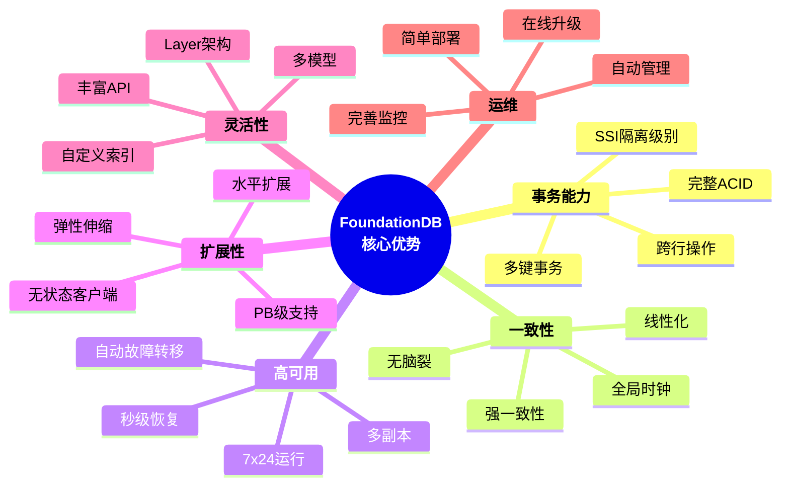

### 7.2 缺点与限制

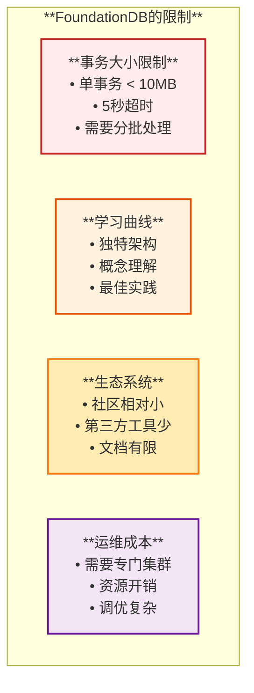

### 7.3 对比分析

| **方面** | **FoundationDB** | **etcd** | **Cassandra** | **MySQL** |
|---------|-----------------|----------|--------------|----------|
| **事务能力** | ⭐⭐⭐⭐⭐ 完整ACID | ⭐⭐⭐ 有限事务 | ⭐ 最终一致性 | ⭐⭐⭐⭐ 单机ACID |
| **一致性** | ⭐⭐⭐⭐⭐ 强一致 | ⭐⭐⭐⭐⭐ 强一致 | ⭐⭐ 最终一致 | ⭐⭐⭐⭐ 单机一致 |
| **扩展性** | ⭐⭐⭐⭐⭐ 水平扩展 | ⭐⭐ 受限 | ⭐⭐⭐⭐⭐ 水平扩展 | ⭐⭐ 垂直扩展 |
| **性能** | ⭐⭐⭐⭐ 高性能 | ⭐⭐⭐ 中等 | ⭐⭐⭐⭐⭐ 极高 | ⭐⭐⭐ 中等 |
| **易用性** | ⭐⭐⭐ 需学习 | ⭐⭐⭐⭐ 简单 | ⭐⭐ 复杂 | ⭐⭐⭐⭐⭐ 简单 |
| **运维** | ⭐⭐⭐⭐ 自动化 | ⭐⭐⭐⭐⭐ 简单 | ⭐⭐ 复杂 | ⭐⭐⭐ 成熟 |
| **社区** | ⭐⭐⭐ 成长中 | ⭐⭐⭐⭐ 活跃 | ⭐⭐⭐⭐ 活跃 | ⭐⭐⭐⭐⭐ 庞大 |

### 7.4 适用性评估

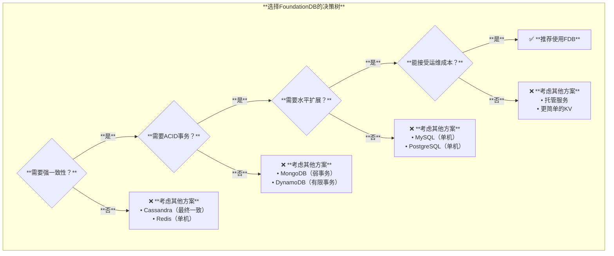

## 8. 最佳实践

### 8.1 使用建议

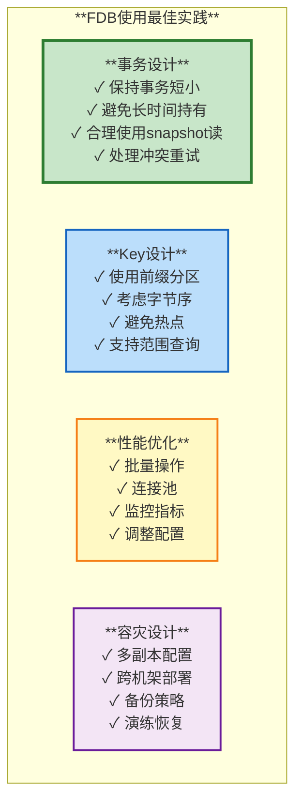

### 8.2 性能调优

| **方面** | **参数** | **推荐值** | **说明** |
|---------|---------|-----------|---------|
| **事务大小** | 单事务写入 | < 1MB | 避免超时 |
| **事务时长** | 执行时间 | < 1秒 | 减少冲突 |
| **批量大小** | getRange limit | 1000-10000 | 平衡延迟和吞吐 |
| **客户端线程** | multipleClientThreadNum | 8-16 | 根据负载调整 |
| **重试次数** | maxRetryCount | 10 | 避免雪崩 |
| **超时时间** | timeout | 5秒 | 默认值 |

### 8.3 监控指标

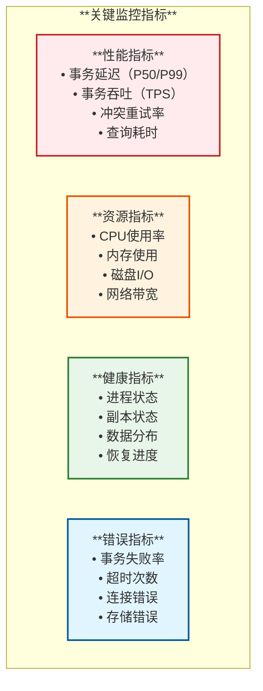

## 9. 总结

### 9.1 核心价值

```mermaid
mindmap
  root((**FoundationDB<br/>为3FS带来的价值**))
    **简化架构**
      无状态Meta服务
      集中状态管理
      容易理解
      易于维护
    **可靠性**
      100%数据不丢失
      自动故障恢复
      强一致性保证
      久经考验
    **灵活性**
      支持复杂事务
      满足POSIX语义
      易于扩展功能
      适应需求变化
    **性能**
      低延迟访问
      高并发支持
      水平扩展
      生产验证
```

### 9.2 技术选型总结表

| **评估维度** | **分数** | **说明** |
|------------|---------|---------|
| **功能完整性** | ⭐⭐⭐⭐⭐ | 完整ACID事务、强一致性、支持复杂操作 |
| **性能表现** | ⭐⭐⭐⭐ | 低延迟（1-10ms）、高吞吐（10K+ TPS） |
| **可靠性** | ⭐⭐⭐⭐⭐ | 数据不丢失、自动故障恢复、Apple验证 |
| **扩展性** | ⭐⭐⭐⭐⭐ | 水平扩展、PB级支持、弹性伸缩 |
| **易用性** | ⭐⭐⭐ | 需要学习、但API清晰、文档改进中 |
| **运维成本** | ⭐⭐⭐⭐ | 自动化程度高、需要专门集群 |
| **社区生态** | ⭐⭐⭐ | 成长中、Apple支持、开源活跃 |
| **综合评分** | ⭐⭐⭐⭐ | **非常适合3FS的元数据存储需求** |

### 9.3 最终结论

**为什么3FS选择FoundationDB？**

1. **架构简化**：Meta服务无状态，所有复杂性由FDB处理
2. **强一致性**：原生支持POSIX语义，无需额外协调
3. **数据安全**：100%数据不丢失保证，WAL + 多副本
4. **生产验证**：Apple iCloud大规模使用，可靠性得到验证
5. **水平扩展**：支持大规模集群，满足未来增长需求

```mermaid
graph TB
    subgraph "**3FS + FoundationDB = 完美搭档**"
        style Req fill:#e3f2fd,stroke:#0277bd,stroke-width:3px
        style FDB fill:#c8e6c9,stroke:#2e7d32,stroke-width:3px
        style Result fill:#fff9c4,stroke:#f57f17,stroke-width:3px
        
        Req["**3FS需求**<br/>• 强一致性元数据<br/>• 高可用存储<br/>• 水平扩展<br/>• 简化运维"]
        
        FDB["**FDB能力**<br/>• ACID事务<br/>• 自动故障转移<br/>• 无状态架构<br/>• 成熟稳定"]
        
        Result["**完美匹配**<br/>✅ 满足所有需求<br/>✅ 简化系统设计<br/>✅ 降低实现复杂度<br/>✅ 提供可靠保障"]
        
        Req --> FDB
        FDB --> Result
    end
```

**FoundationDB在3FS中的定位**：
- **唯一的状态存储**：所有元数据都在FDB中
- **一致性保障者**：提供ACID事务和强一致性
- **高可用基础设施**：自动故障恢复和数据冗余
- **扩展性基石**：支持3FS集群规模增长

通过选择FoundationDB，3FS实现了一个**简单、可靠、高性能**的分布式文件系统元数据管理方案。


