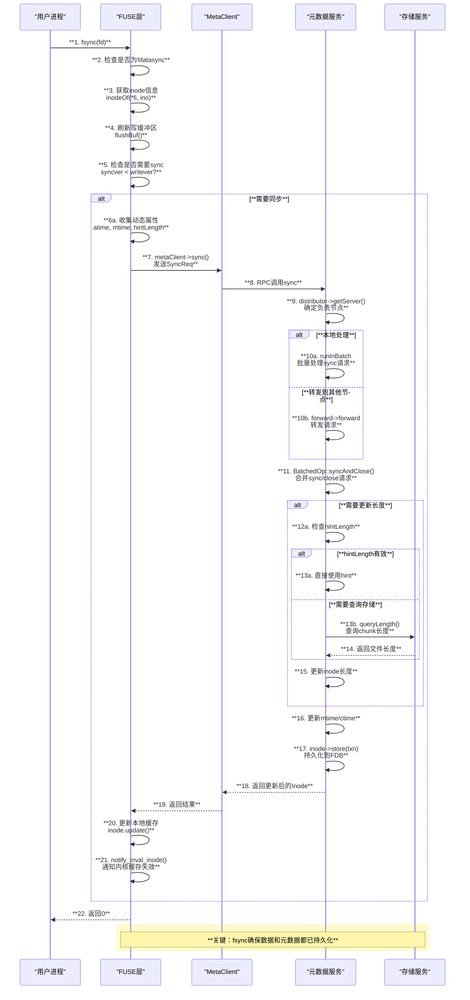
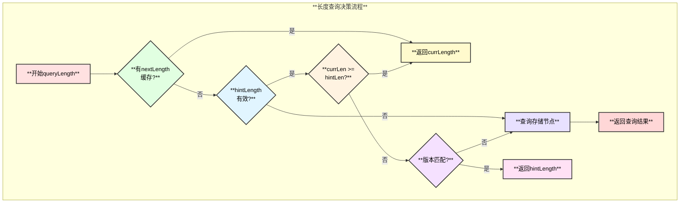
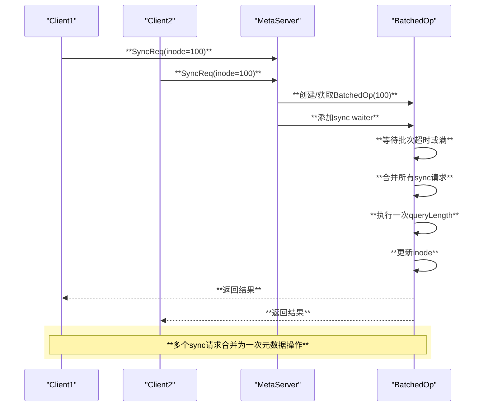

# 3FS fsync 系统调用实现分析

## 1. 总体架构

```mermaid
graph TB
    subgraph "**应用层**"
        A[**用户进程<br/>fsync()/fdatasync()**]
    end
    
    subgraph "**FUSE层**"
        B[**hf3fs_fsync<br/>FUSE回调**]
        C[**flushAndSync<br/>刷新同步**]
        D[**sync()<br/>元数据同步**]
    end
    
    subgraph "**客户端层**"
        E[**MetaClient<br/>元数据客户端**]
    end
    
    subgraph "**元数据层**"
        F[**MetaOperator<br/>元数据服务**]
        G[**BatchedOp<br/>批量操作**]
        H[**FileHelper<br/>文件助手**]
    end
    
    subgraph "**存储层**"
        I[**StorageClient<br/>长度查询**]
    end
    
    A --> B
    B --> C
    C --> D
    D --> E
    E --> F
    F --> G
    G --> H
    H --> I
    
    style A fill:#ffe1e1,stroke:#333,stroke-width:2px,color:#000
    style B fill:#e1ffe1,stroke:#333,stroke-width:2px,color:#000
    style C fill:#e1f5ff,stroke:#333,stroke-width:2px,color:#000
    style D fill:#fff3e1,stroke:#333,stroke-width:2px,color:#000
    style E fill:#f5e1ff,stroke:#333,stroke-width:2px,color:#000
    style F fill:#fffacd,stroke:#333,stroke-width:2px,color:#000
    style G fill:#ffe1f5,stroke:#333,stroke-width:2px,color:#000
    style H fill:#e8e1ff,stroke:#333,stroke-width:2px,color:#000
    style I fill:#ffd7d7,stroke:#333,stroke-width:2px,color:#000
```

## 2. fsync vs fdatasync


| **操作**       | **fsync**              | **fdatasync**          |
|----------------|------------------------|------------------------|
| 刷新写缓冲     | ✓                      | ✓                      |
| 更新文件长度   | 必须更新               | 配置控制               |
| 更新mtime      | ✓                      | 可选                   |
| 更新atime      | ✓                      | 可选                   |

## 3. 核心流程时序图



## 4. 函数调用链

```text
hf3fs_fsync() - src/fuse/FuseOps.cc:1691
├── 日志记录
│   └── XLOGF(OP_LOG_LEVEL, "hf3fs_sync(ino={}, datasync={}, pid={})", ...)
├── 操作计数
│   └── record(datasync ? "fdatasync" : "fsync", fuse_req_ctx(req)->uid)
├── 刷新并同步
│   └── flushAndSync(req, fino, datasync && !config->fdatasync_update_length(), SyncType::Fsync, fi)
│       └── ┌────────────┬────────────────────────┬───────────────────┐
│           │  **参数**   │  **含义**               │  **说明**          │
│           ├────────────┼────────────────────────┼───────────────────┤
│           │  req       │  FUSE请求              │  包含用户信息      │
│           ├────────────┼────────────────────────┼───────────────────┤
│           │  fino      │  fuse inode号          │  文件标识          │
│           ├────────────┼────────────────────────┼───────────────────┤
│           │  flushOnly │  是否仅刷新            │  fdatasync可能true │
│           ├────────────┼────────────────────────┼───────────────────┤
│           │  syncType  │  同步类型              │  Fsync/ForceFsync  │
│           └────────────┴────────────────────────┴───────────────────┘
└── 返回结果
    └── fuse_reply_err(req, 0)

flushAndSync() - src/fuse/FuseOps.cc:596
├── 获取inode
│   └── inodeOf(*fi, ino) - src/fuse/FuseOps.cc:606
├── 检查是否为文件
│   └── pi->inode.isFile()
├── 刷新写缓冲区
│   └── flushBuf(req, pi, wb->off, *wb->memh, wb->len, true) - src/fuse/FuseOps.cc:617
│       └── ┌────────────┬────────────────────────┬───────────────────┐
│           │  **步骤**   │  **操作**               │  **说明**          │
│           ├────────────┼────────────────────────┼───────────────────┤
│           │  1         │  获取wbMtx锁           │  保证线程安全      │
│           ├────────────┼────────────────────────┼───────────────────┤
│           │  2         │  检查wb->len           │  有数据才刷新      │
│           ├────────────┼────────────────────────┼───────────────────┤
│           │  3         │  调用flushBuf          │  发送到存储节点    │
│           ├────────────┼────────────────────────┼───────────────────┤
│           │  4         │  清空wb->len           │  标记缓冲区已刷新  │
│           └────────────┴────────────────────────┴───────────────────┘
├── 检查是否仅刷新
│   └── if (flushOnly) return true
├── 移除dirty标记
│   └── d.dirtyInodes.lock()->erase(ino)
└── 同步元数据
    └── sync(userInfo, *pi, syncType) - src/fuse/FuseOps.cc:632

sync() - src/fuse/FuseOps.cc:517
├── 获取动态属性
│   └── inode.dynamicAttr.rlock()
│       └── ┌────────────┬────────────────────────┬───────────────────┐
│           │  **字段**   │  **含义**               │  **说明**          │
│           ├────────────┼────────────────────────┼───────────────────┤
│           │  written   │  写入版本号            │  每次写入递增      │
│           ├────────────┼────────────────────────┼───────────────────┤
│           │  synced    │  周期同步版本          │  后台同步用        │
│           ├────────────┼────────────────────────┼───────────────────┤
│           │  fsynced   │  fsync版本             │  显式fsync用       │
│           ├────────────┼────────────────────────┼───────────────────┤
│           │  hintLength│  本地长度提示          │  避免查询存储      │
│           ├────────────┼────────────────────────┼───────────────────┤
│           │  atime     │  访问时间              │  本地缓存          │
│           ├────────────┼────────────────────────┼───────────────────┤
│           │  mtime     │  修改时间              │  本地缓存          │
│           └────────────┴────────────────────────┴───────────────────┘
├── 检查是否需要同步
│   └── if (!force && syncver >= writever) return nullopt
├── 准备hintLength
│   └── fsync时可能不使用hint，强制查询实际长度
└── 调用MetaClient::sync
    └── d.metaClient->sync(userInfo, inode.inode.id, true, atime, mtime, hint)

MetaClient::sync() - src/client/meta/MetaClient.cc:941
├── 构造SyncReq
│   └── SyncReq(userInfo, inode, updateLength, atime, mtime, false, hint)
│       └── ┌────────────┬────────────────────────┬───────────────────┐
│           │  **字段**   │  **含义**               │  **说明**          │
│           ├────────────┼────────────────────────┼───────────────────┤
│           │  inode     │  目标inode ID          │  要同步的文件      │
│           ├────────────┼────────────────────────┼───────────────────┤
│           │  updateLength│ 是否更新长度         │  fsync=true        │
│           ├────────────┼────────────────────────┼───────────────────┤
│           │  atime     │  访问时间              │  可选              │
│           ├────────────┼────────────────────────┼───────────────────┤
│           │  mtime     │  修改时间              │  可选              │
│           ├────────────┼────────────────────────┼───────────────────┤
│           │  hint      │  长度提示              │  优化查询          │
│           └────────────┴────────────────────────┴───────────────────┘
└── 发送请求
    └── retry(&IMetaServiceStub::sync, req)

MetaOperator::sync() - src/meta/service/MetaOperator.cc:319
├── 确定负责节点
│   └── distributor_->getServer(req.inode)
├── 本地处理
│   └── runInBatch<SyncReq, SyncRsp>(inodeId, std::move(req))
└── 转发请求
    └── forward_->forward<SyncReq, SyncRsp>(node, std::move(req))

BatchedOp::run() - src/meta/store/ops/BatchOperation.cc:57
├── 检查分布
│   └── distributor().checkOnServer(txn, inodeId_)
├── 加载inode
│   └── Inode::snapshotLoad(txn, inodeId_)
├── 处理sync和close
│   └── syncAndClose(txn, *inode)
├── 处理setAttr
│   └── setAttr(txn, *inode)
└── 持久化
    └── inode->store(txn)

BatchedOp::syncAndClose() - src/meta/store/ops/BatchOperation.cc:107
├── 合并所有sync请求
│   └── for (auto &waiter : syncs_) sync(inode, waiter.get().req, ...)
├── 合并所有close请求
│   └── for (auto &waiter : closes_) close(inode, waiter.get().req, ...)
├── 查询文件长度
│   └── queryLength(inode, hintLength, truncate) - src/meta/store/ops/BatchOperation.cc:260
│       └── ┌────────────┬────────────────────────┬───────────────────┐
│           │  **优化**   │  **条件**               │  **说明**          │
│           ├────────────┼────────────────────────┼───────────────────┤
│           │  跳过查询  │  currLen>=hintLen      │  当前长度足够大    │
│           ├────────────┼────────────────────────┼───────────────────┤
│           │  使用hint  │  hint.truncVer==curr   │  版本匹配时        │
│           ├────────────┼────────────────────────┼───────────────────┤
│           │  查询存储  │  需要精确长度          │  truncate后必须    │
│           └────────────┴────────────────────────┴───────────────────┘
├── 更新文件长度
│   └── inode.asFile().setVersionedLength(*newLength)
└── 更新时间戳
    └── SetAttr::update(inode.mtime, UtcClock::now(), ...)

FileHelper::queryLength() - src/meta/components/FileHelper.cc:88
├── 创建FileOperation
│   └── FileOperation fop(*storageClient_, *rawRoutingInfo, userInfo, inode, recorder)
├── 查询所有chunk
│   └── fop.queryChunks(hasHole != nullptr, config_.dynamic_stripe())
│       └── ┌────────────┬────────────────────────┬───────────────────┐
│           │  **返回**   │  **字段**               │  **说明**          │
│           ├────────────┼────────────────────────┼───────────────────┤
│           │  length    │  文件实际长度          │  最大chunk偏移+长度 │
│           ├────────────┼────────────────────────┼───────────────────┤
│           │  totalChunkLen│ chunk总长度        │  检测空洞用        │
│           ├────────────┼────────────────────────┼───────────────────┤
│           │  totalNumChunks│ chunk总数         │  验证完整性        │
│           └────────────┴────────────────────────┴───────────────────┘
└── 返回长度
    └── co_return queryResult->length
```

## 5. 关键数据结构

### 5.1 RcInode::DynamicAttr

| **字段**       | **类型**               | **说明**                |
|----------------|------------------------|------------------------|
| written        | uint64_t               | 写入操作版本号          |
| synced         | uint64_t               | 周期同步版本号          |
| fsynced        | uint64_t               | fsync同步版本号         |
| writer         | flat::Uid              | 最后写入者UID           |
| dynStripe      | uint32_t               | 动态stripe数            |
| truncateVer    | uint64_t               | 截断版本号              |
| hintLength     | optional<VersionedLength> | 本地长度提示         |
| atime          | optional<UtcTime>      | 本地访问时间            |
| mtime          | optional<UtcTime>      | 本地修改时间            |

### 5.2 SyncReq

| **字段**       | **类型**               | **说明**                |
|----------------|------------------------|------------------------|
| user           | UserInfo               | 用户信息                |
| inode          | InodeId                | 目标inode               |
| updateLength   | bool                   | 是否更新长度            |
| atime          | optional<UtcTime>      | 访问时间                |
| mtime          | optional<UtcTime>      | 修改时间                |
| truncated      | bool                   | 是否截断操作            |
| hint           | optional<VersionedLength> | 长度提示             |

### 5.3 VersionedLength

| **字段**       | **类型**               | **说明**                |
|----------------|------------------------|------------------------|
| length         | uint64_t               | 文件长度                |
| truncateVer    | uint64_t               | 截断版本号              |

## 6. 同步类型


| **类型**       | **触发场景**           | **行为差异**            |
|----------------|------------------------|------------------------|
| Lookup         | 目录项查找             | 不通知缓存失效          |
| GetAttr        | stat系统调用           | 不通知缓存失效          |
| PeriodSync     | 后台定时器             | 更新synced版本          |
| Fsync          | fsync系统调用          | 更新fsynced版本         |
| ForceFsync     | ioctl强制同步          | 忽略版本检查            |

## 7. 长度查询优化



### 7.1 hintLength机制

- **来源**：客户端在`finishWrite`时更新本地hintLength
- **格式**：`{length, truncateVer}` 带版本号的长度
- **用途**：避免每次sync都查询存储节点

### 7.2 优化条件

| **条件**                              | **动作**        |
|---------------------------------------|-----------------|
| `currLen >= hintLen` 且版本匹配        | 跳过查询        |
| `hintLen > currLen` 且版本匹配         | 使用hint        |
| 版本不匹配或无hint                     | 查询存储        |
| truncate操作后                         | 强制查询        |

## 8. 批量处理机制



## 9. 性能特点

| **特性**           | **实现方式**           | **性能影响**            |
|--------------------|------------------------|------------------------|
| hintLength优化     | 客户端缓存长度提示      | 减少存储查询           |
| 批量处理           | BatchedOp合并请求       | 减少FDB事务           |
| 版本号检查         | syncver/writever比较   | 避免无效同步           |
| 请求转发           | distributor分片        | 负载均衡               |
| 后台周期同步       | periodicSync定时器      | 延迟元数据更新         |

## 10. 关键配置项

| **配置项**                    | **说明**                          |
|-------------------------------|-----------------------------------|
| fsync_length_hint             | fsync是否使用length hint          |
| fdatasync_update_length       | fdatasync是否更新文件长度         |
| ignore_length_hint            | 是否忽略length hint强制查询       |
| time_granularity              | 时间戳精度                        |
| flush_on_stat                 | stat时是否刷新缓冲                |

