# 3FS服务间通信机制详解（Serde框架）

## 重要说明

**3FS并未使用gRPC**，而是实现了一套自定义的高性能RPC框架，称为**Serde框架**。该框架针对RDMA网络和高性能存储场景进行了深度优化。

## 1. 概述

### 1.1 为什么不用gRPC？

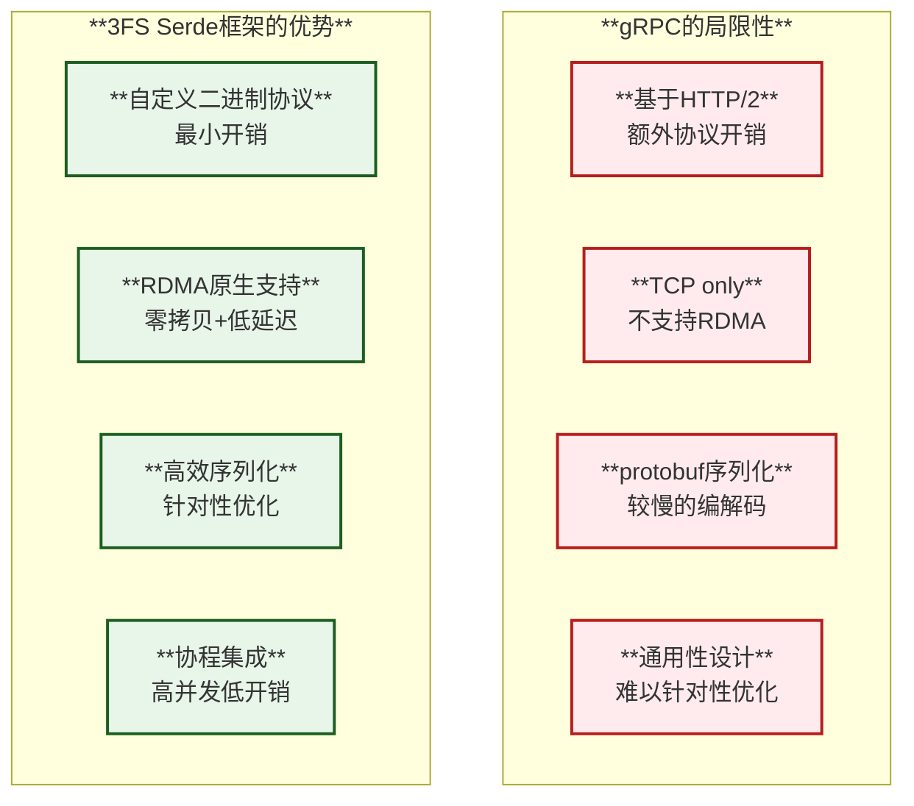
```mermaid
graph TB
    subgraph "**gRPC的局限性**"
        style L1 fill:#ffebee,stroke:#b71c1c,stroke-width:2px
        style L2 fill:#ffebee,stroke:#b71c1c,stroke-width:2px
        style L3 fill:#ffebee,stroke:#b71c1c,stroke-width:2px
        style L4 fill:#ffebee,stroke:#b71c1c,stroke-width:2px
        
        L1["**基于HTTP/2**<br/>额外协议开销"]
        L2["**TCP only**<br/>不支持RDMA"]
        L3["**protobuf序列化**<br/>较慢的编解码"]
        L4["**通用性设计**<br/>难以针对性优化"]
    end
    
    subgraph "**3FS Serde框架的优势**"
        style A1 fill:#e8f5e9,stroke:#1b5e20,stroke-width:2px
        style A2 fill:#e8f5e9,stroke:#1b5e20,stroke-width:2px
        style A3 fill:#e8f5e9,stroke:#1b5e20,stroke-width:2px
        style A4 fill:#e8f5e9,stroke:#1b5e20,stroke-width:2px
        
        A1["**自定义二进制协议**<br/>最小开销"]
        A2["**RDMA原生支持**<br/>零拷贝+低延迟"]
        A3["**高效序列化**<br/>针对性优化"]
        A4["**协程集成**<br/>高并发低开销"]
    end
```

### 1.2 Serde框架特点

- **双网络支持**: TCP和RDMA（InfiniBand/RoCE）
- **协程驱动**: 基于folly::coro实现异步非阻塞
- **零拷贝**: RDMA直接读写远程内存
- **类型安全**: 编译期生成服务存根
- **高性能序列化**: 自定义二进制格式

## 2. 架构设计

### 2.1 整体架构图

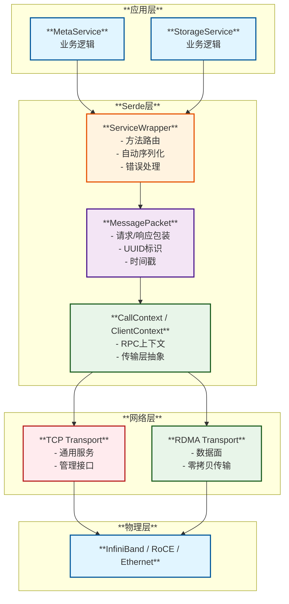
```mermaid
graph TB
    subgraph "**应用层**"
        style Service1 fill:#e1f5ff,stroke:#01579b,stroke-width:2px
        style Service2 fill:#e1f5ff,stroke:#01579b,stroke-width:2px
        Service1["**MetaService**<br/>业务逻辑"]
        Service2["**StorageService**<br/>业务逻辑"]
    end
    
    subgraph "**Serde层**"
        style Wrapper fill:#fff3e0,stroke:#e65100,stroke-width:2px
        style Packet fill:#f3e5f5,stroke:#4a148c,stroke-width:2px
        style Context fill:#e8f5e9,stroke:#1b5e20,stroke-width:2px
        
        Wrapper["**ServiceWrapper**<br/>- 方法路由<br/>- 自动序列化<br/>- 错误处理"]
        Packet["**MessagePacket**<br/>- 请求/响应包装<br/>- UUID标识<br/>- 时间戳"]
        Context["**CallContext / ClientContext**<br/>- RPC上下文<br/>- 传输层抽象"]
    end
    
    subgraph "**网络层**"
        style TCP fill:#ffebee,stroke:#b71c1c,stroke-width:2px
        style RDMA fill:#e8f5e9,stroke:#1b5e20,stroke-width:2px
        
        TCP["**TCP Transport**<br/>- 通用服务<br/>- 管理接口"]
        RDMA["**RDMA Transport**<br/>- 数据面<br/>- 零拷贝传输"]
    end
    
    subgraph "**物理层**"
        style Net fill:#e1f5ff,stroke:#01579b,stroke-width:2px
        Net["**InfiniBand / RoCE / Ethernet**"]
    end
    
    Service1 --> Wrapper
    Service2 --> Wrapper
    Wrapper --> Packet
    Packet --> Context
    Context --> TCP
    Context --> RDMA
    TCP --> Net
    RDMA --> Net
```

### 2.2 核心模块关系

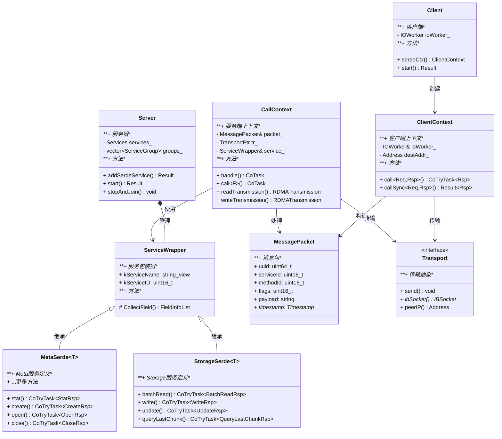
```mermaid
classDiagram
    class ServiceWrapper {
        **+ 服务包装器**
        + kServiceName: string_view
        + kServiceID: uint16_t
        
        **+ 方法**
        # CollectField() FieldInfoList
    }
    
    class MetaSerde~T~ {
        **+ Meta服务定义**
        + stat() CoTryTask~StatRsp~
        + create() CoTryTask~CreateRsp~
        + open() CoTryTask~OpenRsp~
        + close() CoTryTask~CloseRsp~
        + ...更多方法
    }
    
    class StorageSerde~T~ {
        **+ Storage服务定义**
        + batchRead() CoTryTask~BatchReadRsp~
        + write() CoTryTask~WriteRsp~
        + update() CoTryTask~UpdateRsp~
        + queryLastChunk() CoTryTask~QueryLastChunkRsp~
    }
    
    class CallContext {
        **+ 服务端上下文**
        - MessagePacket& packet_
        - TransportPtr tr_
        - ServiceWrapper& service_
        
        **+ 方法**
        + handle() CoTask
        + call~F~() CoTask
        + readTransmission() RDMATransmission
        + writeTransmission() RDMATransmission
    }
    
    class ClientContext {
        **+ 客户端上下文**
        - IOWorker& ioWorker_
        - Address destAddr_
        
        **+ 方法**
        + call~Req,Rsp~() CoTryTask~Rsp~
        + callSync~Req,Rsp~() Result~Rsp~
    }
    
    class MessagePacket {
        **+ 消息包**
        + uuid: uint64_t
        + serviceId: uint16_t
        + methodId: uint16_t
        + flags: uint16_t
        + payload: string
        + timestamp: Timestamp*
    }
    
    class Transport {
        **+ 传输抽象**
        <<interface>>
        + send() void
        + ibSocket() IBSocket*
        + peerIP() Address
    }
    
    class Server {
        **+ 服务器**
        - Services services_
        - vector~ServiceGroup~ groups_
        
        **+ 方法**
        + addSerdeService() Result
        + start() Result
        + stopAndJoin() void
    }
    
    class Client {
        **+ 客户端**
        - IOWorker ioWorker_
        
        **+ 方法**
        + serdeCtx() ClientContext
        + start() Result
    }
    
    ServiceWrapper <|-- MetaSerde : 继承
    ServiceWrapper <|-- StorageSerde : 继承
    
    CallContext --> ServiceWrapper : 使用
    CallContext --> MessagePacket : 处理
    CallContext --> Transport : 传输
    
    ClientContext --> MessagePacket : 构造
    ClientContext --> Transport : 传输
    
    Server *-- ServiceWrapper : 管理
    Client --> ClientContext : 创建
```

## 3. RPC调用流程

### 3.1 完整的RPC时序图

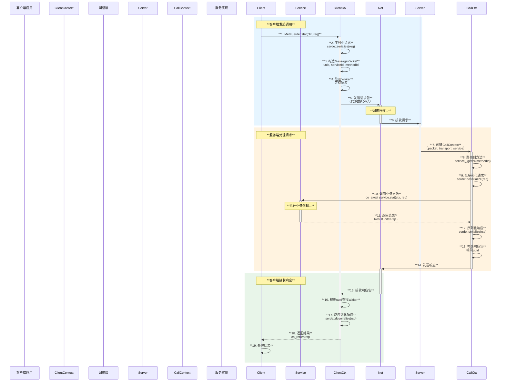
```mermaid
sequenceDiagram
    participant **Client** as 客户端应用
    participant **ClientCtx** as ClientContext
    participant **Net** as 网络层
    participant **Server** as Server
    participant **CallCtx** as CallContext
    participant **Service** as 服务实现
    
    rect rgb(230, 245, 255)
    Note over Client,Service: **客户端发起调用**
    Client->>+ClientCtx: **1. MetaSerde::stat(ctx, req)**
    ClientCtx->>ClientCtx: **2. 序列化请求**<br/>serde::serialize(req)
    ClientCtx->>ClientCtx: **3. 构造MessagePacket**<br/>uuid, serviceId, methodId
    ClientCtx->>ClientCtx: **4. 注册Waiter**<br/>等待响应
    ClientCtx->>+Net: **5. 发送请求包**<br/>（TCP或RDMA）
    Note over Net: **网络传输...**
    Net->>+Server: **6. 接收请求**
    deactivate Net
    end
    
    rect rgb(255, 243, 224)
    Note over Client,Service: **服务端处理请求**
    Server->>+CallCtx: **7. 创建CallContext**<br/>（packet, transport, service）
    CallCtx->>CallCtx: **8. 路由到方法**<br/>service_.getter(methodId)
    CallCtx->>CallCtx: **9. 反序列化请求**<br/>serde::deserialize(req)
    CallCtx->>+Service: **10. 调用业务方法**<br/>co_await service.stat(ctx, req)
    Note over Service: **执行业务逻辑...**
    Service-->>-CallCtx: **11. 返回结果**<br/>Result~StatRsp~
    CallCtx->>CallCtx: **12. 序列化响应**<br/>serde::serialize(rsp)
    CallCtx->>CallCtx: **13. 构造响应包**<br/>相同uuid
    CallCtx->>+Net: **14. 发送响应**
    deactivate CallCtx
    deactivate Server
    end
    
    rect rgb(232, 245, 233)
    Note over Client,Service: **客户端接收响应**
    Net->>ClientCtx: **15. 接收响应包**
    deactivate Net
    ClientCtx->>ClientCtx: **16. 根据uuid查找Waiter**
    ClientCtx->>ClientCtx: **17. 反序列化响应**<br/>serde::deserialize(rsp)
    ClientCtx-->>-Client: **18. 返回结果**<br/>co_return rsp
    Client->>Client: **19. 处理结果**
    end
```

### 3.2 服务端方法分发

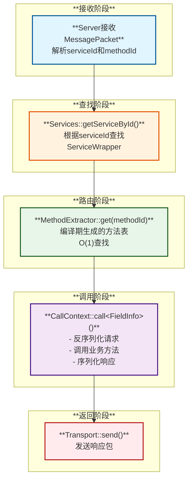
```mermaid
graph TB
    subgraph "**接收阶段**"
        style Recv fill:#e1f5ff,stroke:#01579b,stroke-width:2px
        Recv["**Server接收MessagePacket**<br/>解析serviceId和methodId"]
    end
    
    subgraph "**查找阶段**"
        style Lookup fill:#fff3e0,stroke:#e65100,stroke-width:2px
        Lookup["**Services::getServiceById()**<br/>根据serviceId查找ServiceWrapper"]
    end
    
    subgraph "**路由阶段**"
        style Route fill:#e8f5e9,stroke:#1b5e20,stroke-width:2px
        Route["**MethodExtractor::get(methodId)**<br/>编译期生成的方法表<br/>O(1)查找"]
    end
    
    subgraph "**调用阶段**"
        style Call fill:#f3e5f5,stroke:#4a148c,stroke-width:2px
        Call["**CallContext::call&lt;FieldInfo&gt;()**<br/>- 反序列化请求<br/>- 调用业务方法<br/>- 序列化响应"]
    end
    
    subgraph "**返回阶段**"
        style Send fill:#ffebee,stroke:#b71c1c,stroke-width:2px
        Send["**Transport::send()**<br/>发送响应包"]
    end
    
    Recv --> Lookup
    Lookup --> Route
    Route --> Call
    Call --> Send
```

**关键特点**:
- **编译期生成**: 方法表在编译时构建，无运行时开销
- **O(1)路由**: 直接数组索引，无哈希或查找
- **类型安全**: 编译期检查参数和返回类型

### 3.3 RDMA零拷贝传输

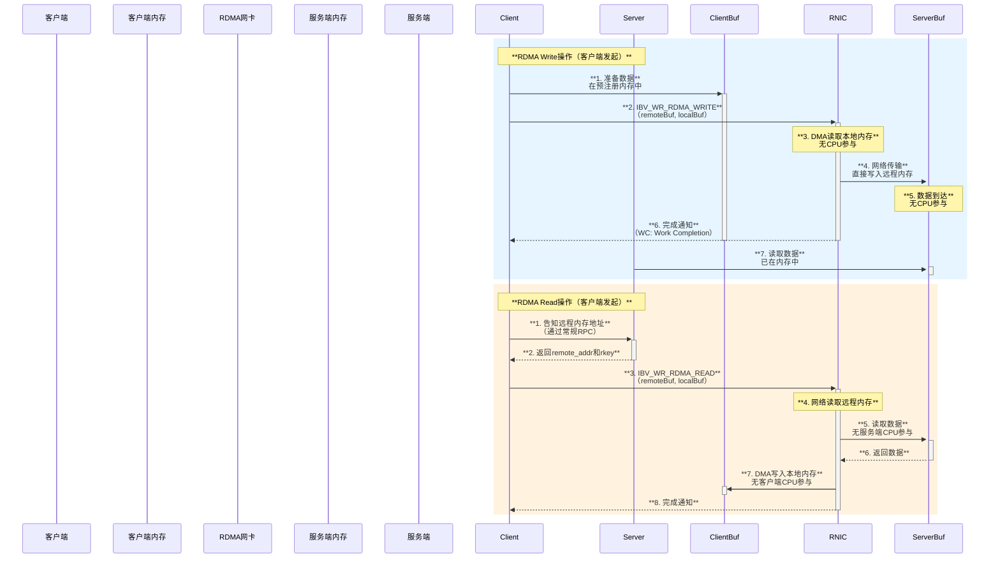
```mermaid
sequenceDiagram
    participant **Client** as 客户端
    participant **ClientBuf** as 客户端内存
    participant **RNIC** as RDMA网卡
    participant **ServerBuf** as 服务端内存
    participant **Server** as 服务端
    
    rect rgb(230, 245, 255)
    Note over Client,Server: **RDMA Write操作（客户端发起）**
    Client->>+ClientBuf: **1. 准备数据**<br/>在预注册内存中
    Client->>+RNIC: **2. IBV_WR_RDMA_WRITE**<br/>（remoteBuf, localBuf）
    Note over RNIC: **3. DMA读取本地内存**<br/>无CPU参与
    RNIC->>+ServerBuf: **4. 网络传输**<br/>直接写入远程内存
    Note over ServerBuf: **5. 数据到达**<br/>无CPU参与
    RNIC-->>-Client: **6. 完成通知**<br/>（WC: Work Completion）
    deactivate ClientBuf
    Server->>+ServerBuf: **7. 读取数据**<br/>已在内存中
    deactivate ServerBuf
    end
    
    rect rgb(255, 243, 224)
    Note over Client,Server: **RDMA Read操作（客户端发起）**
    Client->>+Server: **1. 告知远程内存地址**<br/>（通过常规RPC）
    Server-->>-Client: **2. 返回remote_addr和rkey**
    Client->>+RNIC: **3. IBV_WR_RDMA_READ**<br/>（remoteBuf, localBuf）
    Note over RNIC: **4. 网络读取远程内存**
    RNIC->>+ServerBuf: **5. 读取数据**<br/>无服务端CPU参与
    ServerBuf-->>-RNIC: **6. 返回数据**
    RNIC->>+ClientBuf: **7. DMA写入本地内存**<br/>无客户端CPU参与
    deactivate ClientBuf
    RNIC-->>-Client: **8. 完成通知**
    end
```

**RDMA优势**:
- **零CPU拷贝**: 数据直接在内存和网卡间传输
- **低延迟**: 绕过内核协议栈，微秒级延迟
- **高带宽**: 充分利用200/400 Gbps网络

## 4. 关键技术实现

### 4.1 服务定义（SERDE宏）

```cpp
// 定义服务（src/fbs/meta/Service.h）
SERDE_SERVICE(MetaSerde, 1)  // 服务名，服务ID
{
  // 定义方法：名称，方法ID，请求类型，响应类型
  SERDE_SERVICE_METHOD(stat, 1, StatReq, StatRsp);
  SERDE_SERVICE_METHOD(create, 2, CreateReq, CreateRsp);
  SERDE_SERVICE_METHOD(open, 3, OpenReq, OpenRsp);
  SERDE_SERVICE_METHOD(close, 4, CloseReq, CloseRsp);
  // ... 更多方法
};

// 宏展开后生成：
// 1. 方法ID常量
// 2. 客户端调用函数（异步和同步版本）
// 3. 反射信息（用于服务端路由）
```

### 4.2 服务实现

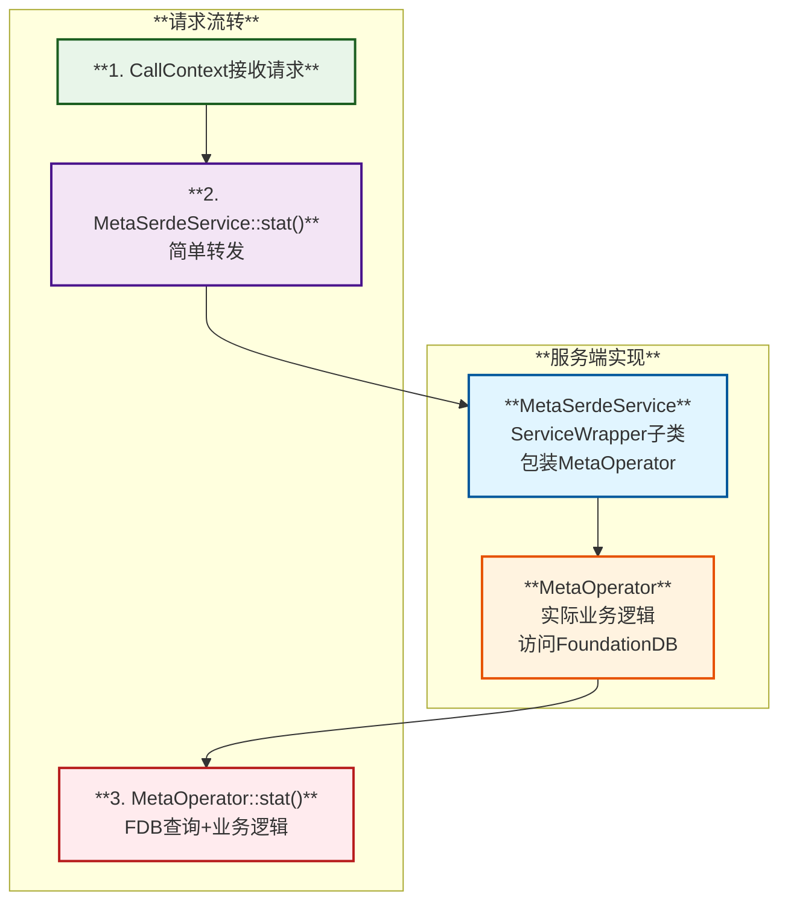
```mermaid
graph TB
    subgraph "**服务端实现**"
        style Impl1 fill:#e1f5ff,stroke:#01579b,stroke-width:2px
        style Impl2 fill:#fff3e0,stroke:#e65100,stroke-width:2px
        
        Impl1["**MetaSerdeService**<br/>ServiceWrapper子类<br/>包装MetaOperator"]
        
        Impl2["**MetaOperator**<br/>实际业务逻辑<br/>访问FoundationDB"]
    end
    
    subgraph "**请求流转**"
        style Flow1 fill:#e8f5e9,stroke:#1b5e20,stroke-width:2px
        style Flow2 fill:#f3e5f5,stroke:#4a148c,stroke-width:2px
        style Flow3 fill:#ffebee,stroke:#b71c1c,stroke-width:2px
        
        Flow1["**1. CallContext接收请求**"]
        Flow2["**2. MetaSerdeService::stat()**<br/>简单转发"]
        Flow3["**3. MetaOperator::stat()**<br/>FDB查询+业务逻辑"]
    end
    
    Flow1 --> Flow2
    Flow2 --> Impl1
    Impl1 --> Impl2
    Impl2 --> Flow3
```

```cpp
// 服务包装器（src/meta/service/MetaSerdeService.h）
class MetaSerdeService : public serde::ServiceWrapper<MetaSerdeService, MetaSerde> {
 public:
  MetaSerdeService(MetaOperator &meta) : meta_(meta) {}
  
  // 宏简化方法定义
  #define META_SERVICE_METHOD(NAME, REQ, RESP) \
    CoTryTask<RESP> NAME(serde::CallContext &, const REQ &req) { \
      return meta_.NAME(req); \
    }
  
  META_SERVICE_METHOD(stat, StatReq, StatRsp);
  META_SERVICE_METHOD(create, CreateReq, CreateRsp);
  // ...
  
 private:
  MetaOperator &meta_;  // 实际业务逻辑
};
```

### 4.3 客户端调用

```cpp
// 客户端代码示例
class MetaClient {
 public:
  CoTryTask<StatRsp> stat(const StatReq &req) {
    // 自动选择可用的Meta服务
    auto ctx = mgmtdClient_->getMetaSerdeContext();
    
    // 调用生成的方法
    co_return co_await MetaSerde<>::stat(ctx, req);
  }
};

// 应用层使用
CoTask<void> example() {
  MetaClient client;
  StatReq req{.path = "/data/file.txt"};
  
  auto rsp = co_await client.stat(req);
  if (rsp) {
    std::cout << "File size: " << rsp->attrs.size << std::endl;
  }
}
```

### 4.4 序列化机制

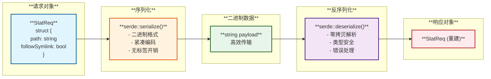
```mermaid
graph LR
    subgraph "**请求对象**"
        style Obj fill:#e1f5ff,stroke:#01579b,stroke-width:2px
        Obj["**StatReq**<br/>struct {<br/>  path: string<br/>  followSymlink: bool<br/>}"]
    end
    
    subgraph "**序列化**"
        style Ser fill:#fff3e0,stroke:#e65100,stroke-width:2px
        Ser["**serde::serialize()**<br/>- 二进制格式<br/>- 紧凑编码<br/>- 无标签开销"]
    end
    
    subgraph "**二进制数据**"
        style Bin fill:#e8f5e9,stroke:#1b5e20,stroke-width:2px
        Bin["**string payload**<br/>高效传输"]
    end
    
    subgraph "**反序列化**"
        style Deser fill:#f3e5f5,stroke:#4a148c,stroke-width:2px
        Deser["**serde::deserialize()**<br/>- 零拷贝解析<br/>- 类型安全<br/>- 错误处理"]
    end
    
    subgraph "**响应对象**"
        style Rsp fill:#ffebee,stroke:#b71c1c,stroke-width:2px
        Rsp["**StatReq (重建)**"]
    end
    
    Obj --> Ser
    Ser --> Bin
    Bin --> Deser
    Deser --> Rsp
```

**Serde序列化特点**:
- **自定义二进制格式**: 比protobuf更紧凑
- **宏驱动**: `SERDE_STRUCT_FIELD` 自动生成代码
- **零拷贝**: 字符串和数组引用原始缓冲区
- **高性能**: 针对3FS的数据类型优化

## 5. 网络传输架构

### 5.1 双网络架构

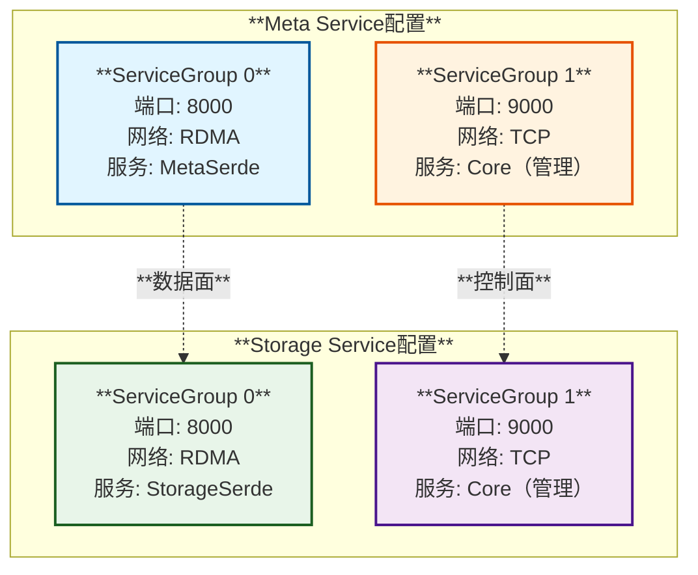
```mermaid
graph TB
    subgraph "**Meta Service配置**"
        style M1 fill:#e1f5ff,stroke:#01579b,stroke-width:2px
        style M2 fill:#fff3e0,stroke:#e65100,stroke-width:2px
        
        M1["**ServiceGroup 0**<br/>端口: 8000<br/>网络: RDMA<br/>服务: MetaSerde"]
        M2["**ServiceGroup 1**<br/>端口: 9000<br/>网络: TCP<br/>服务: Core（管理）"]
    end
    
    subgraph "**Storage Service配置**"
        style S1 fill:#e8f5e9,stroke:#1b5e20,stroke-width:2px
        style S2 fill:#f3e5f5,stroke:#4a148c,stroke-width:2px
        
        S1["**ServiceGroup 0**<br/>端口: 8000<br/>网络: RDMA<br/>服务: StorageSerde"]
        S2["**ServiceGroup 1**<br/>端口: 9000<br/>网络: TCP<br/>服务: Core（管理）"]
    end
    
    M1 -.->|"**数据面**"| S1
    M2 -.->|"**控制面**"| S2
```

**设计原因**:
- **RDMA**: 用于高频数据传输（读写、批量操作）
- **TCP**: 用于管理接口（健康检查、配置更新）
- **隔离**: 控制面和数据面分离，互不影响

### 5.2 连接管理

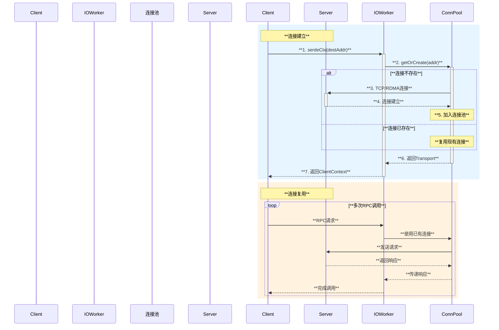
```mermaid
sequenceDiagram
    participant **Client** as Client
    participant **IOWorker** as IOWorker
    participant **ConnPool** as 连接池
    participant **Server** as Server
    
    rect rgb(230, 245, 255)
    Note over Client,Server: **连接建立**
    Client->>+IOWorker: **1. serdeCtx(destAddr)**
    IOWorker->>+ConnPool: **2. getOrCreate(addr)**
    
    alt **连接不存在**
        ConnPool->>+Server: **3. TCP/RDMA连接**
        Server-->>-ConnPool: **4. 连接建立**
        Note over ConnPool: **5. 加入连接池**
    else **连接已存在**
        Note over ConnPool: **复用现有连接**
    end
    
    ConnPool-->>-IOWorker: **6. 返回Transport**
    IOWorker-->>-Client: **7. 返回ClientContext**
    end
    
    rect rgb(255, 243, 224)
    Note over Client,Server: **连接复用**
    loop **多次RPC调用**
        Client->>IOWorker: **RPC请求**
        IOWorker->>ConnPool: **使用已有连接**
        ConnPool->>Server: **发送请求**
        Server-->>ConnPool: **返回响应**
        ConnPool-->>IOWorker: **传递响应**
        IOWorker-->>Client: **完成调用**
    end
    end
```

### 5.3 协程与I/O多路复用

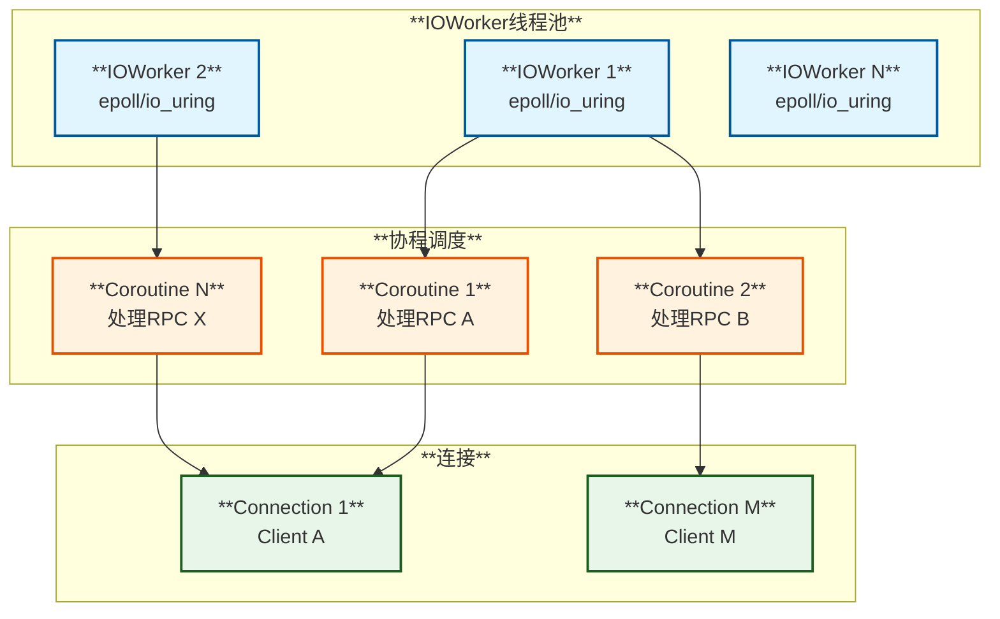
```mermaid
graph TB
    subgraph "**IOWorker线程池**"
        style IO1 fill:#e1f5ff,stroke:#01579b,stroke-width:2px
        style IO2 fill:#e1f5ff,stroke:#01579b,stroke-width:2px
        style IO3 fill:#e1f5ff,stroke:#01579b,stroke-width:2px
        
        IO1["**IOWorker 1**<br/>epoll/io_uring"]
        IO2["**IOWorker 2**<br/>epoll/io_uring"]
        IO3["**IOWorker N**<br/>epoll/io_uring"]
    end
    
    subgraph "**协程调度**"
        style Coro1 fill:#fff3e0,stroke:#e65100,stroke-width:2px
        style Coro2 fill:#fff3e0,stroke:#e65100,stroke-width:2px
        style Coro3 fill:#fff3e0,stroke:#e65100,stroke-width:2px
        
        Coro1["**Coroutine 1**<br/>处理RPC A"]
        Coro2["**Coroutine 2**<br/>处理RPC B"]
        Coro3["**Coroutine N**<br/>处理RPC X"]
    end
    
    subgraph "**连接**"
        style Conn1 fill:#e8f5e9,stroke:#1b5e20,stroke-width:2px
        style Conn2 fill:#e8f5e9,stroke:#1b5e20,stroke-width:2px
        
        Conn1["**Connection 1**<br/>Client A"]
        Conn2["**Connection M**<br/>Client M"]
    end
    
    IO1 --> Coro1
    IO1 --> Coro2
    IO2 --> Coro3
    
    Coro1 --> Conn1
    Coro2 --> Conn2
    Coro3 --> Conn1
```

**协程优势**:
- **轻量级**: 单个线程处理数千个并发请求
- **同步风格**: `co_await` 简化异步逻辑
- **无阻塞**: I/O等待时自动切换协程
- **低开销**: 相比线程池，内存和切换开销极小

## 6. 服务发现与负载均衡

### 6.1 服务注册流程

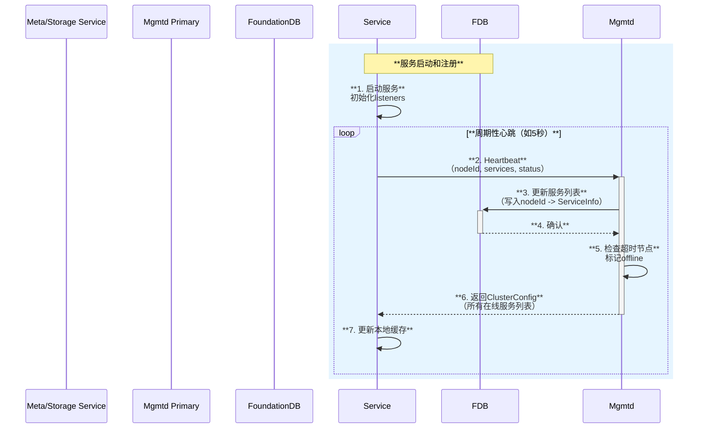
```mermaid
sequenceDiagram
    participant **Service** as Meta/Storage Service
    participant **Mgmtd** as Mgmtd Primary
    participant **FDB** as FoundationDB
    
    rect rgb(230, 245, 255)
    Note over Service,FDB: **服务启动和注册**
    Service->>Service: **1. 启动服务**<br/>初始化listeners
    
    loop **周期性心跳（如5秒）**
        Service->>+Mgmtd: **2. Heartbeat**<br/>（nodeId, services, status）
        Mgmtd->>+FDB: **3. 更新服务列表**<br/>（写入nodeId -> ServiceInfo）
        FDB-->>-Mgmtd: **4. 确认**
        Mgmtd->>Mgmtd: **5. 检查超时节点**<br/>标记offline
        Mgmtd-->>-Service: **6. 返回ClusterConfig**<br/>（所有在线服务列表）
        Service->>Service: **7. 更新本地缓存**
    end
    end
```

### 6.2 客户端服务发现

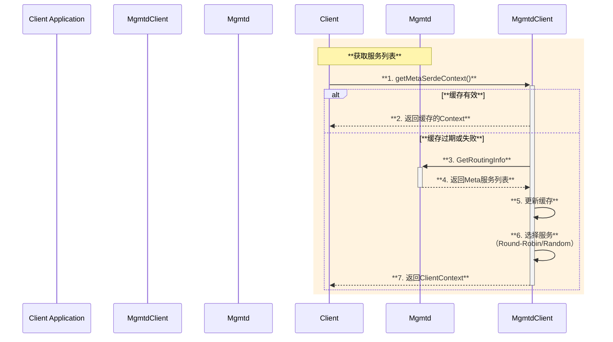
```mermaid
sequenceDiagram
    participant **Client** as Client Application
    participant **MgmtdClient** as MgmtdClient
    participant **Mgmtd** as Mgmtd
    
    rect rgb(255, 243, 224)
    Note over Client,Mgmtd: **获取服务列表**
    Client->>+MgmtdClient: **1. getMetaSerdeContext()**
    
    alt **缓存有效**
        MgmtdClient-->>Client: **2. 返回缓存的Context**
    else **缓存过期或失败**
        MgmtdClient->>+Mgmtd: **3. GetRoutingInfo**
        Mgmtd-->>-MgmtdClient: **4. 返回Meta服务列表**
        MgmtdClient->>MgmtdClient: **5. 更新缓存**
        MgmtdClient->>MgmtdClient: **6. 选择服务**<br/>（Round-Robin/Random）
        MgmtdClient-->>-Client: **7. 返回ClientContext**
    end
    end
```

### 6.3 负载均衡策略

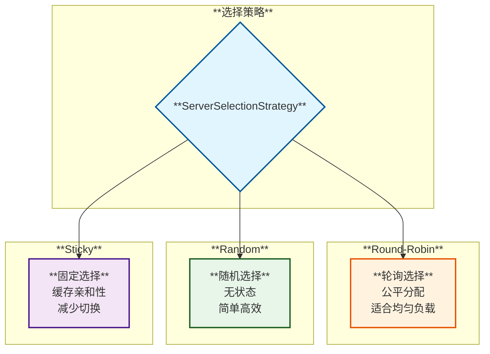
```mermaid
graph TB
    subgraph "**选择策略**"
        style Strategy fill:#e1f5ff,stroke:#01579b,stroke-width:2px
        Strategy{**ServerSelectionStrategy**}
    end
    
    subgraph "**Round-Robin**"
        style RR fill:#fff3e0,stroke:#e65100,stroke-width:2px
        RR["**轮询选择**<br/>公平分配<br/>适合均匀负载"]
    end
    
    subgraph "**Random**"
        style Rand fill:#e8f5e9,stroke:#1b5e20,stroke-width:2px
        Rand["**随机选择**<br/>无状态<br/>简单高效"]
    end
    
    subgraph "**Sticky**"
        style Sticky fill:#f3e5f5,stroke:#4a148c,stroke-width:2px
        Sticky["**固定选择**<br/>缓存亲和性<br/>减少切换"]
    end
    
    Strategy --> RR
    Strategy --> Rand
    Strategy --> Sticky
```

**3FS策略**:
- **Meta服务**: 默认Random，客户端可随意选择
- **Storage服务**: 根据ChunkID和Chain Table确定目标（不是负载均衡）
- **故障转移**: 请求失败时自动切换到其他服务

## 7. 错误处理与重试

### 7.1 错误传播

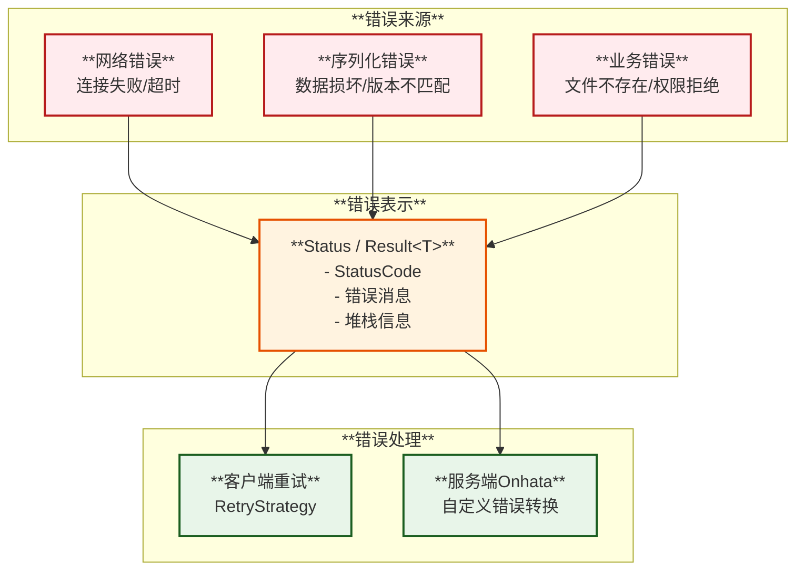
```mermaid
graph TB
    subgraph "**错误来源**"
        style E1 fill:#ffebee,stroke:#b71c1c,stroke-width:2px
        style E2 fill:#ffebee,stroke:#b71c1c,stroke-width:2px
        style E3 fill:#ffebee,stroke:#b71c1c,stroke-width:2px
        
        E1["**网络错误**<br/>连接失败/超时"]
        E2["**序列化错误**<br/>数据损坏/版本不匹配"]
        E3["**业务错误**<br/>文件不存在/权限拒绝"]
    end
    
    subgraph "**错误表示**"
        style Status fill:#fff3e0,stroke:#e65100,stroke-width:2px
        Status["**Status / Result&lt;T&gt;**<br/>- StatusCode<br/>- 错误消息<br/>- 堆栈信息"]
    end
    
    subgraph "**错误处理**"
        style H1 fill:#e8f5e9,stroke:#1b5e20,stroke-width:2px
        style H2 fill:#e8f5e9,stroke:#1b5e20,stroke-width:2px
        
        H1["**客户端重试**<br/>RetryStrategy"]
        H2["**服务端Onhata**<br/>自定义错误转换"]
    end
    
    E1 --> Status
    E2 --> Status
    E3 --> Status
    
    Status --> H1
    Status --> H2
```

### 7.2 重试策略

```cpp
// 客户端重试配置
struct RetryConfig {
  Duration init_wait_time = 100_ms;      // 初始重试等待
  Duration max_wait_time = 5_s;          // 最大重试等待
  Duration max_retry_time = 30_s;        // 总重试时间
  uint32_t max_failures_before_failover = 3;  // 失败N次后切换服务
};

// 重试逻辑（简化）
CoTryTask<Rsp> callWithRetry(const Req &req) {
  auto strategy = RetryStrategy(config);
  
  while (true) {
    auto ctx = selectServer();  // 选择服务
    auto result = co_await Service::method(ctx, req);
    
    if (result) {
      co_return result;  // 成功
    }
    
    if (!strategy.shouldRetry(result.error())) {
      co_return result;  // 不可重试错误
    }
    
    if (strategy.failureCount() >= config.max_failures_before_failover) {
      markServerFailed(ctx);  // 标记服务失败，切换
    }
    
    co_await strategy.wait();  // 指数退避
  }
}
```

## 8. 性能特性

### 8.1 性能对比

| **指标** | **gRPC** | **3FS Serde** | **提升** |
|---------|---------|-------------|---------|
| **单次RPC延迟（TCP）** | ~50-100 μs | ~30-50 μs | **30-40%** ⭐⭐⭐⭐ |
| **单次RPC延迟（RDMA）** | 不支持 | ~5-10 μs | **10倍+** ⭐⭐⭐⭐⭐ |
| **吞吐量（小请求）** | ~10K RPS/core | ~50K RPS/core | **5倍** ⭐⭐⭐⭐⭐ |
| **序列化速度** | protobuf (~1 GB/s) | 自定义 (~5 GB/s) | **5倍** ⭐⭐⭐⭐⭐ |
| **内存拷贝（RDMA）** | N/A | **零拷贝** | **无限** ⭐⭐⭐⭐⭐ |
| **协议开销** | HTTP/2头 (~50字节) | 自定义 (~20字节) | **60%减少** ⭐⭐⭐⭐ |

### 8.2 性能优化技术

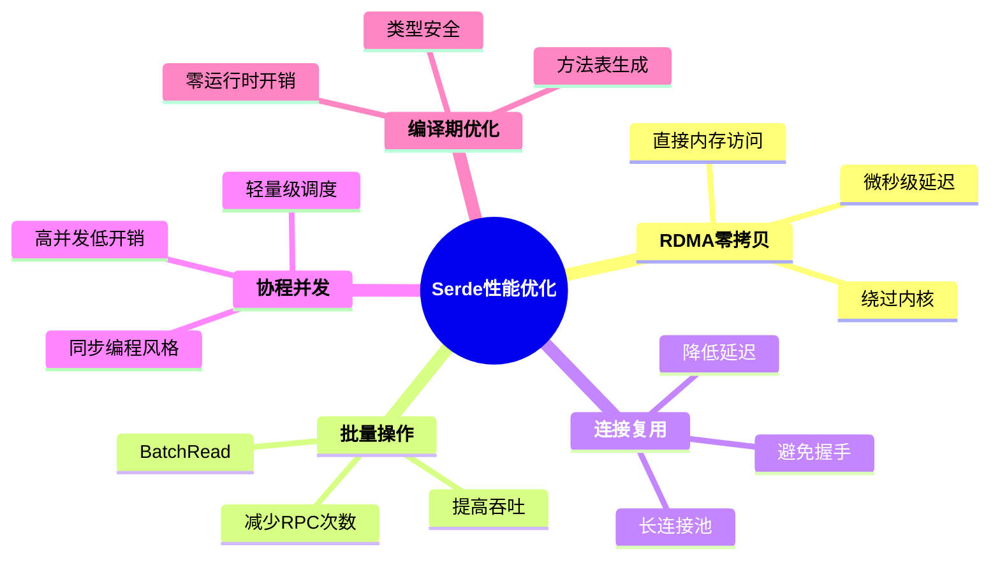
```mermaid
mindmap
  root((**Serde性能优化**))
    **RDMA零拷贝**
      直接内存访问
      绕过内核
      微秒级延迟
    **批量操作**
      BatchRead
      减少RPC次数
      提高吞吐
    **连接复用**
      长连接池
      避免握手
      降低延迟
    **协程并发**
      轻量级调度
      高并发低开销
      同步编程风格
    **编译期优化**
      方法表生成
      零运行时开销
      类型安全
```

### 8.3 监控指标

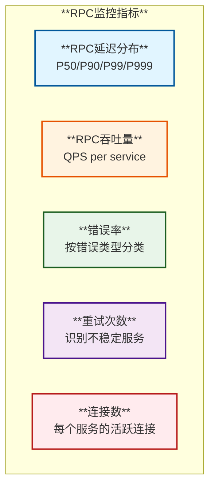
```mermaid
graph TB
    subgraph "**RPC监控指标**"
        style M1 fill:#e1f5ff,stroke:#01579b,stroke-width:2px
        style M2 fill:#fff3e0,stroke:#e65100,stroke-width:2px
        style M3 fill:#e8f5e9,stroke:#1b5e20,stroke-width:2px
        style M4 fill:#f3e5f5,stroke:#4a148c,stroke-width:2px
        style M5 fill:#ffebee,stroke:#b71c1c,stroke-width:2px
        
        M1["**RPC延迟分布**<br/>P50/P90/P99/P999"]
        M2["**RPC吞吐量**<br/>QPS per service"]
        M3["**错误率**<br/>按错误类型分类"]
        M4["**重试次数**<br/>识别不稳定服务"]
        M5["**连接数**<br/>每个服务的活跃连接"]
    end
```

## 9. 总结

### 9.1 Serde框架核心特点

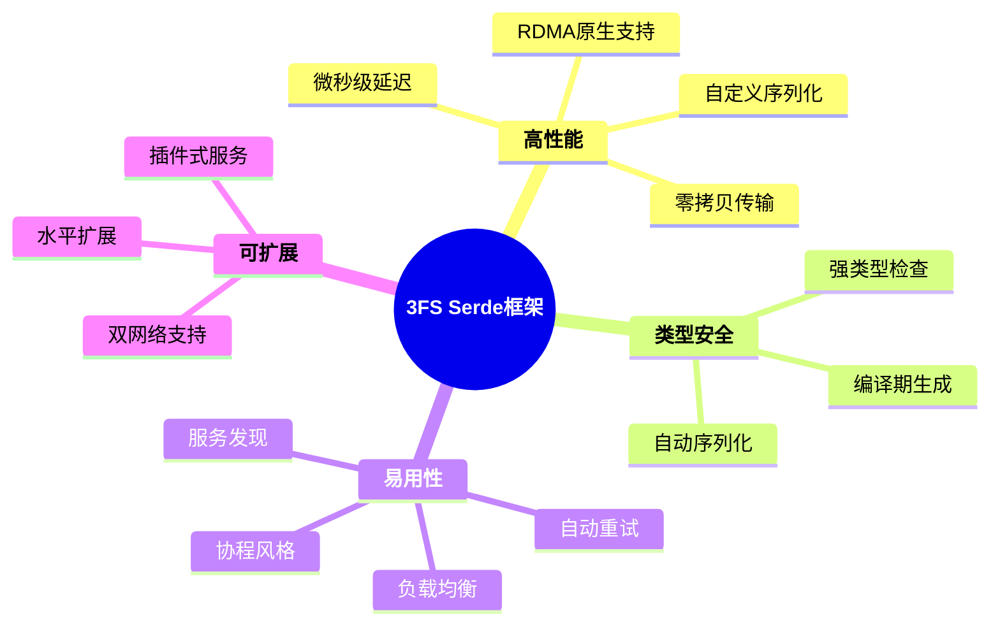
```mermaid
mindmap
  root((**3FS Serde框架**))
    **高性能**
      RDMA原生支持
      零拷贝传输
      微秒级延迟
      自定义序列化
    **类型安全**
      编译期生成
      强类型检查
      自动序列化
    **易用性**
      协程风格
      自动重试
      服务发现
      负载均衡
    **可扩展**
      插件式服务
      双网络支持
      水平扩展
```

### 9.2 与gRPC的差异总结

| **方面** | **gRPC** | **3FS Serde** |
|---------|---------|-------------|
| **传输协议** | HTTP/2 over TCP | 自定义 over TCP/RDMA |
| **序列化** | Protobuf | 自定义二进制格式 |
| **网络栈** | 内核TCP栈 | 内核TCP + 用户态RDMA |
| **编程模型** | 回调/Future | folly::coro协程 |
| **代码生成** | protoc | C++宏 |
| **RDMA支持** | ❌ | ✅ 原生支持 |
| **零拷贝** | ❌ | ✅ RDMA场景 |
| **性能** | 通用 | **针对存储优化** |
| **生态** | **丰富** | 3FS专用 |

### 9.3 适用场景

**Serde框架的优势**:
- ✅ **高性能数据传输**: RDMA网络环境
- ✅ **存储系统**: 需要极低延迟和高吞吐
- ✅ **内部服务**: 控制整个技术栈
- ✅ **大规模集群**: 需要精细控制

**gRPC的优势**:
- ✅ **跨语言**: 多语言生态
- ✅ **公共API**: 对外暴露服务
- ✅ **标准化**: HTTP/2生态成熟
- ✅ **快速开发**: 丰富的工具链

### 9.4 设计哲学

3FS选择自研Serde框架的核心原因：

1. **性能至上**: 存储系统对延迟和吞吐极度敏感
2. **RDMA深度集成**: gRPC无法充分利用RDMA特性
3. **完全控制**: 可针对特定场景深度优化
4. **简化依赖**: 减少外部依赖，提高稳定性

---

## 附录：代码示例

### A.1 定义服务

```cpp
// src/fbs/meta/Service.h
SERDE_SERVICE(MetaSerde, 1) {
  SERDE_SERVICE_METHOD(stat, 1, StatReq, StatRsp);
  SERDE_SERVICE_METHOD(create, 2, CreateReq, CreateRsp);
  SERDE_SERVICE_METHOD(open, 3, OpenReq, OpenRsp);
  SERDE_SERVICE_METHOD(close, 4, CloseReq, CloseRsp);
  SERDE_SERVICE_METHOD(remove, 5, RemoveReq, RemoveRsp);
  // ... 更多方法
};
```

### A.2 服务端实现

```cpp
// src/meta/service/MetaSerdeService.h
class MetaSerdeService : public serde::ServiceWrapper<MetaSerdeService, MetaSerde> {
 public:
  MetaSerdeService(MetaOperator &meta) : meta_(meta) {}
  
  CoTryTask<StatRsp> stat(serde::CallContext &ctx, const StatReq &req) {
    // 直接转发给业务逻辑层
    co_return co_await meta_.stat(req);
  }
  
  // ... 其他方法
  
 private:
  MetaOperator &meta_;
};

// src/meta/service/MetaServer.cc
Result<Void> MetaServer::beforeStart() {
  // 注册服务
  RETURN_ON_ERROR(addSerdeService(
      std::make_unique<MetaSerdeService>(*metaOperator_), 
      true  // 使用RDMA
  ));
  return Void{};
}
```

### A.3 客户端调用

```cpp
// src/client/meta/MetaClient.cc
class MetaClient {
 public:
  CoTryTask<StatRsp> stat(const std::string &path) {
    StatReq req;
    req.path = path;
    req.followSymlink = true;
    
    // 获取Context（自动选择可用服务）
    auto ctx = getContext();
    
    // 调用远程方法
    co_return co_await MetaSerde<>::stat(ctx, req);
  }
  
 private:
  ClientContext getContext() {
    // 从MgmtdClient获取Meta服务列表
    auto servers = mgmtdClient_->getMetaServers();
    auto addr = selectServer(servers);  // 负载均衡
    return client_.serdeCtx(addr);
  }
};
```

### A.4 RDMA传输

```cpp
// src/storage/service/StorageOperator.cc
CoTryTask<WriteRsp> StorageOperator::write(
    ServiceRequestContext &requestCtx,
    const WriteReq &req,
    net::IBSocket *ibSocket) {
  
  // 使用RDMA Read获取客户端数据
  auto transmission = ctx.readTransmission();
  auto localBuf = allocateBuffer(req.payload.length);
  
  RETURN_ON_ERROR(transmission.add(
      req.payload.remoteBuf,  // 远程内存地址
      localBuf                // 本地缓冲区
  ));
  
  co_await transmission.applyTransmission(timeout);
  
  // 数据已在localBuf中，无CPU拷贝
  co_return co_await processWrite(localBuf);
}
```

