# 3FS中io_uring的使用详解

## 1. 概述

3FS在两个关键场景中使用io_uring实现高性能异步I/O：
1. **客户端FUSE层**: 实现零拷贝的用户态I/O接口（IoRing）
2. **存储服务层**: 实现高性能的磁盘异步读取（AioReadWorker）

io_uring相比传统libaio的优势：
- **更少的系统调用**: 通过共享内存环形队列
- **批量操作**: 支持批量提交和收割完成事件
- **更好的性能**: 减少上下文切换和内存拷贝
- **固定文件和缓冲区**: 通过注册减少每次I/O的开销

## 2. 架构概览

### 2.1 整体架构图

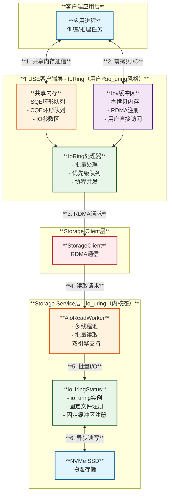

## 3. 客户端IoRing实现

### 3.1 模块图

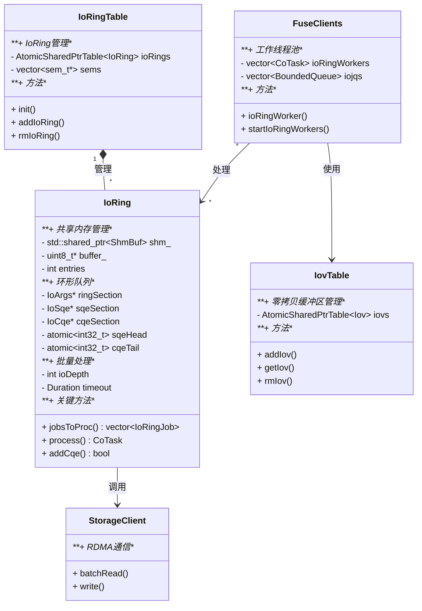

### 3.2 IoRing数据结构

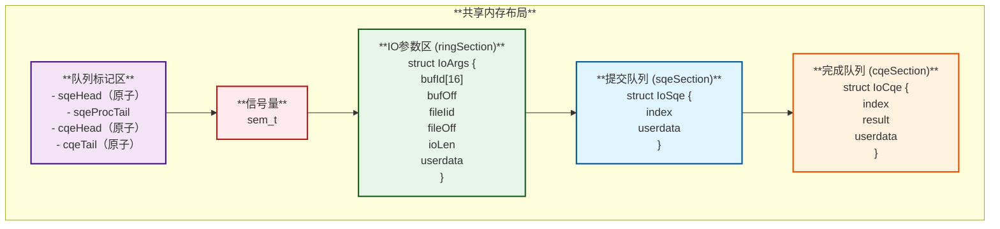

### 3.3 IoRing工作流程

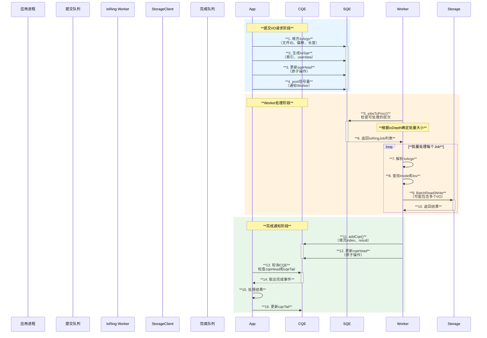

### 3.4 批量处理和优先级

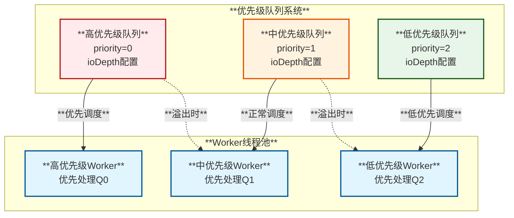

**批量处理策略**:
- **正ioDepth**: 固定批量大小，等待足够的I/O或超时
- **负ioDepth**: 可变批量大小，至少处理abs(ioDepth)个I/O
- **零ioDepth**: 处理所有可用的I/O

## 4. 存储层io_uring实现

### 4.1 模块图

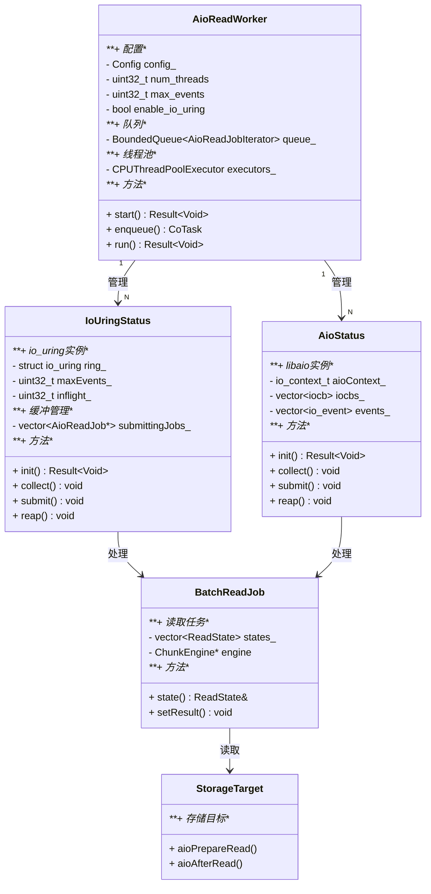

### 4.2 io_uring初始化流程

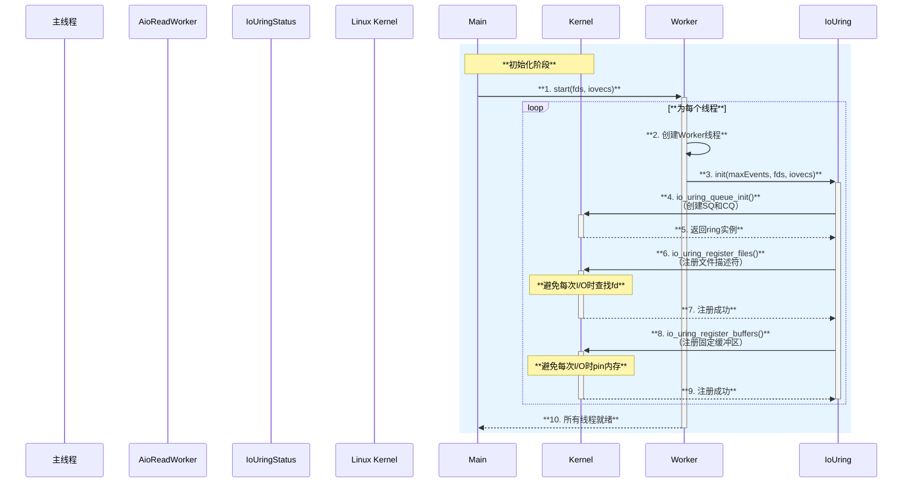

### 4.3 批量读取流程

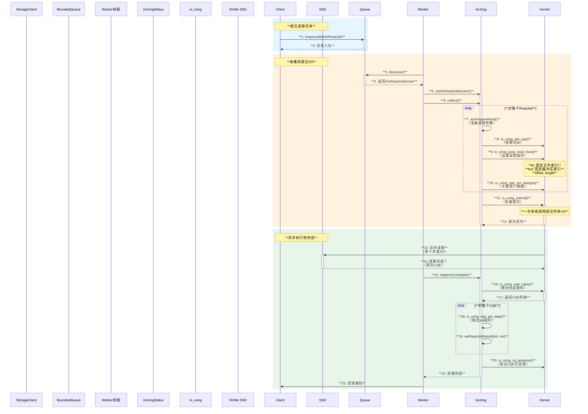

### 4.4 双引擎架构

```mermaid
graph TB
    subgraph "**AioReadWorker配置**"
        style Config fill:#e1f5ff,stroke:#01579b,stroke-width:2px
        Config["**Config**<br/>enable_io_uring: true<br/>ioengine: libaio/io_uring/random"]
    end
    
    subgraph "**运行时选择**"
        style Select fill:#fff3e0,stroke:#e65100,stroke-width:2px
        Select{**useIoUring()?**}
    end
    
    subgraph "**io_uring路径**"
        style IoUring fill:#e8f5e9,stroke:#1b5e20,stroke-width:2px
        style IoUringFeature fill:#e8f5e9,stroke:#1b5e20,stroke-width:2px
        IoUring["**IoUringStatus**"]
        IoUringFeature["**特性:**<br/>- 固定文件<br/>- 固定缓冲区<br/>- 批量操作<br/>- 更低延迟"]
    end
    
    subgraph "**libaio路径**"
        style Aio fill:#ffebee,stroke:#b71c1c,stroke-width:2px
        style AioFeature fill:#ffebee,stroke:#b71c1c,stroke-width:2px
        Aio["**AioStatus**"]
        AioFeature["**特性:**<br/>- 传统接口<br/>- 更稳定<br/>- 兼容性好"]
    end
    
    Config --> Select
    Select -->|"**true**"| IoUring
    Select -->|"**false**"| Aio
    IoUring --> IoUringFeature
    Aio --> AioFeature
```

## 5. 性能优化技术

### 5.1 优化技术总览

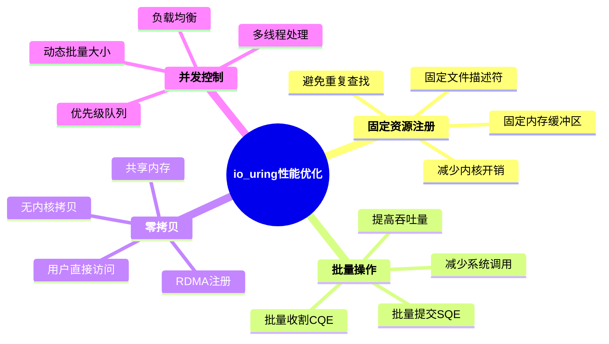

### 5.2 关键优化点对比

| **优化技术** | **传统I/O** | **libaio** | **io_uring** | **3FS实现** |
|------------|------------|-----------|-------------|------------|
| **系统调用次数** | 每次I/O一次 | 批量减少 | 批量+共享内存 | **极少** ⭐⭐⭐⭐⭐ |
| **固定文件** | ❌ | ❌ | ✅ | **注册后零开销** ⭐⭐⭐⭐⭐ |
| **固定缓冲区** | ❌ | ❌ | ✅ | **预注册避免pin** ⭐⭐⭐⭐⭐ |
| **批量提交** | ❌ | ✅ | ✅ | **最多512个** ⭐⭐⭐⭐⭐ |
| **批量完成** | ❌ | ✅ | ✅ | **最多512个** ⭐⭐⭐⭐⭐ |
| **用户态轮询** | ❌ | ❌ | ✅（可选） | **支持** ⭐⭐⭐⭐ |

### 5.3 批量大小调优

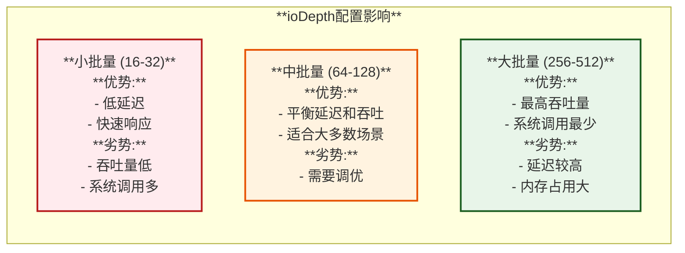

**3FS的默认配置**:
- **Storage层**: `max_events = 512` （支持最大批量）
- **Client层**: `ioDepth` 可配置（典型值128）
- **策略**: 根据负载动态调整

### 5.4 固定资源的收益

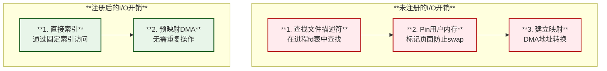

**性能提升**:
- **fd查找**: 节约 ~100-200 CPU周期/操作
- **内存pin**: 节约 ~1-2 微秒/操作
- **总体提升**: 小I/O场景下提升 20-30%

## 6. 监控和调优

### 6.1 关键监控指标

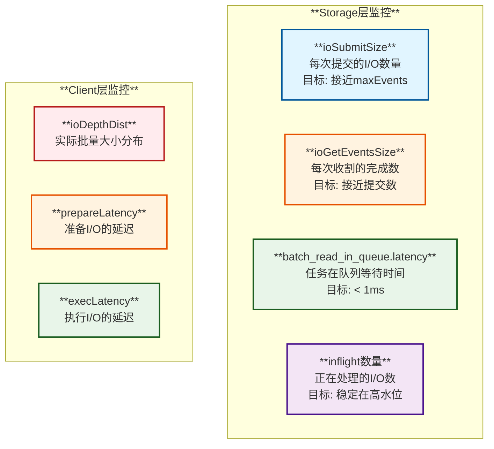

### 6.2 常见问题和调优

| **问题** | **症状** | **原因** | **解决方案** |
|---------|---------|---------|------------|
| **低吞吐** | ioSubmitSize小 | ioDepth配置过小 | 增大ioDepth到128-256 |
| **高延迟** | prepareLatency高 | Worker线程不足 | 增加num_threads |
| **队列阻塞** | batch_read_in_queue.latency高 | 后端I/O慢 | 检查SSD性能，增加Worker |
| **不均衡** | 某些线程CPU高 | 负载不均 | 启用优先级队列 |
| **内存不足** | 提交失败 | maxEvents过大 | 减小maxEvents或增加内存 |

### 6.3 推荐配置

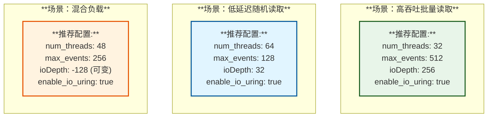

## 7. 总结

### 7.1 3FS的io_uring应用特点

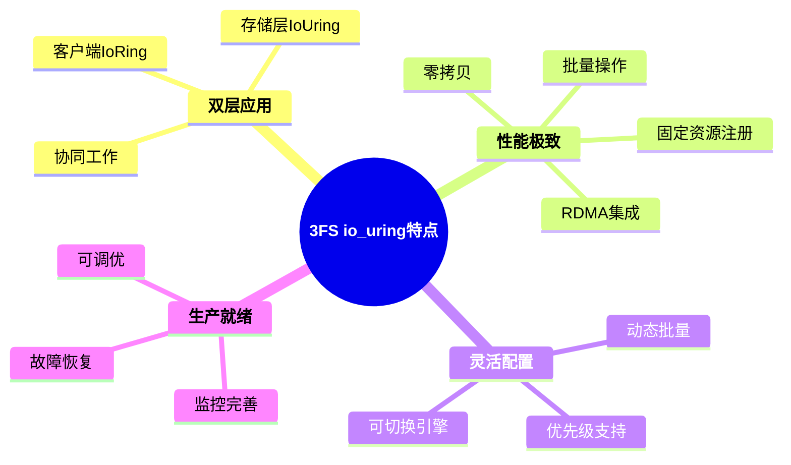

### 7.2 关键收益

| **方面** | **收益** | **量化指标** |
|---------|---------|------------|
| **系统调用** | 大幅减少 | **减少90%+** 批量提交 |
| **延迟** | 显著降低 | **减少30-50%** 相比libaio |
| **吞吐量** | 大幅提升 | **提升20-40%** 大批量场景 |
| **CPU效率** | 更高效 | **节约10-20% CPU** 每IOPS |
| **扩展性** | 更好 | **线性扩展** 到数百线程 |

### 7.3 最佳实践

1. **Storage层**:
   - 启用io_uring（`enable_io_uring: true`）
   - 注册所有SSD的文件描述符
   - 注册固定缓冲区（与buffer pool大小匹配）
   - 配置合理的max_events（256-512）

2. **Client层**:
   - 使用Native API而非FUSE（当需要极致性能时）
   - 配置合适的ioDepth（根据负载特征）
   - 利用优先级队列分离不同工作负载
   - 监控CQE填充率和SQE消耗率

3. **调优策略**:
   - 从默认配置开始
   - 通过监控指标识别瓶颈
   - 逐步调整批量大小和线程数
   - 压测验证改动效果

### 7.4 与传统方案对比

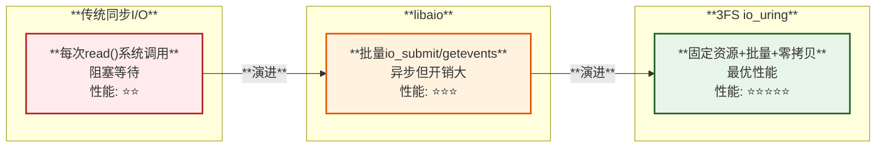

---

## 附录：代码示例

### A.1 Storage层初始化io_uring

```cpp
Result<Void> IoUringStatus::init(uint32_t maxEvents, 
                                  const std::vector<int> &fds, 
                                  const std::vector<struct iovec> &iovecs) {
  maxEvents_ = maxEvents;
  
  // 初始化io_uring实例
  auto ret = ::io_uring_queue_init(maxEvents_, &ring_, 0);
  if (UNLIKELY(ret != 0)) {
    return makeError(StatusCode::kInvalidConfig, 
                     fmt::format("init io uring failed: {}", ret));
  }
  
  // 注册固定文件描述符
  if (!fds.empty()) {
    ret = ::io_uring_register_files(&ring_, fds.data(), fds.size());
    if (UNLIKELY(ret != 0)) {
      return makeError(StatusCode::kInvalidConfig, 
                       fmt::format("register_files failed: {}", ret));
    }
  }
  
  // 注册固定缓冲区
  if (!iovecs.empty()) {
    ret = ::io_uring_register_buffers(&ring_, iovecs.data(), iovecs.size());
    if (UNLIKELY(ret != 0)) {
      return makeError(StatusCode::kInvalidConfig, 
                       fmt::format("register_buffers failed: {}", ret));
    }
  }
  
  return Void{};
}
```

### A.2 提交和收割操作

```cpp
void IoUringStatus::collect() {
  while (availableToSubmit() && iterator_) {
    auto &job = *iterator_++;
    auto &state = job.state();
    
    // 获取SQE
    struct io_uring_sqe *sqe = ::io_uring_get_sqe(&ring_);
    
    // 准备读取操作（使用固定文件和缓冲区）
    ::io_uring_prep_read_fixed(sqe,
                               state.fdIndex.value_or(state.readFd),
                               state.localbuf.ptr(),
                               state.readLength,
                               state.readOffset,
                               state.bufferIndex);
    if (state.fdIndex) {
      sqe->flags |= IOSQE_FIXED_FILE;  // 使用固定文件
    }
    
    ::io_uring_sqe_set_data(sqe, &job);  // 关联用户数据
    ++inflight_;
  }
}

void IoUringStatus::submit() {
  int ret = ::io_uring_submit(&ring_);  // 批量提交
  // 错误处理...
}

void IoUringStatus::reap(uint32_t minCompleteIn) {
  io_uring_cqe *cqe = nullptr;
  
  // 等待至少minCompleteIn个完成事件
  ::io_uring_wait_cqes(&ring_, &cqe, minCompleteIn, nullptr, nullptr);
  
  // 遍历所有完成的CQE
  uint32_t cnt = 0;
  unsigned head = 0;
  io_uring_for_each_cqe(&ring_, head, cqe) {
    ++cnt;
    auto *job = static_cast<AioReadJob*>(::io_uring_cqe_get_data(cqe));
    setReadJobResult(job, cqe->res);  // 设置结果
  }
  
  inflight_ -= cnt;
  ::io_uring_cq_advance(&ring_, cnt);  // 标记已处理
}
```

