# 3FS元数据管理详解

## 1. 概述

3FS采用**无状态元数据服务 + 分布式KV存储**的架构，实现高可用、高性能的元数据管理。所有元数据持久化在FoundationDB中，Meta服务作为无状态的中间层提供文件系统语义。

### 1.1 核心特点

- **无状态Meta服务**: 所有状态存储在FoundationDB，服务可随意扩展
- **强事务保证**: 利用FoundationDB的SSI（Serializable Snapshot Isolation）
- **水平扩展**: 客户端可连接任意Meta服务
- **高可用**: Meta服务故障不影响数据，快速恢复

## 2. 架构设计

### 2.1 整体架构图

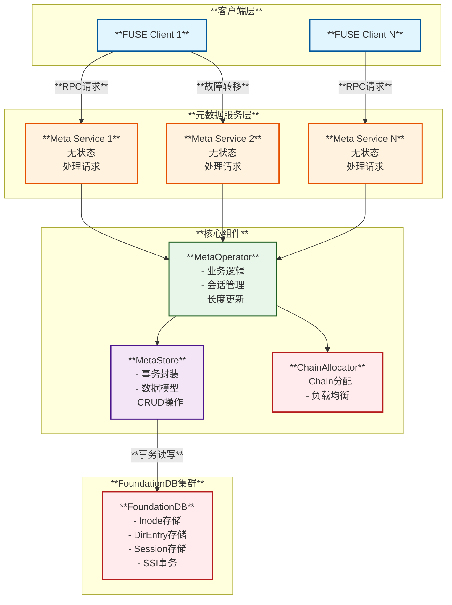
```mermaid
graph TB
    subgraph "**客户端层**"
        style Client1 fill:#e1f5ff,stroke:#01579b,stroke-width:2px
        style Client2 fill:#e1f5ff,stroke:#01579b,stroke-width:2px
        Client1["**FUSE Client 1**"]
        Client2["**FUSE Client N**"]
    end
    
    subgraph "**元数据服务层**"
        style Meta1 fill:#fff3e0,stroke:#e65100,stroke-width:2px
        style Meta2 fill:#fff3e0,stroke:#e65100,stroke-width:2px
        style Meta3 fill:#fff3e0,stroke:#e65100,stroke-width:2px
        
        Meta1["**Meta Service 1**<br/>无状态<br/>处理请求"]
        Meta2["**Meta Service 2**<br/>无状态<br/>处理请求"]
        Meta3["**Meta Service N**<br/>无状态<br/>处理请求"]
    end
    
    subgraph "**核心组件**"
        style Operator fill:#e8f5e9,stroke:#1b5e20,stroke-width:2px
        style Store fill:#f3e5f5,stroke:#4a148c,stroke-width:2px
        style Chain fill:#ffebee,stroke:#b71c1c,stroke-width:2px
        
        Operator["**MetaOperator**<br/>- 业务逻辑<br/>- 会话管理<br/>- 长度更新"]
        Store["**MetaStore**<br/>- 事务封装<br/>- 数据模型<br/>- CRUD操作"]
        Chain["**ChainAllocator**<br/>- Chain分配<br/>- 负载均衡"]
    end
    
    subgraph "**FoundationDB集群**"
        style FDB fill:#ffebee,stroke:#b71c1c,stroke-width:2px
        FDB["**FoundationDB**<br/>- Inode存储<br/>- DirEntry存储<br/>- Session存储<br/>- SSI事务"]
    end
    
    Client1 -->|"**RPC请求**"| Meta1
    Client1 -->|"**故障转移**"| Meta2
    Client2 -->|"**RPC请求**"| Meta3
    
    Meta1 --> Operator
    Meta2 --> Operator
    Meta3 --> Operator
    
    Operator --> Store
    Operator --> Chain
    
    Store -->|"**事务读写**"| FDB
```

### 2.2 核心模块关系

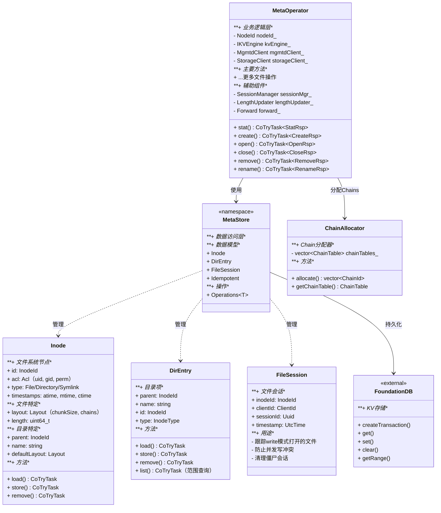
```mermaid
classDiagram
    class MetaOperator {
        **+ 业务逻辑层**
        - NodeId nodeId_
        - IKVEngine kvEngine_
        - MgmtdClient mgmtdClient_
        - StorageClient storageClient_
        
        **+ 主要方法**
        + stat() CoTryTask~StatRsp~
        + create() CoTryTask~CreateRsp~
        + open() CoTryTask~OpenRsp~
        + close() CoTryTask~CloseRsp~
        + remove() CoTryTask~RemoveRsp~
        + rename() CoTryTask~RenameRsp~
        + ...更多文件操作
        
        **+ 辅助组件**
        - SessionManager sessionMgr_
        - LengthUpdater lengthUpdater_
        - Forward forward_
    }
    
    class MetaStore {
        **+ 数据访问层**
        <<namespace>>
        
        **+ 数据模型**
        + Inode
        + DirEntry
        + FileSession
        + Idempotent
        
        **+ 操作**
        + Operations~T~
    }
    
    class Inode {
        **+ 文件系统节点**
        + id: InodeId
        + acl: Acl（uid, gid, perm）
        + type: File/Directory/Symlink
        + timestamps: atime, mtime, ctime
        
        **+ 文件特定**
        + layout: Layout（chunkSize, chains）
        + length: uint64_t
        
        **+ 目录特定**
        + parent: InodeId
        + name: string
        + defaultLayout: Layout
        
        **+ 方法**
        + load() CoTryTask
        + store() CoTryTask
        + remove() CoTryTask
    }
    
    class DirEntry {
        **+ 目录项**
        + parent: InodeId
        + name: string
        + id: InodeId
        + type: InodeType
        
        **+ 方法**
        + load() CoTryTask
        + store() CoTryTask
        + remove() CoTryTask
        + list() CoTryTask（范围查询）
    }
    
    class FileSession {
        **+ 文件会话**
        + inodeId: InodeId
        + clientId: ClientId
        + sessionId: Uuid
        + timestamp: UtcTime
        
        **+ 用途**
        - 跟踪write模式打开的文件
        - 防止并发写冲突
        - 清理僵尸会话
    }
    
    class ChainAllocator {
        **+ Chain分配器**
        - vector~ChainTable~ chainTables_
        
        **+ 方法**
        + allocate() vector~ChainId~
        + getChainTable() ChainTable
    }
    
    class FoundationDB {
        **+ KV存储**
        <<external>>
        + createTransaction()
        + get()
        + set()
        + clear()
        + getRange()
    }
    
    MetaOperator --> MetaStore : 使用
    MetaOperator --> ChainAllocator : 分配Chains
    MetaStore ..> Inode : 管理
    MetaStore ..> DirEntry : 管理
    MetaStore ..> FileSession : 管理
    MetaStore --> FoundationDB : 持久化
```

## 3. 数据模型

### 3.1 FoundationDB键空间设计

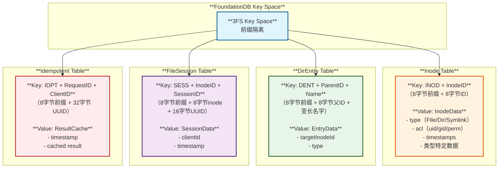
```mermaid
graph TB
    subgraph "**FoundationDB Key Space**"
        style Space fill:#e1f5ff,stroke:#01579b,stroke-width:2px
        Space["**3FS Key Space**<br/>前缀隔离"]
    end
    
    subgraph "**Inode Table**"
        style Inode fill:#fff3e0,stroke:#e65100,stroke-width:2px
        Inode["**Key: INOD + InodeID**<br/>（8字节前缀 + 8字节ID）<br/><br/>**Value: InodeData**<br/>- type（File/Dir/Symlink）<br/>- acl（uid/gid/perm）<br/>- timestamps<br/>- 类型特定数据"]
    end
    
    subgraph "**DirEntry Table**"
        style DirEnt fill:#e8f5e9,stroke:#1b5e20,stroke-width:2px
        DirEnt["**Key: DENT + ParentID + Name**<br/>（8字节前缀 + 8字节父ID + 变长名字）<br/><br/>**Value: EntryData**<br/>- targetInodeId<br/>- type"]
    end
    
    subgraph "**FileSession Table**"
        style Session fill:#f3e5f5,stroke:#4a148c,stroke-width:2px
        Session["**Key: SESS + InodeID + SessionID**<br/>（8字节前缀 + 8字节inode + 16字节UUID）<br/><br/>**Value: SessionData**<br/>- clientId<br/>- timestamp"]
    end
    
    subgraph "**Idempotent Table**"
        style Idemp fill:#ffebee,stroke:#b71c1c,stroke-width:2px
        Idemp["**Key: IDPT + RequestID + ClientID**<br/>（8字节前缀 + 32字节UUID）<br/><br/>**Value: ResultCache**<br/>- timestamp<br/>- cached result"]
    end
    
    Space --> Inode
    Space --> DirEnt
    Space --> Session
    Space --> Idemp
```

### 3.2 Inode数据结构

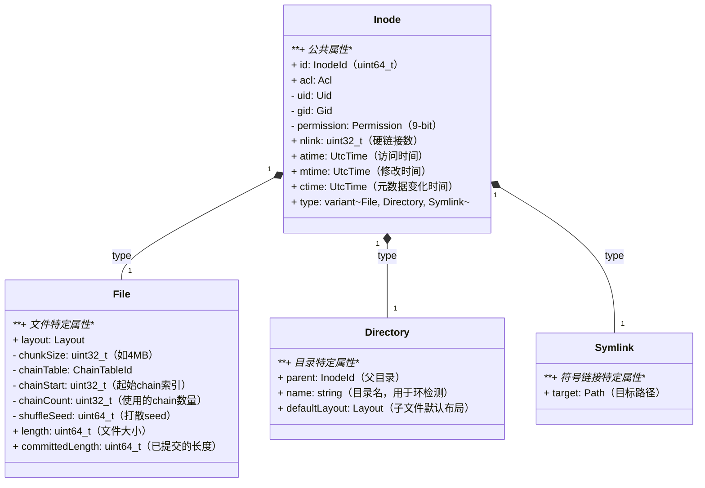
```mermaid
classDiagram
    class Inode {
        **+ 公共属性**
        + id: InodeId（uint64_t）
        + acl: Acl
          - uid: Uid
          - gid: Gid
          - permission: Permission（9-bit）
        + nlink: uint32_t（硬链接数）
        + atime: UtcTime（访问时间）
        + mtime: UtcTime（修改时间）
        + ctime: UtcTime（元数据变化时间）
        + type: variant~File, Directory, Symlink~
    }
    
    class File {
        **+ 文件特定属性**
        + layout: Layout
          - chunkSize: uint32_t（如4MB）
          - chainTable: ChainTableId
          - chainStart: uint32_t（起始chain索引）
          - chainCount: uint32_t（使用的chain数量）
          - shuffleSeed: uint64_t（打散seed）
        + length: uint64_t（文件大小）
        + committedLength: uint64_t（已提交的长度）
    }
    
    class Directory {
        **+ 目录特定属性**
        + parent: InodeId（父目录）
        + name: string（目录名，用于环检测）
        + defaultLayout: Layout（子文件默认布局）
    }
    
    class Symlink {
        **+ 符号链接特定属性**
        + target: Path（目标路径）
    }
    
    Inode "1" *-- "1" File : type
    Inode "1" *-- "1" Directory : type
    Inode "1" *-- "1" Symlink : type
```

**关键设计**:
- **InodeID**: 单调递增的全局唯一ID，使用little-endian编码分散存储
- **Layout**: 存储文件的数据布局信息，客户端据此计算chunk位置
- **nlink**: 支持硬链接，引用计数为0时删除
- **parent + name**: 目录的父节点和名称，用于移动时的环检测

### 3.3 DirEntry数据结构

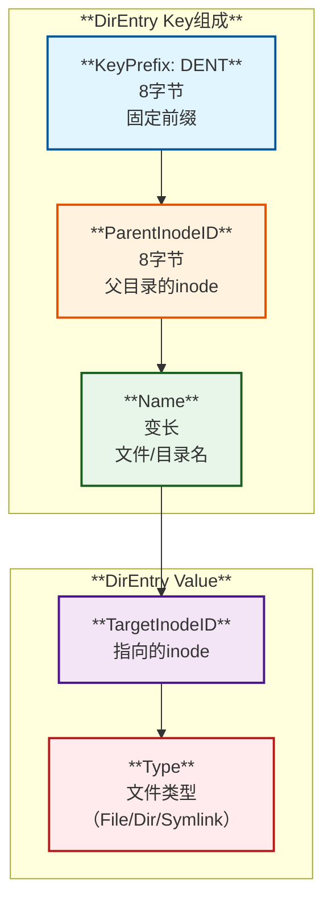
```mermaid
graph TB
    subgraph "**DirEntry Key组成**"
        style K1 fill:#e1f5ff,stroke:#01579b,stroke-width:2px
        style K2 fill:#fff3e0,stroke:#e65100,stroke-width:2px
        style K3 fill:#e8f5e9,stroke:#1b5e20,stroke-width:2px
        
        K1["**KeyPrefix: DENT**<br/>8字节<br/>固定前缀"]
        K2["**ParentInodeID**<br/>8字节<br/>父目录的inode"]
        K3["**Name**<br/>变长<br/>文件/目录名"]
    end
    
    subgraph "**DirEntry Value**"
        style V1 fill:#f3e5f5,stroke:#4a148c,stroke-width:2px
        style V2 fill:#ffebee,stroke:#b71c1c,stroke-width:2px
        
        V1["**TargetInodeID**<br/>指向的inode"]
        V2["**Type**<br/>文件类型<br/>（File/Dir/Symlink）"]
    end
    
    K1 --> K2
    K2 --> K3
    K3 --> V1
    V1 --> V2
```

**Key设计优势**:
- **自然排序**: 同一目录下的所有entry在FDB中连续存储
- **高效列表**: 通过范围查询（getRange）快速列出目录内容
- **原子操作**: rename操作可以在同一事务中原子地删除旧entry和创建新entry

## 4. 核心操作流程

### 4.1 文件创建流程

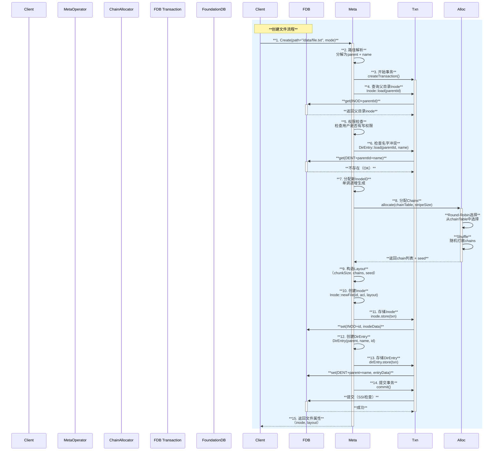
```mermaid
sequenceDiagram
    participant **Client** as Client
    participant **Meta** as MetaOperator
    participant **Alloc** as ChainAllocator
    participant **Txn** as FDB Transaction
    participant **FDB** as FoundationDB
    
    rect rgb(230, 245, 255)
    Note over Client,FDB: **创建文件流程**
    Client->>+Meta: **1. Create(path="/data/file.txt", mode)**
    
    Meta->>Meta: **2. 路径解析**<br/>分解为parent + name
    
    Meta->>+Txn: **3. 开始事务**<br/>createTransaction()
    
    Meta->>Txn: **4. 查询父目录Inode**<br/>Inode::load(parentId)
    Txn->>+FDB: **get(INOD+parentId)**
    FDB-->>-Txn: **返回父目录inode**
    
    Meta->>Meta: **5. 权限检查**<br/>检查用户是否有写权限
    
    Meta->>Txn: **6. 检查名字冲突**<br/>DirEntry::load(parentId, name)
    Txn->>+FDB: **get(DENT+parentId+name)**
    FDB-->>-Txn: **不存在（OK）**
    
    Meta->>Meta: **7. 分配新InodeID**<br/>单调递增生成
    
    Meta->>+Alloc: **8. 分配Chains**<br/>allocate(chainTable, stripeSize)
    Alloc->>Alloc: **Round-Robin选择**<br/>从chainTable中选择
    Alloc->>Alloc: **Shuffle**<br/>随机打散chains
    Alloc-->>-Meta: **返回chain列表 + seed**
    
    Meta->>Meta: **9. 构造Layout**<br/>（chunkSize, chains, seed）
    
    Meta->>Meta: **10. 创建Inode**<br/>Inode::newFile(id, acl, layout)
    Meta->>Txn: **11. 存储Inode**<br/>inode.store(txn)
    Txn->>FDB: **set(INOD+id, inodeData)**
    
    Meta->>Meta: **12. 创建DirEntry**<br/>DirEntry(parent, name, id)
    Meta->>Txn: **13. 存储DirEntry**<br/>dirEntry.store(txn)
    Txn->>FDB: **set(DENT+parent+name, entryData)**
    
    Meta->>Txn: **14. 提交事务**<br/>commit()
    Txn->>+FDB: **提交（SSI检查）**
    FDB-->>-Txn: **成功**
    deactivate Txn
    
    Meta-->>-Client: **15. 返回文件属性**<br/>（inode, layout）
    end
```

**事务保证**:
- **原子性**: Inode和DirEntry的创建要么全成功，要么全失败
- **隔离性**: 并发创建同名文件会被FDB的SSI检测到并重试
- **一致性**: 确保每个DirEntry都指向有效的Inode

### 4.2 文件打开流程

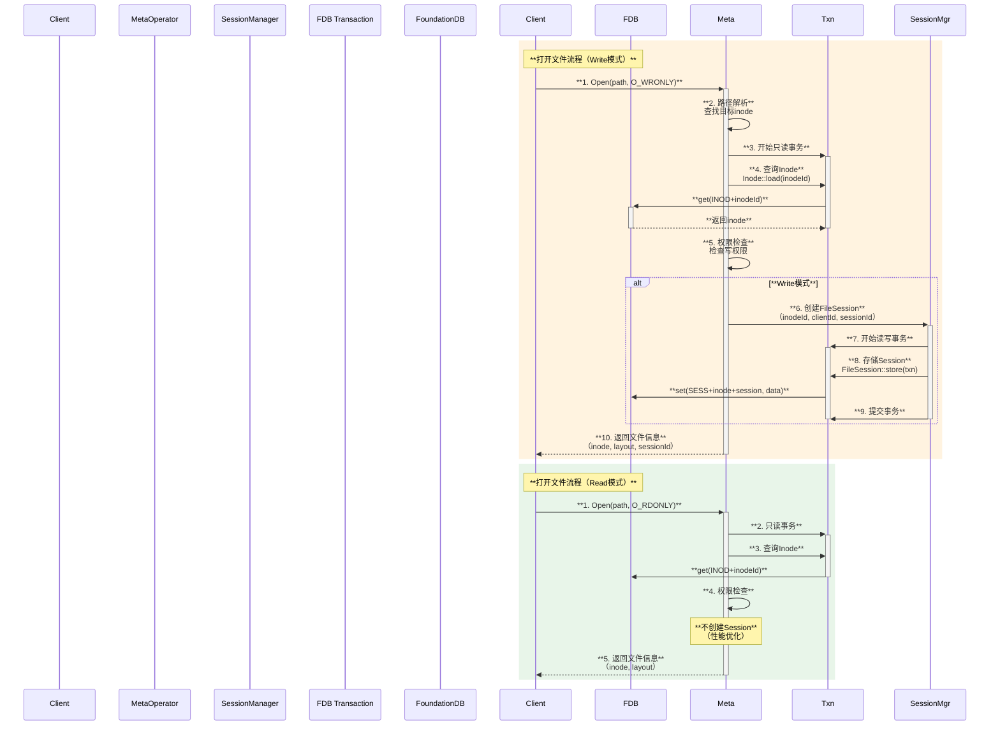
```mermaid
sequenceDiagram
    participant **Client** as Client
    participant **Meta** as MetaOperator
    participant **SessionMgr** as SessionManager
    participant **Txn** as FDB Transaction
    participant **FDB** as FoundationDB
    
    rect rgb(255, 243, 224)
    Note over Client,FDB: **打开文件流程（Write模式）**
    Client->>+Meta: **1. Open(path, O_WRONLY)**
    
    Meta->>Meta: **2. 路径解析**<br/>查找目标inode
    
    Meta->>+Txn: **3. 开始只读事务**
    Meta->>Txn: **4. 查询Inode**<br/>Inode::load(inodeId)
    Txn->>+FDB: **get(INOD+inodeId)**
    FDB-->>-Txn: **返回inode**
    deactivate Txn
    
    Meta->>Meta: **5. 权限检查**<br/>检查写权限
    
    alt **Write模式**
        Meta->>+SessionMgr: **6. 创建FileSession**<br/>（inodeId, clientId, sessionId）
        SessionMgr->>+Txn: **7. 开始读写事务**
        SessionMgr->>Txn: **8. 存储Session**<br/>FileSession::store(txn)
        Txn->>FDB: **set(SESS+inode+session, data)**
        SessionMgr->>Txn: **9. 提交事务**
        deactivate SessionMgr
        deactivate Txn
    end
    
    Meta-->>-Client: **10. 返回文件信息**<br/>（inode, layout, sessionId）
    end
    
    rect rgb(232, 245, 233)
    Note over Client,FDB: **打开文件流程（Read模式）**
    Client->>+Meta: **1. Open(path, O_RDONLY)**
    
    Meta->>+Txn: **2. 只读事务**
    Meta->>Txn: **3. 查询Inode**
    Txn->>FDB: **get(INOD+inodeId)**
    deactivate Txn
    
    Meta->>Meta: **4. 权限检查**
    
    Note over Meta: **不创建Session**<br/>（性能优化）
    
    Meta-->>-Client: **5. 返回文件信息**<br/>（inode, layout）
    end
```

**设计要点**:
- **Read模式**: 不跟踪会话，减少FDB负载
- **Write模式**: 创建会话，防止并发写冲突
- **Layout信息**: 返回给客户端，客户端据此直接访问Storage

### 4.3 文件删除流程

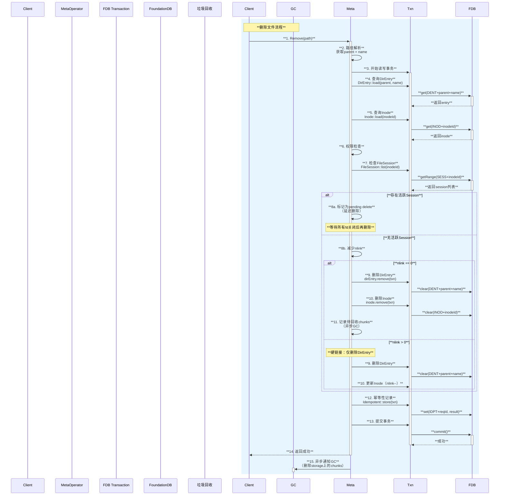
```mermaid
sequenceDiagram
    participant **Client** as Client
    participant **Meta** as MetaOperator
    participant **Txn** as FDB Transaction
    participant **FDB** as FoundationDB
    participant **GC** as 垃圾回收
    
    rect rgb(230, 245, 255)
    Note over Client,GC: **删除文件流程**
    Client->>+Meta: **1. Remove(path)**
    
    Meta->>Meta: **2. 路径解析**<br/>获取parent + name
    
    Meta->>+Txn: **3. 开始读写事务**
    
    Meta->>Txn: **4. 查询DirEntry**<br/>DirEntry::load(parent, name)
    Txn->>+FDB: **get(DENT+parent+name)**
    FDB-->>-Txn: **返回entry**
    
    Meta->>Txn: **5. 查询Inode**<br/>Inode::load(inodeId)
    Txn->>+FDB: **get(INOD+inodeId)**
    FDB-->>-Txn: **返回inode**
    
    Meta->>Meta: **6. 权限检查**
    
    Meta->>Txn: **7. 检查FileSession**<br/>FileSession::list(inodeId)
    Txn->>+FDB: **getRange(SESS+inodeId)**
    FDB-->>-Txn: **返回session列表**
    
    alt **存在活跃Session**
        Meta->>Meta: **8a. 标记为pending delete**<br/>（延迟删除）
        Note over Meta: **等待所有fd关闭后再删除**
    else **无活跃Session**
        Meta->>Meta: **8b. 减少nlink**
        
        alt **nlink == 0**
            Meta->>Txn: **9. 删除DirEntry**<br/>dirEntry.remove(txn)
            Txn->>FDB: **clear(DENT+parent+name)**
            
            Meta->>Txn: **10. 删除Inode**<br/>inode.remove(txn)
            Txn->>FDB: **clear(INOD+inodeId)**
            
            Meta->>Meta: **11. 记录待回收chunks**<br/>（异步GC）
        else **nlink > 0**
            Note over Meta: **硬链接：仅删除DirEntry**
            Meta->>Txn: **9. 删除DirEntry**
            Txn->>FDB: **clear(DENT+parent+name)**
            Meta->>Txn: **10. 更新Inode（nlink--）**
        end
    end
    
    Meta->>Txn: **12. 幂等性记录**<br/>Idempotent::store(txn)
    Txn->>FDB: **set(IDPT+reqId, result)**
    
    Meta->>Txn: **13. 提交事务**
    Txn->>+FDB: **commit()**
    FDB-->>-Txn: **成功**
    deactivate Txn
    
    Meta-->>-Client: **14. 返回成功**
    
    Meta->>+GC: **15. 异步通知GC**<br/>（删除storage上的chunks）
    deactivate GC
    end
```

**延迟删除机制**:
- 文件被删除时如果有write session存在，延迟实际删除
- 防止并发写导致的垃圾chunk
- 会话管理器定期清理僵尸会话

### 4.4 目录重命名流程

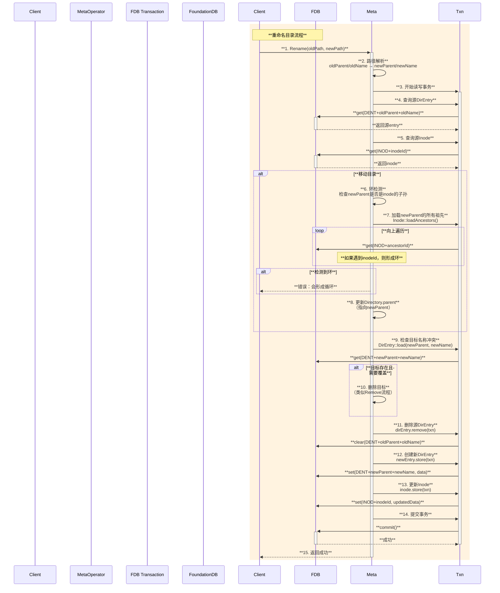
```mermaid
sequenceDiagram
    participant **Client** as Client
    participant **Meta** as MetaOperator
    participant **Txn** as FDB Transaction
    participant **FDB** as FoundationDB
    
    rect rgb(255, 243, 224)
    Note over Client,FDB: **重命名目录流程**
    Client->>+Meta: **1. Rename(oldPath, newPath)**
    
    Meta->>Meta: **2. 路径解析**<br/>oldParent/oldName → newParent/newName
    
    Meta->>+Txn: **3. 开始读写事务**
    
    Meta->>Txn: **4. 查询源DirEntry**
    Txn->>+FDB: **get(DENT+oldParent+oldName)**
    FDB-->>-Txn: **返回源entry**
    
    Meta->>Txn: **5. 查询源Inode**
    Txn->>+FDB: **get(INOD+inodeId)**
    FDB-->>-Txn: **返回inode**
    
    alt **移动目录**
        Meta->>Meta: **6. 环检测**<br/>检查newParent是否是inode的子孙
        Meta->>Txn: **7. 加载newParent的所有祖先**<br/>Inode::loadAncestors()
        loop **向上遍历**
            Txn->>FDB: **get(INOD+ancestorId)**
            Note over Meta: **如果遇到inodeId，则形成环**
        end
        
        alt **检测到环**
            Meta-->>Client: **错误：会形成循环**
        end
        
        Meta->>Meta: **8. 更新Directory.parent**<br/>（指向newParent）
    end
    
    Meta->>Txn: **9. 检查目标名称冲突**<br/>DirEntry::load(newParent, newName)
    Txn->>FDB: **get(DENT+newParent+newName)**
    
    alt **目标存在且需要覆盖**
        Meta->>Meta: **10. 删除目标**<br/>（类似Remove流程）
    end
    
    Meta->>Txn: **11. 删除源DirEntry**<br/>dirEntry.remove(txn)
    Txn->>FDB: **clear(DENT+oldParent+oldName)**
    
    Meta->>Txn: **12. 创建新DirEntry**<br/>newEntry.store(txn)
    Txn->>FDB: **set(DENT+newParent+newName, data)**
    
    Meta->>Txn: **13. 更新Inode**<br/>inode.store(txn)
    Txn->>FDB: **set(INOD+inodeId, updatedData)**
    
    Meta->>Txn: **14. 提交事务**
    Txn->>+FDB: **commit()**
    FDB-->>-Txn: **成功**
    deactivate Txn
    
    Meta-->>-Client: **15. 返回成功**
    end
```

**原子性保证**:
- 删除旧entry和创建新entry在同一事务中
- 目录的parent更新也在同一事务中
- 环检测和移动操作原子执行

## 5. 高级特性

### 5.1 文件长度管理

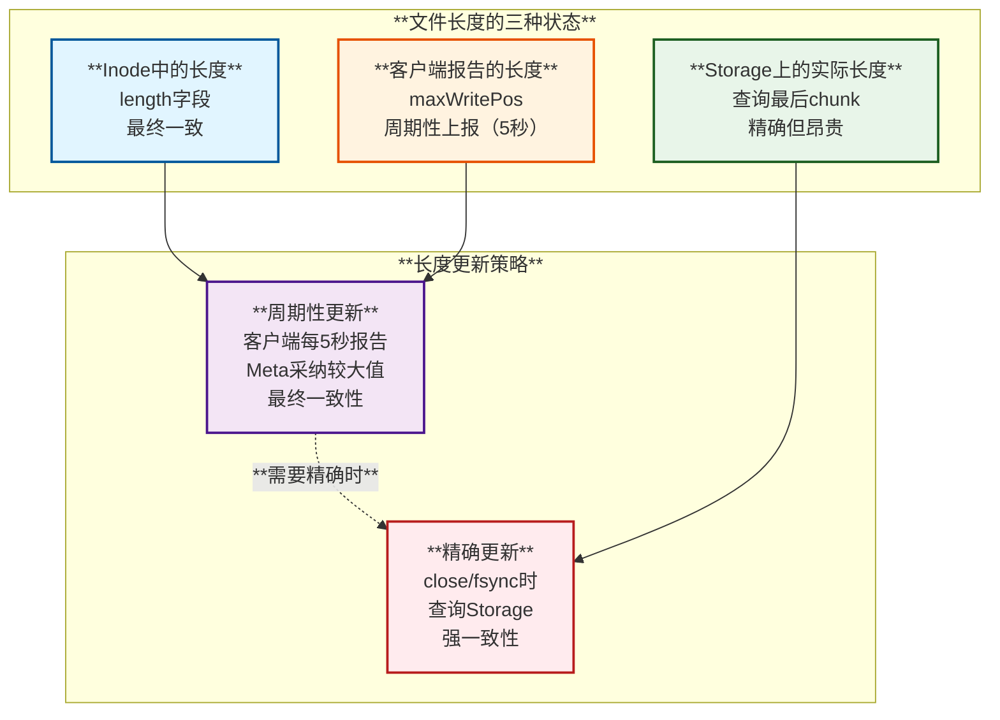
```mermaid
graph TB
    subgraph "**文件长度的三种状态**"
        style L1 fill:#e1f5ff,stroke:#01579b,stroke-width:2px
        style L2 fill:#fff3e0,stroke:#e65100,stroke-width:2px
        style L3 fill:#e8f5e9,stroke:#1b5e20,stroke-width:2px
        
        L1["**Inode中的长度**<br/>length字段<br/>最终一致"]
        L2["**客户端报告的长度**<br/>maxWritePos<br/>周期性上报（5秒）"]
        L3["**Storage上的实际长度**<br/>查询最后chunk<br/>精确但昂贵"]
    end
    
    subgraph "**长度更新策略**"
        style U1 fill:#f3e5f5,stroke:#4a148c,stroke-width:2px
        style U2 fill:#ffebee,stroke:#b71c1c,stroke-width:2px
        
        U1["**周期性更新**<br/>客户端每5秒报告<br/>Meta采纳较大值<br/>最终一致性"]
        U2["**精确更新**<br/>close/fsync时<br/>查询Storage<br/>强一致性"]
    end
    
    L1 --> U1
    L2 --> U1
    U1 -.->|"**需要精确时**"| U2
    L3 --> U2
```

**设计权衡**:
- **性能**: 周期性更新避免每次写入都查询Storage
- **一致性**: close时查询确保精确长度
- **冲突处理**: 多个Meta并发更新长度时，使用rendez-vous hash分片

### 5.2 动态文件属性优化

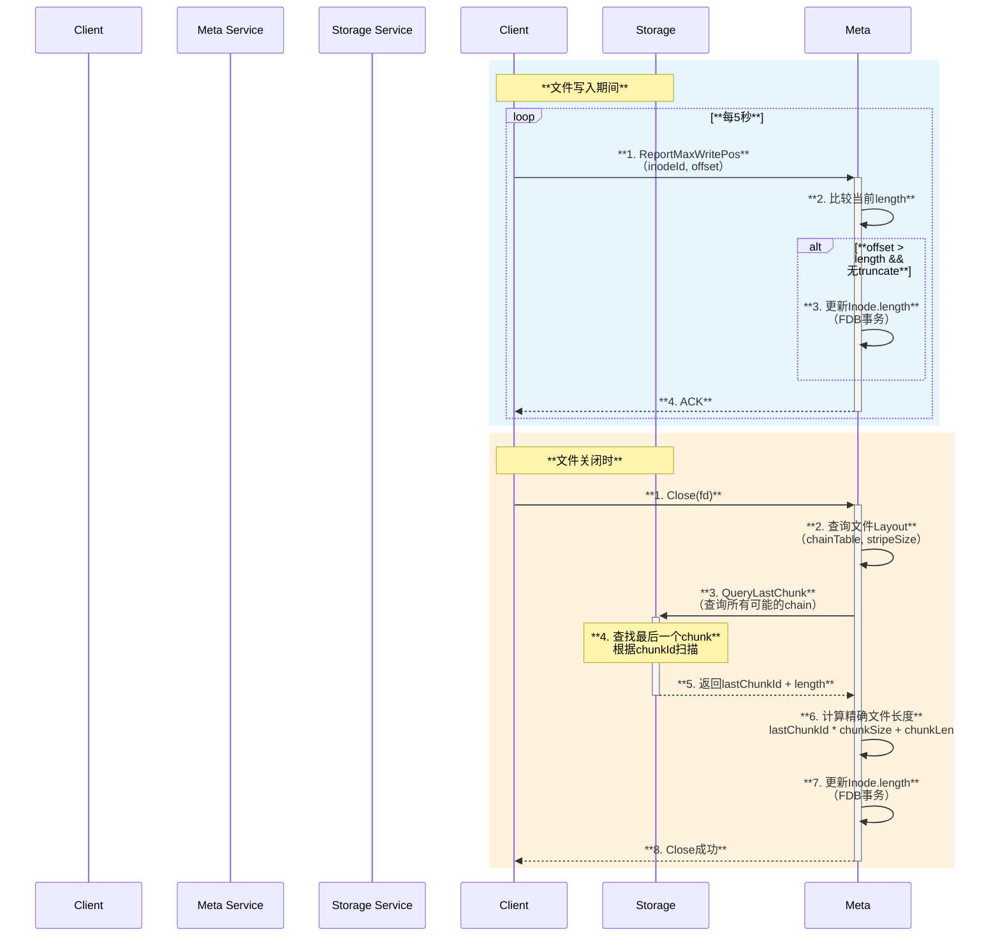
```mermaid
sequenceDiagram
    participant **Client** as Client
    participant **Meta** as Meta Service
    participant **Storage** as Storage Service
    
    rect rgb(230, 245, 255)
    Note over Client,Storage: **文件写入期间**
    loop **每5秒**
        Client->>+Meta: **1. ReportMaxWritePos**<br/>（inodeId, offset）
        Meta->>Meta: **2. 比较当前length**
        
        alt **offset > length && 无truncate**
            Meta->>Meta: **3. 更新Inode.length**<br/>（FDB事务）
        end
        
        Meta-->>-Client: **4. ACK**
    end
    end
    
    rect rgb(255, 243, 224)
    Note over Client,Storage: **文件关闭时**
    Client->>+Meta: **1. Close(fd)**
    
    Meta->>Meta: **2. 查询文件Layout**<br/>（chainTable, stripeSize）
    
    Meta->>+Storage: **3. QueryLastChunk**<br/>（查询所有可能的chain）
    Note over Storage: **4. 查找最后一个chunk**<br/>根据chunkId扫描
    Storage-->>-Meta: **5. 返回lastChunkId + length**
    
    Meta->>Meta: **6. 计算精确文件长度**<br/>lastChunkId * chunkSize + chunkLen
    
    Meta->>Meta: **7. 更新Inode.length**<br/>（FDB事务）
    
    Meta-->>-Client: **8. Close成功**
    end
```

**优化技巧**:
- **Hint优化**: 记录已使用的chain数量，避免查询所有stripeSize个chain
- **小文件优化**: 初始hint=16，翻倍增长，小文件只查询少量chain
- **分布式更新**: 使用rendezvous hash将文件长度更新分散到不同Meta服务

### 5.3 会话管理

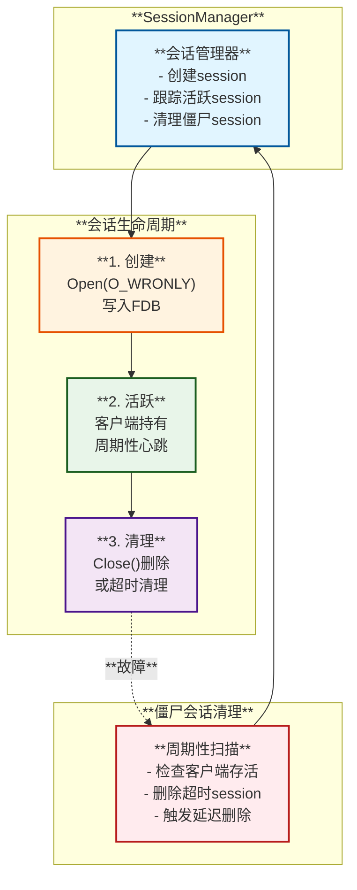
```mermaid
graph TB
    subgraph "**SessionManager**"
        style SM fill:#e1f5ff,stroke:#01579b,stroke-width:2px
        SM["**会话管理器**<br/>- 创建session<br/>- 跟踪活跃session<br/>- 清理僵尸session"]
    end
    
    subgraph "**会话生命周期**"
        style S1 fill:#fff3e0,stroke:#e65100,stroke-width:2px
        style S2 fill:#e8f5e9,stroke:#1b5e20,stroke-width:2px
        style S3 fill:#f3e5f5,stroke:#4a148c,stroke-width:2px
        
        S1["**1. 创建**<br/>Open(O_WRONLY)<br/>写入FDB"]
        S2["**2. 活跃**<br/>客户端持有<br/>周期性心跳"]
        S3["**3. 清理**<br/>Close()删除<br/>或超时清理"]
    end
    
    subgraph "**僵尸会话清理**"
        style C1 fill:#ffebee,stroke:#b71c1c,stroke-width:2px
        C1["**周期性扫描**<br/>- 检查客户端存活<br/>- 删除超时session<br/>- 触发延迟删除"]
    end
    
    SM --> S1
    S1 --> S2
    S2 --> S3
    S3 -.->|"**故障**"| C1
    C1 --> SM
```

**会话的作用**:
- **防止垃圾chunk**: 删除文件时如果有活跃写入，延迟删除
- **追踪写入者**: 便于调试和监控
- **超时清理**: 客户端崩溃时自动清理

### 5.4 幂等性保证

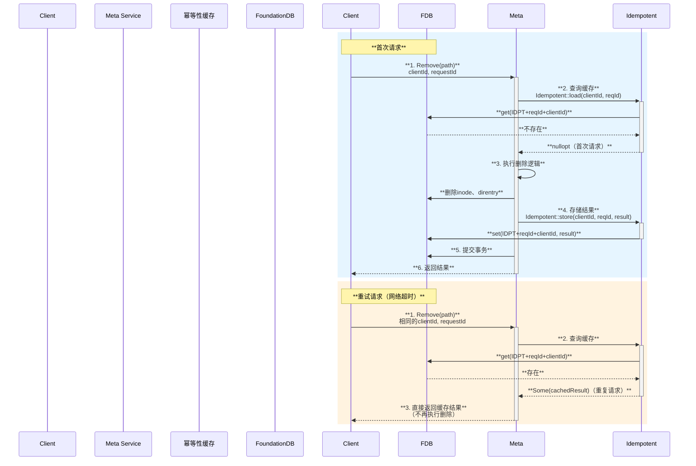
```mermaid
sequenceDiagram
    participant **Client** as Client
    participant **Meta** as Meta Service
    participant **Idempotent** as 幂等性缓存
    participant **FDB** as FoundationDB
    
    rect rgb(230, 245, 255)
    Note over Client,FDB: **首次请求**
    Client->>+Meta: **1. Remove(path)**<br/>clientId, requestId
    
    Meta->>+Idempotent: **2. 查询缓存**<br/>Idempotent::load(clientId, reqId)
    Idempotent->>FDB: **get(IDPT+reqId+clientId)**
    FDB-->>Idempotent: **不存在**
    Idempotent-->>-Meta: **nullopt（首次请求）**
    
    Meta->>Meta: **3. 执行删除逻辑**
    Meta->>FDB: **删除inode、direntry**
    
    Meta->>+Idempotent: **4. 存储结果**<br/>Idempotent::store(clientId, reqId, result)
    Idempotent->>FDB: **set(IDPT+reqId+clientId, result)**
    deactivate Idempotent
    
    Meta->>FDB: **5. 提交事务**
    
    Meta-->>-Client: **6. 返回结果**
    end
    
    rect rgb(255, 243, 224)
    Note over Client,FDB: **重试请求（网络超时）**
    Client->>+Meta: **1. Remove(path)**<br/>相同的clientId, requestId
    
    Meta->>+Idempotent: **2. 查询缓存**
    Idempotent->>FDB: **get(IDPT+reqId+clientId)**
    FDB-->>Idempotent: **存在**
    Idempotent-->>-Meta: **Some(cachedResult)（重复请求）**
    
    Meta-->>-Client: **3. 直接返回缓存结果**<br/>（不再执行删除）
    end
```

**幂等性的必要性**:
- **网络超时**: 客户端不知道请求是否成功，会重试
- **避免重复操作**: 删除操作不能重复执行
- **一致性**: 客户端看到的结果必须一致

## 6. 事务和并发控制

### 6.1 FoundationDB事务模型

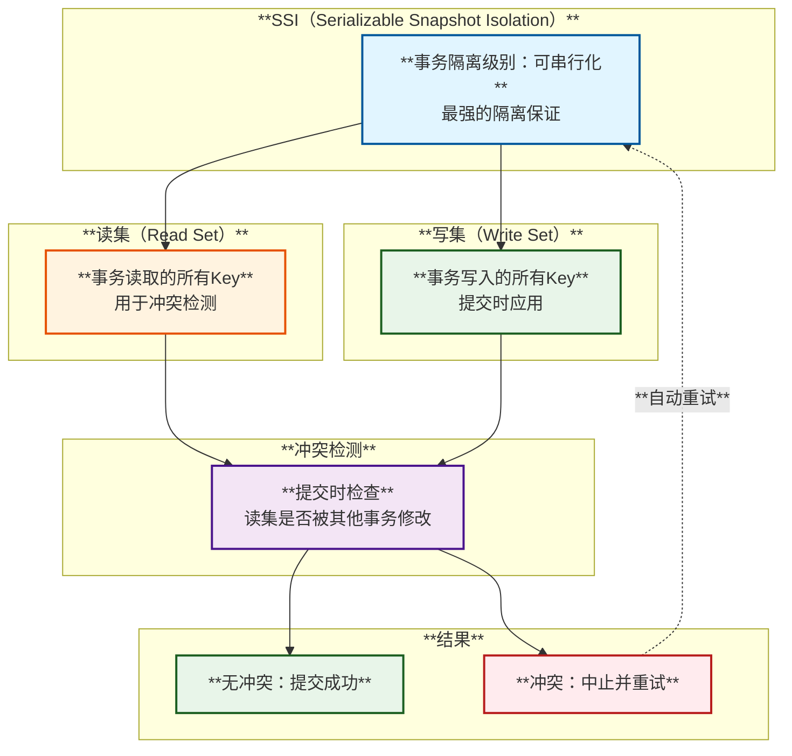
```mermaid
graph TB
    subgraph "**SSI（Serializable Snapshot Isolation）**"
        style SSI fill:#e1f5ff,stroke:#01579b,stroke-width:2px
        SSI["**事务隔离级别：可串行化**<br/>最强的隔离保证"]
    end
    
    subgraph "**读集（Read Set）**"
        style RS fill:#fff3e0,stroke:#e65100,stroke-width:2px
        RS["**事务读取的所有Key**<br/>用于冲突检测"]
    end
    
    subgraph "**写集（Write Set）**"
        style WS fill:#e8f5e9,stroke:#1b5e20,stroke-width:2px
        WS["**事务写入的所有Key**<br/>提交时应用"]
    end
    
    subgraph "**冲突检测**"
        style CD fill:#f3e5f5,stroke:#4a148c,stroke-width:2px
        CD["**提交时检查**<br/>读集是否被其他事务修改"]
    end
    
    subgraph "**结果**"
        style R1 fill:#e8f5e9,stroke:#1b5e20,stroke-width:2px
        style R2 fill:#ffebee,stroke:#b71c1c,stroke-width:2px
        R1["**无冲突：提交成功**"]
        R2["**冲突：中止并重试**"]
    end
    
    SSI --> RS
    SSI --> WS
    RS --> CD
    WS --> CD
    CD --> R1
    CD --> R2
    R2 -.->|"**自动重试**"| SSI
```

### 6.2 并发场景示例

#### 场景1：并发创建同名文件

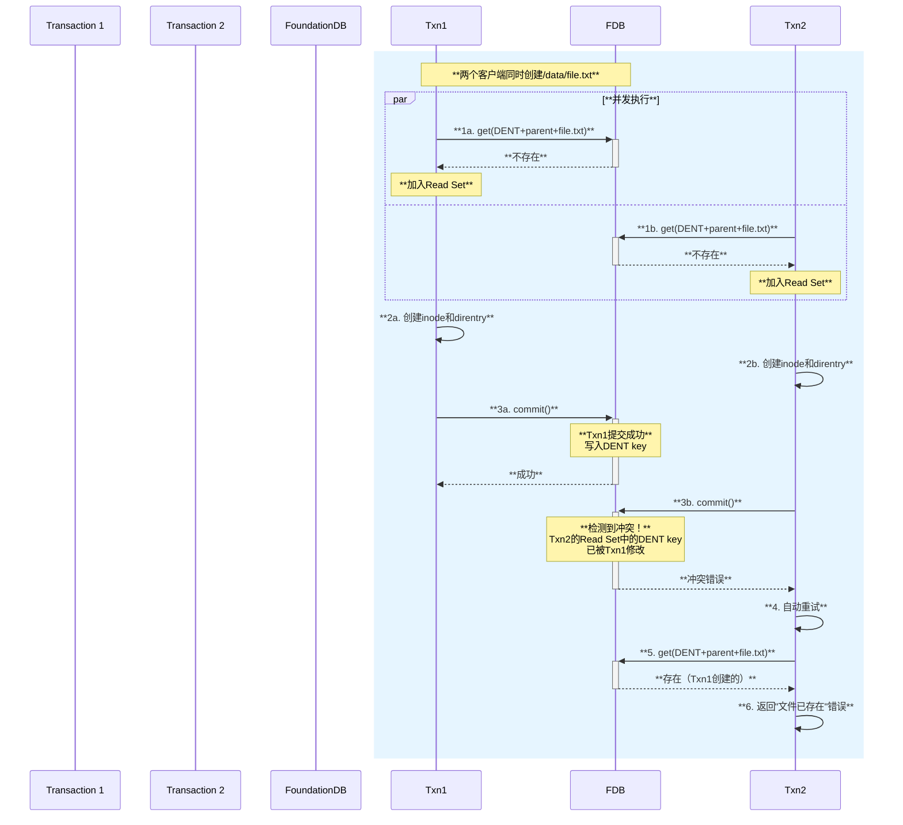
```mermaid
sequenceDiagram
    participant **Txn1** as Transaction 1
    participant **Txn2** as Transaction 2
    participant **FDB** as FoundationDB
    
    rect rgb(230, 245, 255)
    Note over Txn1,FDB: **两个客户端同时创建/data/file.txt**
    
    par **并发执行**
        Txn1->>+FDB: **1a. get(DENT+parent+file.txt)**
        FDB-->>-Txn1: **不存在**
        Note over Txn1: **加入Read Set**
    and
        Txn2->>+FDB: **1b. get(DENT+parent+file.txt)**
        FDB-->>-Txn2: **不存在**
        Note over Txn2: **加入Read Set**
    end
    
    Txn1->>Txn1: **2a. 创建inode和direntry**
    Txn2->>Txn2: **2b. 创建inode和direntry**
    
    Txn1->>+FDB: **3a. commit()**
    Note over FDB: **Txn1提交成功**<br/>写入DENT key
    FDB-->>-Txn1: **成功**
    
    Txn2->>+FDB: **3b. commit()**
    Note over FDB: **检测到冲突！**<br/>Txn2的Read Set中的DENT key<br/>已被Txn1修改
    FDB-->>-Txn2: **冲突错误**
    
    Txn2->>Txn2: **4. 自动重试**
    Txn2->>+FDB: **5. get(DENT+parent+file.txt)**
    FDB-->>-Txn2: **存在（Txn1创建的）**
    Txn2->>Txn2: **6. 返回"文件已存在"错误**
    end
```

#### 场景2：并发删除和重命名

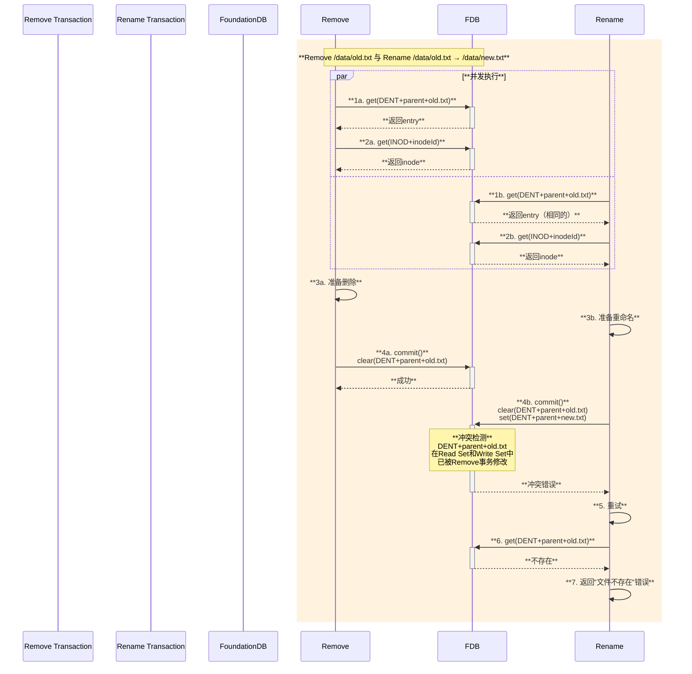
```mermaid
sequenceDiagram
    participant **Remove** as Remove Transaction
    participant **Rename** as Rename Transaction
    participant **FDB** as FoundationDB
    
    rect rgb(255, 243, 224)
    Note over Remove,FDB: **Remove /data/old.txt 与 Rename /data/old.txt → /data/new.txt**
    
    par **并发执行**
        Remove->>+FDB: **1a. get(DENT+parent+old.txt)**
        FDB-->>-Remove: **返回entry**
        Remove->>+FDB: **2a. get(INOD+inodeId)**
        FDB-->>-Remove: **返回inode**
    and
        Rename->>+FDB: **1b. get(DENT+parent+old.txt)**
        FDB-->>-Rename: **返回entry（相同的）**
        Rename->>+FDB: **2b. get(INOD+inodeId)**
        FDB-->>-Rename: **返回inode**
    end
    
    Remove->>Remove: **3a. 准备删除**
    Rename->>Rename: **3b. 准备重命名**
    
    Remove->>+FDB: **4a. commit()**<br/>clear(DENT+parent+old.txt)
    FDB-->>-Remove: **成功**
    
    Rename->>+FDB: **4b. commit()**<br/>clear(DENT+parent+old.txt)<br/>set(DENT+parent+new.txt)
    Note over FDB: **冲突检测**<br/>DENT+parent+old.txt<br/>在Read Set和Write Set中<br/>已被Remove事务修改
    FDB-->>-Rename: **冲突错误**
    
    Rename->>Rename: **5. 重试**
    Rename->>+FDB: **6. get(DENT+parent+old.txt)**
    FDB-->>-Rename: **不存在**
    Rename->>Rename: **7. 返回"文件不存在"错误**
    end
```

### 6.3 事务重试策略

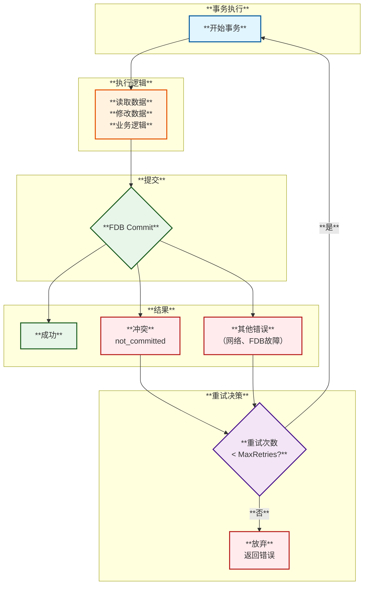
```mermaid
graph TB
    subgraph "**事务执行**"
        style Start fill:#e1f5ff,stroke:#01579b,stroke-width:2px
        Start["**开始事务**"]
    end
    
    subgraph "**执行逻辑**"
        style Exec fill:#fff3e0,stroke:#e65100,stroke-width:2px
        Exec["**读取数据**<br/>**修改数据**<br/>**业务逻辑**"]
    end
    
    subgraph "**提交**"
        style Commit fill:#e8f5e9,stroke:#1b5e20,stroke-width:2px
        Commit{**FDB Commit**}
    end
    
    subgraph "**结果**"
        style Success fill:#e8f5e9,stroke:#1b5e20,stroke-width:2px
        style Conflict fill:#ffebee,stroke:#b71c1c,stroke-width:2px
        style Error fill:#ffebee,stroke:#b71c1c,stroke-width:2px
        
        Success["**成功**"]
        Conflict["**冲突**<br/>not_committed"]
        Error["**其他错误**<br/>（网络、FDB故障）"]
    end
    
    subgraph "**重试决策**"
        style Retry fill:#f3e5f5,stroke:#4a148c,stroke-width:2px
        style Abort fill:#ffebee,stroke:#b71c1c,stroke-width:2px
        
        Retry{**重试次数<br/>< MaxRetries?**}
        Abort["**放弃**<br/>返回错误"]
    end
    
    Start --> Exec
    Exec --> Commit
    Commit --> Success
    Commit --> Conflict
    Commit --> Error
    
    Conflict --> Retry
    Error --> Retry
    
    Retry -->|"**是**"| Start
    Retry -->|"**否**"| Abort
```

**Meta服务的重试逻辑**:
- **自动重试**: 对于`not_committed`错误（事务冲突），自动重试
- **最大次数**: 通常重试5-10次
- **指数退避**: 可选，避免热点竞争
- **幂等性**: 确保重试不会导致副作用

## 7. 性能优化

### 7.1 优化技术总览

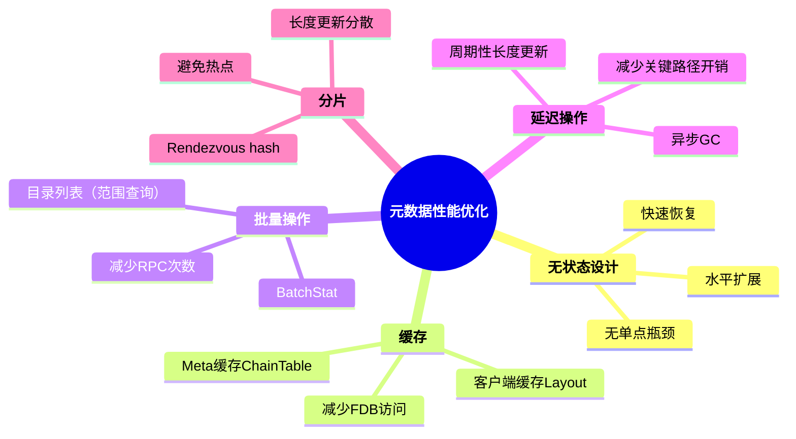
```mermaid
mindmap
  root((**元数据性能优化**))
    **无状态设计**
      水平扩展
      无单点瓶颈
      快速恢复
    **缓存**
      客户端缓存Layout
      Meta缓存ChainTable
      减少FDB访问
    **批量操作**
      BatchStat
      目录列表（范围查询）
      减少RPC次数
    **延迟操作**
      周期性长度更新
      异步GC
      减少关键路径开销
    **分片**
      Rendezvous hash
      长度更新分散
      避免热点
```

### 7.2 关键性能指标

| **操作** | **延迟** | **吞吐量** | **FDB事务** | **备注** |
|---------|---------|-----------|------------|---------|
| **stat** | ~1-2 ms | ~10K ops/s | 只读 | 单key查询 |
| **create** | ~3-5 ms | ~5K ops/s | 读写 | 2个写操作 |
| **open（read）** | ~1-2 ms | ~10K ops/s | 只读 | 无session |
| **open（write）** | ~3-5 ms | ~5K ops/s | 读写 | 创建session |
| **close** | ~5-10 ms | ~2K ops/s | 读写 | 查询Storage+更新长度 |
| **remove** | ~5-10 ms | ~2K ops/s | 读写 | 多个key操作+幂等性 |
| **rename** | ~10-20 ms | ~1K ops/s | 读写 | 环检测+多key操作 |
| **list（1K entries）** | ~10-20 ms | ~100 ops/s | 只读 | 范围查询 |

### 7.3 性能瓶颈和优化

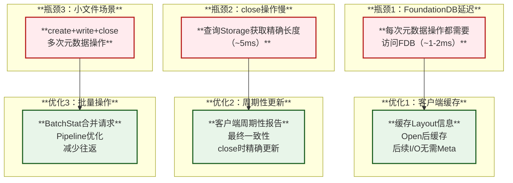
```mermaid
graph TB
    subgraph "**瓶颈1：FoundationDB延迟**"
        style B1 fill:#ffebee,stroke:#b71c1c,stroke-width:2px
        B1["**每次元数据操作都需要<br/>访问FDB（~1-2ms）**"]
    end
    
    subgraph "**优化1：客户端缓存**"
        style O1 fill:#e8f5e9,stroke:#1b5e20,stroke-width:2px
        O1["**缓存Layout信息**<br/>Open后缓存<br/>后续I/O无需Meta"]
    end
    
    subgraph "**瓶颈2：close操作慢**"
        style B2 fill:#ffebee,stroke:#b71c1c,stroke-width:2px
        B2["**查询Storage获取精确长度<br/>（~5ms）**"]
    end
    
    subgraph "**优化2：周期性更新**"
        style O2 fill:#e8f5e9,stroke:#1b5e20,stroke-width:2px
        O2["**客户端周期性报告**<br/>最终一致性<br/>close时精确更新"]
    end
    
    subgraph "**瓶颈3：小文件场景**"
        style B3 fill:#ffebee,stroke:#b71c1c,stroke-width:2px
        B3["**create+write+close<br/>多次元数据操作**"]
    end
    
    subgraph "**优化3：批量操作**"
        style O3 fill:#e8f5e9,stroke:#1b5e20,stroke-width:2px
        O3["**BatchStat合并请求**<br/>Pipeline优化<br/>减少往返"]
    end
    
    B1 --> O1
    B2 --> O2
    B3 --> O3
```

## 8. 监控和调试

### 8.1 关键监控指标

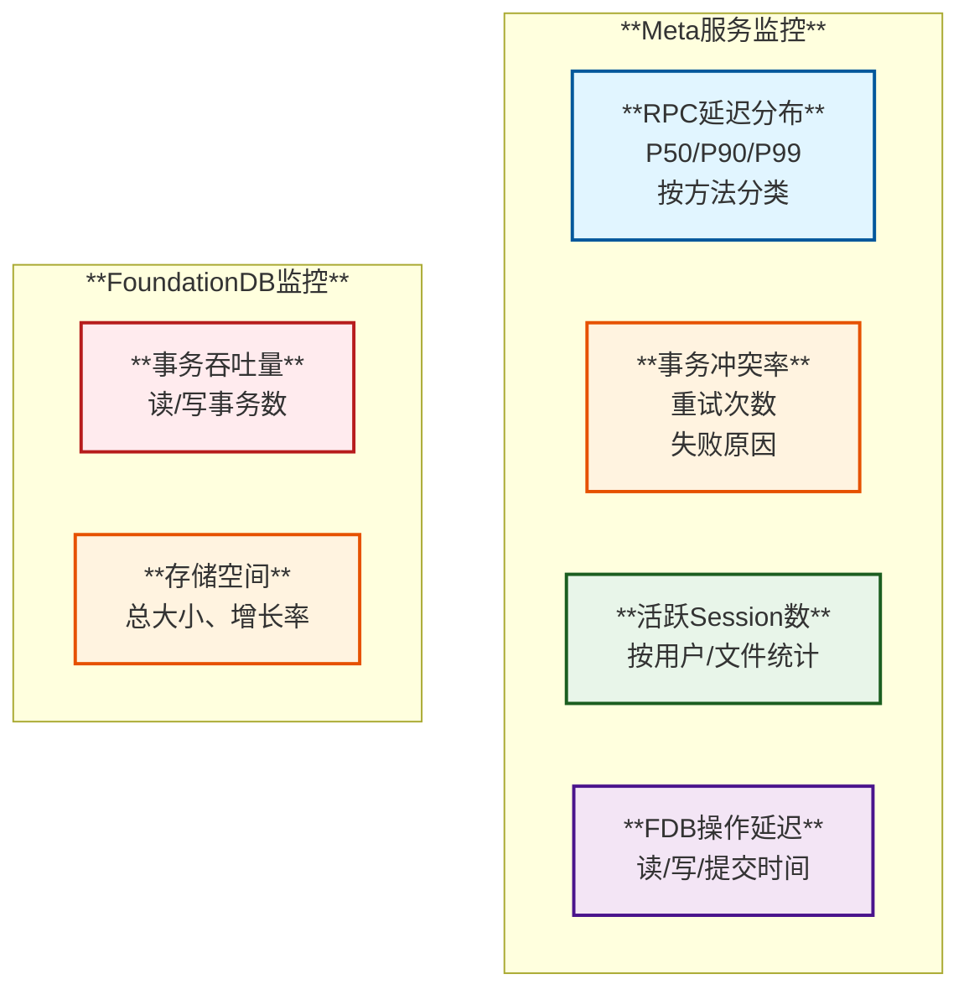
```mermaid
graph TB
    subgraph "**Meta服务监控**"
        style M1 fill:#e1f5ff,stroke:#01579b,stroke-width:2px
        style M2 fill:#fff3e0,stroke:#e65100,stroke-width:2px
        style M3 fill:#e8f5e9,stroke:#1b5e20,stroke-width:2px
        style M4 fill:#f3e5f5,stroke:#4a148c,stroke-width:2px
        
        M1["**RPC延迟分布**<br/>P50/P90/P99<br/>按方法分类"]
        M2["**事务冲突率**<br/>重试次数<br/>失败原因"]
        M3["**活跃Session数**<br/>按用户/文件统计"]
        M4["**FDB操作延迟**<br/>读/写/提交时间"]
    end
    
    subgraph "**FoundationDB监控**"
        style F1 fill:#ffebee,stroke:#b71c1c,stroke-width:2px
        style F2 fill:#fff3e0,stroke:#e65100,stroke-width:2px
        
        F1["**事务吞吐量**<br/>读/写事务数"]
        F2["**存储空间**<br/>总大小、增长率"]
    end
```

### 8.2 常见问题排查

| **问题** | **症状** | **可能原因** | **排查方法** |
|---------|---------|------------|-----------|
| **高延迟** | P99延迟>100ms | FDB慢 | 检查FDB集群健康度 |
| **高冲突率** | 大量事务重试 | 热点key竞争 | 分析冲突的key，考虑分片 |
| **Session泄漏** | Session数持续增长 | 客户端未正常关闭 | 检查客户端日志，调整超时 |
| **元数据不一致** | 文件列表与inode不匹配 | Bug或数据损坏 | 运行一致性检查工具 |
| **垃圾chunk** | 存储空间不回收 | GC未运行或失败 | 检查GC日志和队列 |

## 9. 与其他系统对比

### 9.1 元数据架构对比

| **系统** | **元数据存储** | **服务架构** | **一致性** | **扩展性** |
|---------|-------------|------------|----------|-----------|
| **3FS** | FoundationDB | 无状态Meta | 强一致（SSI） | ⭐⭐⭐⭐⭐ |
| **Lustre** | 本地文件系统 | 有状态MDS | 强一致 | ⭐⭐（单点） |
| **CephFS** | Rados（分布式） | 有状态MDS集群 | 最终→强 | ⭐⭐⭐⭐ |
| **HDFS** | NameNode内存 | 有状态NameNode | 强一致 | ⭐⭐⭐（内存限制） |
| **GFS** | Chubby + 日志 | 单Master | 宽松 | ⭐⭐（单点） |

### 9.2 设计取舍

```mermaid
graph TB
    subgraph "**3FS的选择**"
        style C1 fill:#e8f5e9,stroke:#1b5e20,stroke-width:2px
        C1["**FoundationDB + 无状态**<br/>优势：高可用、易扩展<br/>劣势：依赖外部存储"]
    end
    
    subgraph "**传统方案**"
        style T1 fill:#fff3e0,stroke:#e65100,stroke-width:2px
        style T2 fill:#ffebee,stroke:#b71c1c,stroke-width:2px
        
        T1["**单Master（GFS/HDFS）**<br/>优势：简单、强一致<br/>劣势：单点瓶颈"]
        
        T2["**分布式元数据（Ceph）**<br/>优势：可扩展<br/>劣势：复杂、一致性难"]
    end
    
    C1 -.->|"**避免**"| T1
    C1 -.->|"**简化**"| T2
```

**3FS的优势**:
- **简化运维**: Meta服务无状态，故障恢复简单
- **水平扩展**: 增加Meta服务即可提升吞吐
- **强一致性**: FoundationDB的SSI保证
- **高可用**: FoundationDB自带复制和故障转移

**权衡**:
- **外部依赖**: 必须部署和维护FoundationDB集群
- **延迟**: 每次元数据操作都要访问FDB（~1-2ms）

## 10. 总结

### 10.1 核心设计原则

```mermaid
mindmap
  root((**3FS元数据管理**))
    **分离关注点**
      Meta服务：无状态
      FDB：有状态存储
      清晰的职责划分
    **强一致性**
      SSI事务
      原子操作
      冲突检测
    **性能优化**
      客户端缓存
      批量操作
      延迟更新
    **高可用**
      无单点
      快速恢复
      水平扩展
```

### 10.2 关键技术总结

| **方面** | **技术选择** | **收益** |
|---------|------------|---------|
| **存储** | FoundationDB | 强事务、高可用、简化实现 |
| **服务架构** | 无状态Meta | 水平扩展、故障恢复快 |
| **数据模型** | Inode + DirEntry | 标准文件系统语义 |
| **会话管理** | Write-only tracking | 减少开销、防止垃圾 |
| **长度更新** | 周期性 + 精确 | 平衡性能和一致性 |
| **并发控制** | SSI + 自动重试 | 简化编程模型 |
| **幂等性** | 请求缓存 | 安全重试 |

### 10.3 适用场景

**3FS元数据管理的优势场景**:
- ✅ **大规模集群**: Meta服务可水平扩展
- ✅ **高可用要求**: 无单点，快速恢复
- ✅ **复杂元数据操作**: 原子rename、硬链接、符号链接
- ✅ **强一致性需求**: 训练场景需要精确的文件视图

**不太适合的场景**:
- ❌ **极高频元数据操作**: FDB延迟~1-2ms，对于数十万QPS的元数据操作可能不够
- ❌ **无FDB基础设施**: 需要额外部署和维护FoundationDB集群

---

## 附录：数据结构定义

### A.1 Inode定义（简化）

```cpp
struct Inode {
  InodeId id;  // 全局唯一ID
  InodeData data;
};

struct InodeData {
  std::variant<File, Directory, Symlink> type;
  Acl acl;  // uid, gid, permission
  uint32_t nlink;  // 硬链接计数
  UtcTime atime, mtime, ctime;
};

struct File {
  Layout layout;  // chunkSize, chains, seed
  uint64_t length;
};

struct Directory {
  InodeId parent;
  Layout defaultLayout;
  std::string name;  // 用于环检测
};

struct Symlink {
  Path target;
};
```

### A.2 DirEntry定义（简化）

```cpp
struct DirEntry {
  InodeId parent;
  std::string name;
  InodeId id;  // 指向的inode
  InodeType type;
  
  // Key: DENT + serialize(parent) + name
  std::string packKey() const;
  
  // 范围查询
  static CoTryTask<std::vector<DirEntry>> list(
      IReadOnlyTransaction &txn,
      InodeId parent,
      size_t limit = 0
  );
};
```

### A.3 FileSession定义（简化）

```cpp
struct FileSession {
  InodeId inodeId;
  ClientId clientId;
  Uuid sessionId;
  UtcTime timestamp;
  
  // Key: SESS + serialize(inodeId) + serialize(sessionId)
  static std::string packKey(InodeId inodeId, Uuid session);
  
  // 列出文件的所有session
  static CoTryTask<std::vector<FileSession>> list(
      IReadOnlyTransaction &txn,
      InodeId inodeId
  );
};
```

