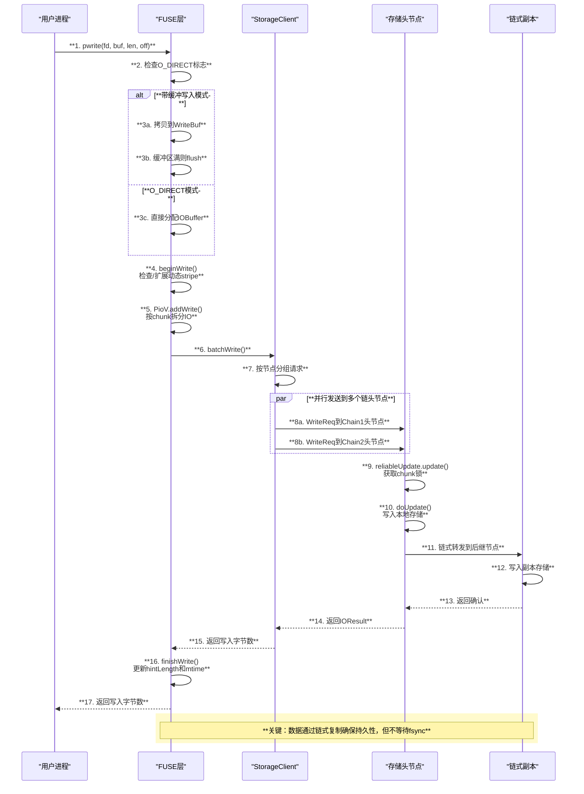
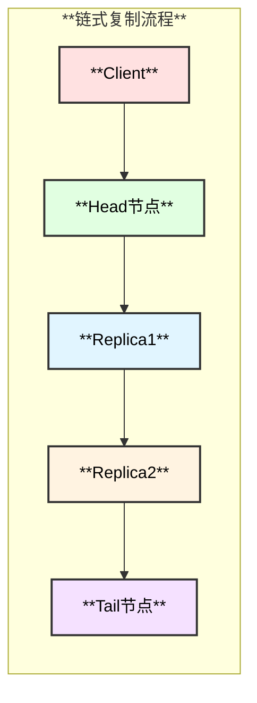

# 3FS pwrite 系统调用实现分析

## 1. 总体架构

```mermaid
graph TB
    subgraph "**应用层**"
        A[**用户进程<br/>pwrite()**]
    end
    
    subgraph "**FUSE层**"
        B[**hf3fs_write<br/>FUSE回调**]
        C[**Write Buffer<br/>写缓冲区**]
        D[**PioV<br/>并行IO向量**]
    end
    
    subgraph "**客户端层**"
        E[**StorageClient<br/>存储客户端**]
        F[**IOBuffer<br/>RDMA缓冲区**]
    end
    
    subgraph "**存储层**"
        G[**Storage Head<br/>链头节点**]
        H[**Chain Replica<br/>链式副本**]
        I[**ChunkReplica<br/>Chunk存储**]
    end
    
    A --> B
    B --> C
    C --> D
    D --> E
    E --> F
    F --> G
    G --> H
    H --> I
    
    style A fill:#ffe1e1,stroke:#333,stroke-width:2px,color:#000
    style B fill:#e1ffe1,stroke:#333,stroke-width:2px,color:#000
    style C fill:#e1f5ff,stroke:#333,stroke-width:2px,color:#000
    style D fill:#fff3e1,stroke:#333,stroke-width:2px,color:#000
    style E fill:#f5e1ff,stroke:#333,stroke-width:2px,color:#000
    style F fill:#fffacd,stroke:#333,stroke-width:2px,color:#000
    style G fill:#ffe1f5,stroke:#333,stroke-width:2px,color:#000
    style H fill:#e8e1ff,stroke:#333,stroke-width:2px,color:#000
    style I fill:#ffd7d7,stroke:#333,stroke-width:2px,color:#000
```

## 2. 核心流程时序图



## 3. 函数调用链

```text
hf3fs_write() - src/fuse/FuseOps.cc:1552
├── 参数验证
│   ├── 检查dryrun_bench_mode()
│   └── 检查readonly()
├── 获取inode信息
│   └── inodeOf(*fi, ino) - src/fuse/FuseOps.cc:1587
├── 根据写入模式分支
│   ├── O_DIRECT或无缓冲模式
│   │   ├── 分配IOBuffer
│   │   │   └── d.bufPool->allocate() - src/fuse/FuseOps.cc:1619
│   │   ├── 拷贝数据
│   │   │   └── memcpy((char *)memh.data(), buf, size)
│   │   └── 直接刷新
│   │       └── flushBuf(req, pi, off, memh, size, false) - src/fuse/FuseOps.cc:1622
│   └── 带缓冲模式
│       ├── 初始化WriteBuf
│       │   └── d.storageClient->registerIOBuffer() - src/fuse/FuseOps.cc:1635
│       ├── 处理非连续写入(刷新已有缓冲)
│       │   └── flushBuf(req, pi, wb->off, *wb->memh, wb->len, true)
│       ├── 拷贝到缓冲区
│       │   └── memcpy(wb->buf.data() + wb->len, buf + done, cplen)
│       └── 缓冲区满时刷新
│           └── flushBuf(req, pi, wb->off, *wb->memh, wb->len, true)
└── 返回结果
    └── fuse_reply_write(req, size) - src/fuse/FuseOps.cc:1688

flushBuf() - src/fuse/FuseOps.cc:424
├── 开始写入
│   └── pi->beginWrite(user, *d.metaClient, off, len) - src/fuse/FuseOps.cc:444
│       └── ┌────────────┬────────────────────────┬───────────────────┐
│           │  **步骤**   │  **操作**               │  **说明**          │
│           ├────────────┼────────────────────────┼───────────────────┤
│           │  1         │  计算所需stripe数       │  offset+len/chunkSize │
│           ├────────────┼────────────────────────┼───────────────────┤
│           │  2         │  检查dynStripe         │  是否需要扩展       │
│           ├────────────┼────────────────────────┼───────────────────┤
│           │  3         │  extendStripe()        │  向meta扩展stripe  │
│           └────────────┴────────────────────────┴───────────────────┘
├── 创建PioV执行器
│   └── PioV ioExec(*d.storageClient, ..., res) - src/fuse/FuseOps.cc:456
├── 添加写入IO
│   └── ioExec.addWrite(0, pi->inode, 0, off + done, len - done, ...) - src/fuse/FuseOps.cc:457
├── 执行写入
│   └── ioExec.executeWrite(user, d.config->storage_io().write()) - src/fuse/FuseOps.cc:464
└── 完成写入
    └── pi->finishWrite(user, truncateVer, off, done) - src/fuse/FuseOps.cc:488

PioV::addWrite() - src/fuse/PioV.cc:55
├── 验证inode类型
├── 按chunk切分写入
│   └── chunkIo(inode, track, off, len, ...) - src/fuse/PioV.cc:74
│       └── ┌────────────┬────────────────────────┬───────────────────┐
│           │  **字段**   │  **计算方式**           │  **说明**          │
│           ├────────────┼────────────────────────┼───────────────────┤
│           │  chunkOff  │  off % chunkSize       │  chunk内偏移       │
│           ├────────────┼────────────────────────┼───────────────────┤
│           │  chainId   │  f.getChainId(...)     │  目标存储链        │
│           ├────────────┼────────────────────────┼───────────────────┤
│           │  chunkId   │  f.getChunkId(...)     │  目标chunk标识     │
│           └────────────┴────────────────────────┴───────────────────┘
└── 创建WriteIO
    └── storageClient_.createWriteIO(chain, chunk, chunkOff, ...) - src/fuse/PioV.cc:83

PioV::executeWrite() - src/fuse/PioV.cc:142
└── storageClient_.batchWrite(wios_, userInfo, options) - src/fuse/PioV.cc:182

StorageClientImpl::batchWrite() - src/client/storage/StorageClientImpl.cc:1757
├── 验证写入范围
│   └── validateWriteDataRange(writeIOs, ...) - src/client/storage/StorageClientImpl.cc:1780
├── 按节点分组
├── 并行发送批次
│   └── processBatches<WriteIO>(batches, sendReq, parallelProcessing)
└── 发送单个请求
    └── sendWriteRequest(requestCtx, writeIO, nodeInfo, userInfo, options) - src/client/storage/StorageClientImpl.cc:1860
        └── ┌────────────┬────────────────────────┬───────────────────┐
            │  **字段**   │  **内容**               │  **说明**          │
            ├────────────┼────────────────────────┼───────────────────┤
            │  UpdateIO  │  offset, length, key   │  写入位置和数据    │
            ├────────────┼────────────────────────┼───────────────────┤
            │  checksum  │  ChecksumInfo          │  校验和(可选)      │
            ├────────────┼────────────────────────┼───────────────────┤
            │  inlinebuf │  小数据内联            │  减少RDMA开销      │
            └────────────┴────────────────────────┴───────────────────┘

StorageOperator::write() - src/storage/service/StorageOperator.cc:236
├── 获取目标存储链
│   └── components_.targetMap.getByChainId(req.payload.key.vChainId)
└── 执行可靠更新
    └── components_.reliableUpdate.update(requestCtx, updateReq, ibSocket, target)

ReliableUpdate::update() - src/storage/service/ReliableUpdate.cc:16
├── 检查channel锁
│   └── target->storageTarget->tryLockChannel(baton, ...)
├── 检查缓存(幂等性)
│   └── 返回已有结果如果seqnum匹配
└── 执行更新
    └── components_.storageOperator.handleUpdate(requestCtx, req, ibSocket, target)

StorageOperator::handleUpdate() - src/storage/service/StorageOperator.cc:333
├── 获取chunk锁
│   └── target->storageTarget->lockChunk(baton, req.payload.key.chunkId, ...)
├── 本地写入
│   └── doUpdate(requestCtx, req.payload, req.options, ...) - src/storage/service/StorageOperator.cc:389
└── 链式转发
    └── components_.reliableForwarding.forward(...) - src/storage/service/ReliableForwarding.cc:144

ChunkReplica::update() - src/storage/store/ChunkReplica.cc:132
├── 获取chunk元数据
│   └── store.get(chunkId)
├── 版本检查
│   └── ┌────────────┬────────────────────────┬───────────────────┐
│       │  **检查项** │  **条件**               │  **结果**          │
│       ├────────────┼────────────────────────┼───────────────────┤
│       │  已提交    │  updateVer<=commitVer  │  kChunkCommittedUpdate │
│       ├────────────┼────────────────────────┼───────────────────┤
│       │  过期      │  updateVer<=updateVer  │  kChunkStaleUpdate │
│       ├────────────┼────────────────────────┼───────────────────┤
│       │  缺失      │  updateVer>updateVer+1 │  kChunkMissingUpdate │
│       └────────────┴────────────────────────┴───────────────────┘
├── 填充间隙
│   └── chunkInfo.view.write(kZeroBytes.data(), writeIO.offset - meta.size, meta.size, meta)
├── 执行写入
│   └── doRealWrite(chunkId, chunkInfo, state.data, writeIO.length, writeIO.offset)
├── 更新校验和
│   └── updateChecksum(chunkInfo, writeIO, ...)
└── 持久化元数据
    └── store.set(chunkId, chunkInfo, !skipPersist)
```

## 4. 关键数据结构

### 4.1 WriteIO 结构

| **字段**       | **类型**          | **说明**                |
|----------------|-------------------|------------------------|
| routingTarget  | RoutingTarget     | 目标chain和channel      |
| chunkId        | ChunkId           | 目标chunk标识           |
| offset         | uint32_t          | chunk内写入偏移         |
| length         | uint32_t          | 写入长度                |
| chunkSize      | uint32_t          | chunk大小               |
| data           | uint8_t*          | 数据指针                |
| buffer         | IOBuffer*         | RDMA注册缓冲区          |
| checksum       | ChecksumInfo      | 数据校验和              |

### 4.2 IOResult 结构

| **字段**       | **类型**          | **说明**                |
|----------------|-------------------|------------------------|
| lengthInfo     | Result<uint32_t>  | 写入结果或错误          |
| updateVer      | ChunkVer          | 更新版本号              |
| commitVer      | ChunkVer          | 提交版本号              |
| checksum       | ChecksumInfo      | chunk校验和             |

## 5. 关键特性

### 5.1 写入缓冲

- **带缓冲模式**：小写入先积累到`InodeWriteBuf`，缓冲区满或非连续写入时批量刷新
- **O_DIRECT模式**：每次写入直接发送到存储节点，绕过缓冲

### 5.2 链式复制



- 客户端只与链头节点通信
- 头节点负责将更新转发到后继节点
- 提供强一致性保证

### 5.3 幂等性保证

- 通过`ReliableUpdate`组件实现
- 每个channel维护seqnum，相同seqnum返回缓存结果
- 避免重试导致的重复写入

## 6. 性能特点

| **特性**        | **实现方式**           | **性能影响**            |
|-----------------|------------------------|------------------------|
| 批量写入        | PioV批量处理           | 减少RPC次数            |
| RDMA传输        | IOBuffer注册内存       | 零拷贝传输             |
| 写缓冲          | InodeWriteBuf          | 合并小IO               |
| 并行发送        | 多chain并行            | 提高吞吐量             |
| 动态stripe扩展  | beginWrite检查         | 延迟分配存储资源       |

